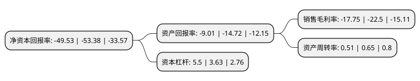

> 本页面由自动化程序生成于 2022年5月20日 01:07
> 内容可能存在错误，如有bug请提交issue至：https://github.com/Eroleice/doc-pi/issues
{.is-warning}

# 上市公司基本情况

## 基本资料

上海美特斯邦威服饰股份有限公司（以下简称“美邦服饰”）成立于2000年12月06日，上海市。于2008年08月28日在深交所中小板上市。

美邦服饰注册资本251,250万元，本公司通过强化品牌建设与推广，产品自主设计与开发，营销网络建设和供应链管理，以外包生产，加盟和直营销售相结合的经营模式，组织美特斯。邦威品牌时尚休闲服饰产品的设计，生产和销售。主要产品为美特斯。邦威品牌系列休闲服饰产品。以下是详细信息：

- 公司名称: 上海美特斯邦威服饰股份有限公司
- 股票代码: 002269.SZ
- 所在地: 上海 - 上海市
- 成立日期: 2000年12月06日
- 注册资本: 251,250万元
- 法定代表人: 胡佳佳
- 主营业务: 本公司通过强化品牌建设与推广，产品自主设计与开发，营销网络建设和供应链管理，以外包生产，加盟和直营销售相结合的经营模式，组织美特斯邦威品牌时尚休闲服饰产品的设计，生产和销售主要产品为美特斯邦威品牌系列休闲服饰产品
- 公司官网: corp.metersbonwe.com
- 公司介绍: 公司是国内著名休闲服生产销售企业，主营服装设计开发；服装、鞋、针织品、皮革制品、羽绒制品、箱包、玩具、饰品、工艺品(除金银)、纸制品的设计、生产和销售。公司拥有由两千多家直营店和加盟店所组成的兼具深度和广度的营销网络。通过细致而科学的品牌建设，专注而系统的品牌推广，借助整合营销的方式已使得美特斯·邦威成为消费者心目中国内休闲服饰的领导品牌之一。美特斯·邦威品获获得“中国驰名商标”荣誉。公司的长期发展目标是成为一家国际领先的服装零售企业，为全球消费者提供新时尚的消费体验。

## 股东及高管情况

上市公司第一大股东为上海华服投资有限公司，持股1,046,388,059股，占比41.65%，为上市公司实际控制人。

截至2022年03月31日，上市公司的前十大股东中，共有1名自然人股东，1名机构股东，8个产品账户，其中5%以上大股东共有2名。上市公司前十大股东明细如下：

> 截至2022年03月31日，上市公司前十大股东信息如下：

| 股东名称 | 持股数量（股） | 持股比例 |
| --- | --- | --- |
| 上海华服投资有限公司 | 1,046,388,059 | 41.65% |
| 胡佳佳 | 225,000,000 | 8.96% |
| 博时基金-农业银行-博时中证金融资产管理计划 | 36,388,000 | 1.45% |
| 银华基金-农业银行-银华中证金融资产管理计划 | 36,388,000 | 1.45% |
| 大成基金-农业银行-大成中证金融资产管理计划 | 36,388,000 | 1.45% |
| 南方基金-农业银行-南方中证金融资产管理计划 | 36,388,000 | 1.45% |
| 中欧基金-农业银行-中欧中证金融资产管理计划 | 36,388,000 | 1.45% |
| 广发基金-农业银行-广发中证金融资产管理计划 | 36,388,000 | 1.45% |
| 工银瑞信基金-农业银行-工银瑞信中证金融资产管理计划 | 36,388,000 | 1.45% |
| 嘉实基金-农业银行-嘉实中证金融资产管理计划 | 36,388,000 | 1.45% |

## 利润表分析

上市公司2021年总收入为26.38亿元，净利润为-4.69亿元，**未实现盈利**。

## 杜邦分析

> 数据列示周期：2021年 | 2020年 | 2019年
{.is-info}

上市公司的净资产收益率在近一年有所下降，下降幅度为-7.21%，其变化情况分解如下：
- 上市公司的销售毛利率在近一年下降了-21.11%，可能是生产效率的下降、商品原材料价格上涨或商品价格的下跌所致。
- 上市公司的资产周转率在近一年下降了-21.54%，可能是源自于更慢的销售回款或库存管理效果下降。
- 上市公司的财务杠杆比率在近一年上升了51.52%，可能是增加负债扩大生产规模。

