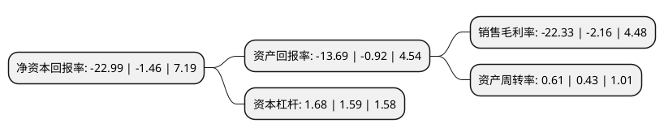

> 本页面由自动化程序生成于 2022年5月20日 01:09
> 内容可能存在错误，如有bug请提交issue至：https://github.com/Eroleice/doc-pi/issues
{.is-warning}

# 上市公司基本情况

## 基本资料

雪松发展股份有限公司（以下简称“*ST雪发”）成立于2003年12月17日，潍坊市。于2010年10月15日在深交所中小板上市。

*ST雪发注册资本54,400万元，主营业务为以自制生产为主，委托加工生产为辅，以直营店和特许加盟店为主，团体订购，贴牌和网上直销为有效补充的生产和销售模式，设计，生产和销售希努尔品牌的西装，衬衫及其它服饰类产品。主要产品为希努尔品牌西装，衬衫及其它服饰类产品。以下是详细信息：

- 公司名称: 雪松发展股份有限公司
- 股票代码: 002485.SZ
- 所在地: 山东 - 潍坊市
- 成立日期: 2003年12月17日
- 注册资本: 54,400万元
- 法定代表人: 范佳昱
- 主营业务: 主营业务为以自制生产为主，委托加工生产为辅，以直营店和特许加盟店为主，团体订购，贴牌和网上直销为有效补充的生产和销售模式，设计，生产和销售希努尔品牌的西装，衬衫及其它服饰类产品主要产品为希努尔品牌西装，衬衫及其它服饰类产品
- 公司官网: www.cedardevt.com
- 公司介绍: 公司是一家集中高档西服、衬衫和服饰产品的设计、生产和销售于一体的企业。公司主要以自制生产为主、委托加工生产为辅，以直营店和特许加盟店为主、团体订购、贴牌和网上直销为有效补充的生产销售模式，设计、生产和销售希努尔品牌的西装、衬衫及其它服饰类产品。公司具有发达的营销终端网络和生产规模优势以及较强的设计研发能力。公司坚持以不断创新的产品和服务满足消费者的需求，推出了一系列在行业内具有创新性和领先性的营销策略，包括终生免费干洗、以旧换新、三件套、量身定制等。通过自身研发力量的投入及对外交流与合作，公司已具有较强的独立创新能力，在运作模式、设计理念和设计水平上位居国内男装行业前列。

## 股东及高管情况

上市公司第一大股东为广州雪松文化旅游投资有限公司，持股346,103,845股，占比63.62%，为上市公司实际控制人。

截至2022年03月31日，上市公司的前十大股东中，共有8名自然人股东，2名机构股东，其中5%以上大股东共有2名。上市公司前十大股东明细如下：

> 截至2022年03月31日，上市公司前十大股东信息如下：

| 股东名称 | 持股数量（股） | 持股比例 |
| --- | --- | --- |
| 广州雪松文化旅游投资有限公司 | 346,103,845 | 63.62% |
| 广州君凯投资有限公司 | 36,364,581 | 6.68% |
| 孟学 | 13,998,836 | 2.57% |
| 刘平 | 8,889,458 | 1.63% |
| 刘申培 | 4,854,003 | 0.89% |
| 李强 | 4,353,767 | 0.8% |
| 熊承英 | 4,153,921 | 0.76% |
| 袁赛薇 | 3,747,972 | 0.69% |
| 施鸿华 | 2,683,512 | 0.49% |
| 朱虹 | 1,672,680 | 0.31% |

## 利润表分析

上市公司2021年总收入为20.16亿元，净利润为-4.51亿元，**未实现盈利**。

## 杜邦分析

> 数据列示周期：2021年 | 2020年 | 2019年
{.is-info}

上市公司的净资产收益率在近一年有所上升，上升幅度为1474.66%，其变化情况分解如下：
- 上市公司的销售毛利率在近一年上升了933.8%，可能是生产效率的提升、商品原材料价格下跌或商品价格的上涨所致。
- 上市公司的资产周转率在近一年上升了41.86%，可能是源自于更快的销售回款或库存管理效果提升。
- 上市公司的财务杠杆比率在近一年上升了5.66%，可能是增加负债扩大生产规模。

