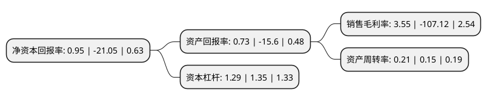

> 本页面由自动化程序生成于 2022年5月20日 01:09
> 内容可能存在错误，如有bug请提交issue至：https://github.com/Eroleice/doc-pi/issues
{.is-warning}

# 上市公司基本情况

## 基本资料

华斯控股股份有限公司（以下简称“华斯股份”）成立于2000年10月27日，沧州市。于2010年11月02日在深交所中小板上市。

华斯股份注册资本38,556.082万元，主营业务包括裘皮服装和饰品的设计，生产及销售;裘皮皮张和裘皮面料的制造和销售。主要产品包括裘皮皮张，裘皮面料，裘皮服装，裘皮饰品。以下是详细信息：

- 公司名称: 华斯控股股份有限公司
- 股票代码: 002494.SZ
- 所在地: 河北 - 沧州市
- 成立日期: 2000年10月27日
- 注册资本: 38,556.082万元
- 法定代表人: 贺国英
- 主营业务: 主营业务包括裘皮服装和饰品的设计，生产及销售;裘皮皮张和裘皮面料的制造和销售主要产品包括裘皮皮张，裘皮面料，裘皮服装，裘皮饰品
- 公司官网: www.huasikonggu.com
- 公司介绍: 公司是一家集裘皮行业完整产业链条于一身的农业产业化国家重点龙头企业和高新技术企业。公司主营业务包括经济特种动物毛皮的深加工和裘皮服饰的设计、制造，具体包括水貂、獭兔、家兔、狐狸、羊皮、貉皮等动物毛皮的收购、鞣制、漂染；裘皮皮张的印花、剪拔深加工和裘皮面料制造；水貂服装、其他裘皮服装、裘皮编制服装和裘布服装和饰品的设计、生产和销售。公司被评为“高新技术企业”、“农业产业化国家重点龙头企业”、“河北省农业产业化经营重点龙头企业”、“全国农产品加工流通大型企业”等荣誉称号。

## 股东及高管情况

上市公司第一大股东为贺国英，持股120,720,374股，占比31.31%，为上市公司实际控制人。

截至2022年03月31日，上市公司的前十大股东中，共有8名自然人股东，2个产品账户，其中5%以上大股东共有1名。上市公司前十大股东明细如下：

> 截至2022年03月31日，上市公司前十大股东信息如下：

| 股东名称 | 持股数量（股） | 持股比例 |
| --- | --- | --- |
| 贺国英 | 120,720,374 | 31.31% |
| 野村东方国际证券-上海纺织(集团)有限公司-野村东方国际日出东方1号单一资产管理计划 | 6,581,354 | 1.71% |
| 郑志华 | 3,262,011 | 0.85% |
| 贺树峰 | 3,108,000 | 0.81% |
| 胡玉兰 | 2,966,900 | 0.77% |
| 甘振芳 | 2,726,100 | 0.71% |
| 贺增党 | 2,062,604 | 0.53% |
| 窦浩兴 | 1,882,400 | 0.49% |
| 北京海燕投资管理有限公司-海燕定向战略3号私募基金 | 1,599,000 | 0.41% |
| 李鹏 | 1,568,048 | 0.41% |

## 利润表分析

上市公司2021年总收入为4.15亿元，净利润为0.14亿元，实现盈利。

## 杜邦分析

> 数据列示周期：2021年 | 2020年 | 2019年
{.is-info}

上市公司的净资产收益率在近一年有所下降，下降幅度为-104.51%，其变化情况分解如下：
- 上市公司的销售毛利率在近一年下降了-103.31%，可能是生产效率的下降、商品原材料价格上涨或商品价格的下跌所致。
- 上市公司的资产周转率在近一年上升了40%，可能是源自于更快的销售回款或库存管理效果提升。
- 上市公司的财务杠杆比率在近一年下降了-4.44%，可能是减少负债降低财务费用。

