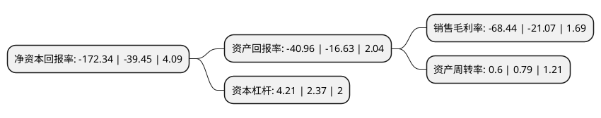

> 本页面由自动化程序生成于 2022年5月20日 01:09
> 内容可能存在错误，如有bug请提交issue至：https://github.com/Eroleice/doc-pi/issues
{.is-warning}

# 上市公司基本情况

## 基本资料

搜于特集团股份有限公司（以下简称“搜于特”）成立于2005年12月05日，东莞市。于2010年11月17日在深交所中小板上市。

搜于特注册资本309,286.825万元，主要产品:“潮流前线”品牌青春休闲服饰，分为淑女，时尚，校园3大系列，包括T恤，衬衣，毛衣，便装，羽绒服，棉衣，针织外套，裤子(包括水洗裤，牛仔裤等)，裙等10大类上百个品种。主营业务:“潮流前线”品牌青春休闲服饰产品的设计与销售。以下是详细信息：

- 公司名称: 搜于特集团股份有限公司
- 股票代码: 002503.SZ
- 所在地: 广东 - 东莞市
- 成立日期: 2005年12月05日
- 注册资本: 309,286.825万元
- 法定代表人: 林朝强
- 主营业务: 主要产品:“潮流前线”品牌青春休闲服饰，分为淑女，时尚，校园3大系列，包括T恤，衬衣，毛衣，便装，羽绒服，棉衣，针织外套，裤子(包括水洗裤，牛仔裤等)，裙等10大类上百个品种主营业务:“潮流前线”品牌青春休闲服饰产品的设计与销售
- 公司官网: www.souyute.com
- 公司介绍: 公司是涵盖休闲服饰品牌运营、供应链管理、品牌管理、互联网金融和对外投资等众多领域的著名时尚产业集团公司，多年上缴国家税收稳居东莞市民营企业前列。近年来，公司为适应服饰市场个性化、差异化、小众化的发展变化，着力规划公司品牌发展新思路。公司通过主抓品牌推广、研发设计和营销渠道建设等服装产业高端环节，将生产加工全部外包的经营模式，走出了一条无污染、低能耗、高产出、可持续的绿色发展之路。公司目前已在全国各个纺织服装集群地设立了多家供应链管理控股子公司、品牌管理控股子公司等，为时尚产业商家客户提供供应链管理服务、品牌管理服务和商业保理服务。通过各个板块业务卓有成效的开展，公司致力于成为中国具有领先优势的时尚生活产业综合服务提供商。

## 股东及高管情况

上市公司第一大股东为马鸿，持股548,113,616股，占比17.72%，**疑似为**上市公司实际控制人。

截至2022年03月31日，上市公司的前十大股东中，共有7名自然人股东，2名机构股东，1个海外主体，其中5%以上大股东共有2名。上市公司前十大股东明细如下：

> 未能通过持股比例判定出上市公司实际控制人（持股30%以上）
> 可能存在通过间接持股、联合持股、协议控制等方式拥有实际控制权的主体，具体请参考上市公司定期公告！
{.is-warning}

> 截至2022年03月31日，上市公司前十大股东信息如下：

| 股东名称 | 持股数量（股） | 持股比例 |
| --- | --- | --- |
| 马鸿 | 548,113,616 | 17.72% |
| 广州高新区投资集团有限公司 | 249,250,540 | 8.06% |
| 邓建华 | 124,237,700 | 4.02% |
| 秦川 | 73,834,614 | 2.39% |
| 广东兴原投资有限公司 | 23,119,149 | 0.75% |
| 张勤俊 | 16,934,800 | 0.55% |
| UBS  AG | 14,950,827 | 0.48% |
| 钟恒光 | 14,193,363 | 0.46% |
| 占学杰 | 8,938,518 | 0.29% |
| 陈永华 | 8,310,000 | 0.27% |

## 利润表分析

上市公司2021年总收入为51.76亿元，净利润为-35.43亿元，**未实现盈利**。

## 杜邦分析

> 数据列示周期：2021年 | 2020年 | 2019年
{.is-info}

上市公司的净资产收益率在近一年有所上升，上升幅度为336.86%，其变化情况分解如下：
- 上市公司的销售毛利率在近一年上升了224.82%，可能是生产效率的提升、商品原材料价格下跌或商品价格的上涨所致。
- 上市公司的资产周转率在近一年下降了-24.05%，可能是源自于更慢的销售回款或库存管理效果下降。
- 上市公司的财务杠杆比率在近一年上升了77.64%，可能是增加负债扩大生产规模。

