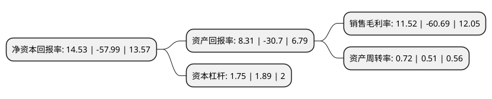

> 本页面由自动化程序生成于 2022年5月20日 01:10
> 内容可能存在错误，如有bug请提交issue至：https://github.com/Eroleice/doc-pi/issues
{.is-warning}

# 上市公司基本情况

## 基本资料

浙江步森服饰股份有限公司（以下简称“ST步森”）成立于2005年06月30日，绍兴市。于2011年04月12日在深交所中小板上市。

ST步森注册资本14,401万元，主营业务为“步森”品牌男装的设计，生产和销售。主要产品包括衬衫，西服，裤装，茄克衫，针织衫等。以下是详细信息：

- 公司名称: 浙江步森服饰股份有限公司
- 股票代码: 002569.SZ
- 所在地: 浙江 - 绍兴市
- 成立日期: 2005年06月30日
- 注册资本: 14,401万元
- 法定代表人: 王雅珠
- 主营业务: 主营业务为“步森”品牌男装的设计，生产和销售主要产品包括衬衫，西服，裤装，茄克衫，针织衫等
- 公司官网: www.busen.cn
- 公司介绍: 公司隶属于步森集团，是男装行业中销售规模较大的企业，是国内为数不多的以自有品牌服装出口的企业。公司主要从事“步森”品牌男士服饰产品的设计、生产和销售，“步森”品牌在国内具有较高的知名度。公司不仅在男装界拥有品牌优势，同时拥有健全的营销网络。公司获得“中国驰名商标(步森商标)”，“中国名牌产品(衬衫)”，“质量卓越企业”等荣誉。公司成立“中国男人身型研究中心”，深化研究中国男士的身型体态，从尺码的贴合感，到着装的心理诉求，以精致上乘的天然质地，独立创新的款式设计，卓越精湛的制衣工艺，创造出“得体”、“有型”的中国男装新格调。

## 股东及高管情况

上市公司第一大股东为北京东方恒正科贸有限公司，持股22,400,000股，占比15.55%，**疑似为**上市公司实际控制人。

截至2022年03月31日，上市公司的前十大股东中，共有3名自然人股东，4名机构股东，3个产品账户，其中5%以上大股东共有2名。上市公司前十大股东明细如下：

> 未能通过持股比例判定出上市公司实际控制人（持股30%以上）
> 可能存在通过间接持股、联合持股、协议控制等方式拥有实际控制权的主体，具体请参考上市公司定期公告！
{.is-warning}

> 截至2022年03月31日，上市公司前十大股东信息如下：

| 股东名称 | 持股数量（股） | 持股比例 |
| --- | --- | --- |
| 北京东方恒正科贸有限公司 | 22,400,000 | 15.55% |
| 上海睿鸷资产管理合伙企业(有限合伙) | 16,720,000 | 11.61% |
| 孟祥龙 | 6,040,000 | 4.19% |
| 张旭 | 5,140,000 | 3.57% |
| 重庆信三威投资咨询中心(有限合伙)-昌盛十一号私募基金 | 4,085,700 | 2.84% |
| 浙江银万斯特投资管理有限公司-银万全盈12号私募证券投资基金 | 3,524,277 | 2.45% |
| 杭州桭源资产管理有限公司-桭源鑫汇16号私募证券投资基金 | 2,976,300 | 2.07% |
| 步森集团有限公司 | 2,670,000 | 1.85% |
| 长城资本管理有限公司 | 2,351,700 | 1.63% |
| 叶美英 | 2,129,400 | 1.48% |

## 利润表分析

上市公司2021年总收入为2.79亿元，净利润为0.32亿元，实现盈利。

## 杜邦分析

> 数据列示周期：2021年 | 2020年 | 2019年
{.is-info}

上市公司的净资产收益率在近一年有所下降，下降幅度为-125.06%，其变化情况分解如下：
- 上市公司的销售毛利率在近一年下降了-118.98%，可能是生产效率的下降、商品原材料价格上涨或商品价格的下跌所致。
- 上市公司的资产周转率在近一年上升了41.18%，可能是源自于更快的销售回款或库存管理效果提升。
- 上市公司的财务杠杆比率在近一年下降了-7.41%，可能是减少负债降低财务费用。

