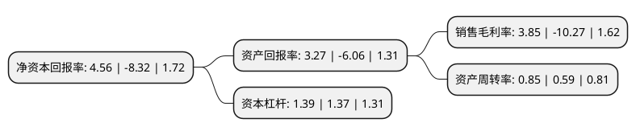

> 本页面由自动化程序生成于 2022年5月20日 01:10
> 内容可能存在错误，如有bug请提交issue至：https://github.com/Eroleice/doc-pi/issues
{.is-warning}

# 上市公司基本情况

## 基本资料

浙江明牌珠宝股份有限公司（以下简称“明牌珠宝”）成立于2002年10月15日，绍兴市。于2011年04月22日在深交所中小板上市。

明牌珠宝注册资本52,800万元，主要产品:黄金饰品，铂金饰品及镶嵌饰品。主要业务:专业从事珠宝首饰的设计，生产和销售。以下是详细信息：

- 公司名称: 浙江明牌珠宝股份有限公司
- 股票代码: 002574.SZ
- 所在地: 浙江 - 绍兴市
- 成立日期: 2002年10月15日
- 注册资本: 52,800万元
- 法定代表人: 虞阿五
- 主营业务: 主要产品:黄金饰品，铂金饰品及镶嵌饰品专业从事珠宝首饰的设计，生产和销售
- 公司官网: www.mingr.com
- 公司介绍: 公司是我国知名珠宝企业之一，全球领先的铂金首饰生产商与零售商，珠宝行业工艺标准制定者之一。公司现已发展成为集研发、设计、生产、销售于一体的大型专业珠宝企业，涵盖钻石、黄金、K金在内的全品类珠宝。公司拥有富于竞争力的品牌、优良的产品品质、广泛的营销网络、持续改进的管理体系，这些是构成公司持续发展的核心竞争力。随着近年来互联网特别是移动互联网的快速发展，公司将积极加快利用互联网进行业务创新与融合，以形成新时代的竞争优势。公司坚持质量、新品优胜战略，从产品研发设计、生产制造工艺等多个层面加强品质管控，确保优良品质，并根据市场需求的变化，主动优化调整产品结构，丰富产品层次，逐步优化消费群体。作为中国珠宝玉石首饰行业协会副会长单位，公司整体综合实力位于珠宝首饰行业前列，品牌拥有较高市场认可度，是中国大陆珠宝首饰行业的知名企业和市场领导者之一。

## 股东及高管情况

上市公司第一大股东为浙江日月首饰集团有限公司，持股158,172,819股，占比29.96%，**疑似为**上市公司实际控制人。

截至2022年03月31日，上市公司的前十大股东中，共有7名自然人股东，3名机构股东，其中5%以上大股东共有2名。上市公司前十大股东明细如下：

> 未能通过持股比例判定出上市公司实际控制人（持股30%以上）
> 可能存在通过间接持股、联合持股、协议控制等方式拥有实际控制权的主体，具体请参考上市公司定期公告！
{.is-warning}

> 截至2022年03月31日，上市公司前十大股东信息如下：

| 股东名称 | 持股数量（股） | 持股比例 |
| --- | --- | --- |
| 浙江日月首饰集团有限公司 | 158,172,819 | 29.96% |
| 永盛国际投资集团有限公司 | 115,103,281 | 21.8% |
| 日月控股有限公司 | 5,984,398 | 1.13% |
| 朱军 | 4,200,000 | 0.8% |
| 孙明伟 | 3,225,200 | 0.61% |
| 张云海 | 2,511,953 | 0.48% |
| 罗卫国 | 1,705,000 | 0.32% |
| 艾照全 | 1,580,983 | 0.3% |
| 翁水平 | 1,259,100 | 0.24% |
| 杜林橙 | 1,192,112 | 0.23% |

## 利润表分析

上市公司2021年总收入为35.82亿元，净利润为1.37亿元，实现盈利。

## 杜邦分析

> 数据列示周期：2021年 | 2020年 | 2019年
{.is-info}

上市公司的净资产收益率在近一年有所下降，下降幅度为-154.81%，其变化情况分解如下：
- 上市公司的销售毛利率在近一年下降了-137.49%，可能是生产效率的下降、商品原材料价格上涨或商品价格的下跌所致。
- 上市公司的资产周转率在近一年上升了44.07%，可能是源自于更快的销售回款或库存管理效果提升。
- 上市公司的财务杠杆比率在近一年上升了1.46%，可能是增加负债扩大生产规模。

