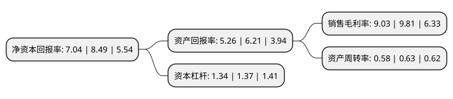

> 本页面由自动化程序生成于 2022年5月20日 01:10
> 内容可能存在错误，如有bug请提交issue至：https://github.com/Eroleice/doc-pi/issues
{.is-warning}

# 上市公司基本情况

## 基本资料

浙江棒杰控股集团股份有限公司（以下简称“棒杰股份”）成立于1993年08月03日，金华市。于2011年12月05日在深交所中小板上市。

棒杰股份注册资本45,935.251万元，主营业务为一直专注于无缝针织技术的深度开发和应用，逐步拥有了独立的研发设计能力和快速高效的规模化生产能力，公司主要产品是无缝服装产品涵盖内衣，运动服装，休闲服装，套装等。以下是详细信息：

- 公司名称: 浙江棒杰控股集团股份有限公司
- 股票代码: 002634.SZ
- 所在地: 浙江 - 金华市
- 成立日期: 1993年08月03日
- 注册资本: 45,935.251万元
- 法定代表人: 陶建伟
- 主营业务: 主营业务为一直专注于无缝针织技术的深度开发和应用，逐步拥有了独立的研发设计能力和快速高效的规模化生产能力，公司主要产品是无缝服装产品涵盖内衣，运动服装，休闲服装，套装等
- 公司官网: www.bangjie.cn
- 公司介绍: 公司是一家专业从事无缝服装设计、研发、织造和营销的现代化企业。公司是全球无缝服装领域重要的产品供应商和应用技术开发商，以ODM/OEM的模式为全球客户提供无缝服装开发设计和生产制造服务。公司拥有“棒杰”、“BAJ”、“法维诗”等多个自主品牌，其中“法维诗”先后被认定为浙江省名牌产品和浙江省著名商标。公司是义乌市无缝织造行业协会的会长单位，中国无缝织造行业标准的主要起草单位。公司与国际主流服装采购商建立了长期合作关系，为C&A、ALDI、NKD、PUMA、M&S等大型服装采购商或高端品牌商提供设计服务，多项产品在全球市场具有很强的竞争力。

## 股东及高管情况

上市公司第一大股东为陶建伟，持股97,237,969股，占比21.17%，**疑似为**上市公司实际控制人。

截至2022年03月31日，上市公司的前十大股东中，共有8名自然人股东，1名机构股东，1个产品账户，其中5%以上大股东共有4名。上市公司前十大股东明细如下：

> 未能通过持股比例判定出上市公司实际控制人（持股30%以上）
> 可能存在通过间接持股、联合持股、协议控制等方式拥有实际控制权的主体，具体请参考上市公司定期公告！
{.is-warning}

> 截至2022年03月31日，上市公司前十大股东信息如下：

| 股东名称 | 持股数量（股） | 持股比例 |
| --- | --- | --- |
| 陶建伟 | 97,237,969 | 21.17% |
| 陶建锋 | 40,446,678 | 8.81% |
| 浙江点创先行航空科技有限公司 | 33,220,932 | 7.23% |
| 金韫之 | 32,412,656 | 7.06% |
| 陶士青 | 19,796,400 | 4.31% |
| 浙江棒杰控股集团股份有限公司-2022年员工持股计划 | 6,600,246 | 1.44% |
| 王晓军 | 3,848,000 | 0.84% |
| 江梓源 | 2,818,480 | 0.61% |
| 张建飞 | 2,353,300 | 0.51% |
| 董国根 | 2,170,000 | 0.47% |

## 利润表分析

上市公司2021年总收入为6.13亿元，净利润为0.55亿元，实现盈利。

## 杜邦分析

> 数据列示周期：2021年 | 2020年 | 2019年
{.is-info}

上市公司的净资产收益率在近一年有所下降，下降幅度为-17.08%，其变化情况分解如下：
- 上市公司的销售毛利率在近一年下降了-7.95%，可能是生产效率的下降、商品原材料价格上涨或商品价格的下跌所致。
- 上市公司的资产周转率在近一年下降了-7.94%，可能是源自于更慢的销售回款或库存管理效果下降。
- 上市公司的财务杠杆比率在近一年下降了-2.19%，可能是减少负债降低财务费用。

