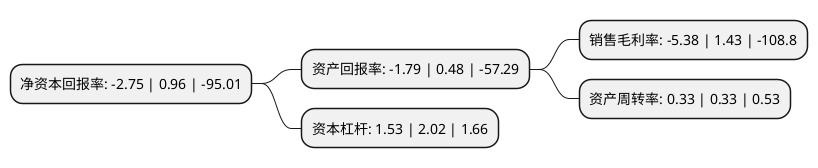

> 本页面由自动化程序生成于 2022年5月20日 01:11
> 内容可能存在错误，如有bug请提交issue至：https://github.com/Eroleice/doc-pi/issues
{.is-warning}

# 上市公司基本情况

## 基本资料

摩登大道时尚集团股份有限公司（以下简称“ST摩登”）成立于2002年07月18日，广州市。于2012年02月28日在深交所中小板上市。

ST摩登注册资本71,251.984万元，主营业务:高级男装服饰的研发设计，品牌推广和零售管理。主要产品是主要经营卡奴迪路(CANUDILO)品牌高级男装服饰，产品分为商旅，假日两大系列，按品类分为西装，衬衫，夹克风衣，T恤，裤子，裘皮，棉褛，皮具和饰品等九大类。以下是详细信息：

- 公司名称: 摩登大道时尚集团股份有限公司
- 股票代码: 002656.SZ
- 所在地: 广东 - 广州市
- 成立日期: 2002年07月18日
- 注册资本: 71,251.984万元
- 法定代表人: 林毅超
- 主营业务: 主营业务:高级男装服饰的研发设计，品牌推广和零售管理主要产品是主要经营卡奴迪路(CANUDILO)品牌高级男装服饰，产品分为商旅，假日两大系列，按品类分为西装，衬衫，夹克风衣，T恤，裤子，裘皮，棉褛，皮具和饰品等九大类
- 公司官网: www.modernavenuegroup.com
- 公司介绍: 公司是一家全球时尚品牌运营商。集团主营业务聚焦服饰箱包、护肤美妆、珠宝配饰等领域。集团以自主品牌、丰富的国际代理品牌和买手店资源为基础，依托多家线下时尚品牌零售店、全渠道电商以及高效供应链，打造线上服务、线下体验的新零售模式，构建中国领先的时尚集团。目前，集团已与苏宁易购、天猫、唯品会、京东、考拉、小红书等电商展开B2B、B2C合作。公司坚持“科学管理、以人为本”的企业管理宗旨，着力营造企业良好的工作氛围和环境，促进公司员工共同追求“责任、诚信、和谐、创新、高效”的价值观。

## 股东及高管情况

上市公司第一大股东为广州普慧源贸易有限公司，持股63,409,343股，占比8.9%，**疑似为**上市公司实际控制人。

截至2022年03月31日，上市公司的前十大股东中，共有7名自然人股东，3名机构股东，其中5%以上大股东共有1名。上市公司前十大股东明细如下：

> 未能通过持股比例判定出上市公司实际控制人（持股30%以上）
> 可能存在通过间接持股、联合持股、协议控制等方式拥有实际控制权的主体，具体请参考上市公司定期公告！
{.is-warning}

> 上市公司第一大股东持股不超过10%，请检查是否存在公司控制权风险！
{.is-danger}

> 截至2022年03月31日，上市公司前十大股东信息如下：

| 股东名称 | 持股数量（股） | 持股比例 |
| --- | --- | --- |
| 广州普慧源贸易有限公司 | 63,409,343 | 8.9% |
| 广州瑞丰集团股份有限公司 | 32,178,914 | 4.52% |
| 翁华银 | 25,765,574 | 3.62% |
| 江德湖 | 25,765,574 | 3.62% |
| 广东佳盟商贸有限公司 | 23,752,212 | 3.33% |
| 李恩平 | 23,446,674 | 3.29% |
| 李蔚 | 23,191,109 | 3.25% |
| 翁武游 | 19,200,000 | 2.69% |
| 林永飞 | 18,800,000 | 2.64% |
| 何琳 | 18,035,902 | 2.53% |

## 利润表分析

上市公司2021年总收入为3.85亿元，净利润为-0.21亿元，**未实现盈利**。

## 杜邦分析

> 数据列示周期：2021年 | 2020年 | 2019年
{.is-info}

上市公司的净资产收益率在近一年有所下降，下降幅度为-386.46%，其变化情况分解如下：
- 上市公司的销售毛利率在近一年下降了-476.22%，可能是生产效率的下降、商品原材料价格上涨或商品价格的下跌所致。
- 上市公司的资产周转率在近一年下降了0%，可能是源自于更慢的销售回款或库存管理效果下降。
- 上市公司的财务杠杆比率在近一年下降了-24.26%，可能是减少负债降低财务费用。

