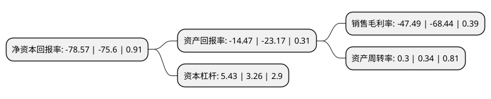

> 本页面由自动化程序生成于 2022年5月20日 01:11
> 内容可能存在错误，如有bug请提交issue至：https://github.com/Eroleice/doc-pi/issues
{.is-warning}

# 上市公司基本情况

## 基本资料

北京金一文化发展股份有限公司（以下简称“金一文化”）成立于2007年11月26日，北京市。于2014年01月27日在深交所中小板上市。

金一文化注册资本95,992.588万元，主营业务包括贵金属工艺品，珠宝首饰的研发设计，生产及销售。以下是详细信息：

- 公司名称: 北京金一文化发展股份有限公司
- 股票代码: 002721.SZ
- 所在地: 北京 - 北京市
- 成立日期: 2007年11月26日
- 注册资本: 95,992.588万元
- 法定代表人: 王晓峰
- 主营业务: 主营业务包括贵金属工艺品，珠宝首饰的研发设计，生产及销售
- 公司官网: www.king1.com.cn
- 公司介绍: 公司是从事贵金属工艺品的研发设计、外包生产和销售的企业。公司上市后，不断拓展多元化的经营模式，在中国黄金珠宝首饰行业包括批发、零售、供应链服务等行业上下游进行战略布局，通过“内生生长＋外延并购”，构建一条较为完整的黄金珠宝产业链。公司定位于产业链中附加值较高的研发和销售环节，生产环节则采用委托加工方式。公司以金、银等贵金属为载体，立足于中华五千年璀璨传统文化，秉承“让黄金讲述文化，让文化诠释黄金”的产品研发理念，围绕“创艺见真金”的品牌定位，以“金一”品牌，不断开发出创意独特、品质卓越的贵金属工艺品，逐渐开拓了中国贵金属工艺品行业的新领域。公司是北京市设计产业联盟第一届理事单位、“2016年度中国黄金珠宝销售收入十大企业”、北京科委认定的“北京市设计创新中心”，公司子公司深圳金一为“2016年度深圳连锁经营50强企业”、“2016年度深圳连锁品牌专卖30强企业”。

## 股东及高管情况

上市公司第一大股东为北京海鑫资产管理有限公司，持股287,749,422股，占比29.9762%，**疑似为**上市公司实际控制人。

截至2022年05月06日，上市公司的前十大股东中，共有5名自然人股东，5名机构股东，其中5%以上大股东共有3名。上市公司前十大股东明细如下：

> 未能通过持股比例判定出上市公司实际控制人（持股30%以上）
> 可能存在通过间接持股、联合持股、协议控制等方式拥有实际控制权的主体，具体请参考上市公司定期公告！
{.is-warning}

> 截至2022年05月06日，上市公司前十大股东信息如下：

| 股东名称 | 持股数量（股） | 持股比例 |
| --- | --- | --- |
| 北京海鑫资产管理有限公司 | 287,749,422 | 29.9762% |
| 北京海鑫资产管理有限公司 | 287,749,422 | 29.98% |
| 钟葱 | 75,328,130 | 7.8473% |
| 陈宝芳 | 41,758,638 | 4.35% |
| 陈宝康 | 33,570,000 | 3.5% |
| 张广顺 | 14,344,167 | 1.49% |
| 黄奕彬 | 14,004,876 | 1.46% |
| 新余市道宁投资有限公司 | 7,817,496 | 0.81% |
| 绍兴越王投资发展有限公司 | 7,808,802 | 0.81% |
| 天鑫洋实业有限责任公司 | 7,098,912 | 0.74% |

## 利润表分析

上市公司2021年总收入为29.5亿元，净利润为-14.02亿元，**未实现盈利**。

## 杜邦分析

> 数据列示周期：2021年 | 2020年 | 2019年
{.is-info}

上市公司的净资产收益率在近一年有所上升，上升幅度为3.93%，其变化情况分解如下：
- 上市公司的销售毛利率在近一年下降了-30.61%，可能是生产效率的下降、商品原材料价格上涨或商品价格的下跌所致。
- 上市公司的资产周转率在近一年下降了-11.76%，可能是源自于更慢的销售回款或库存管理效果下降。
- 上市公司的财务杠杆比率在近一年上升了66.56%，可能是增加负债扩大生产规模。

