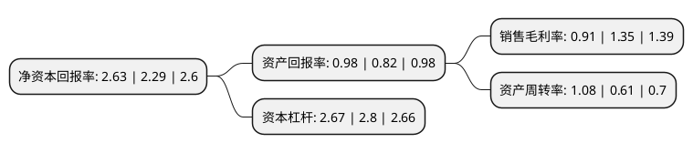

> 本页面由自动化程序生成于 2022年5月20日 01:11
> 内容可能存在错误，如有bug请提交issue至：https://github.com/Eroleice/doc-pi/issues
{.is-warning}

# 上市公司基本情况

## 基本资料

沈阳萃华金银珠宝股份有限公司（以下简称“萃华珠宝”）成立于1985年01月05日，沈阳市。于2014年11月04日在深交所中小板上市。

萃华珠宝注册资本25,615.6万元，主要产品:以黄金饰品为主，兼营铂金饰品，镶嵌饰品等珠宝饰品。主要业务:珠宝饰品设计，加工，批发和零售。以下是详细信息：

- 公司名称: 沈阳萃华金银珠宝股份有限公司
- 股票代码: 002731.SZ
- 所在地: 辽宁 - 沈阳市
- 成立日期: 1985年01月05日
- 注册资本: 25,615.6万元
- 法定代表人: 郭英杰
- 主营业务: 主要产品:以黄金饰品为主，兼营铂金饰品，镶嵌饰品等珠宝饰品珠宝饰品设计，加工，批发和零售
- 公司官网: www.chjd.com.cn
- 公司介绍: 公司根植于数千年中华文化精髓，承袭皇室珠宝传统工艺，以“缔造经典，引领时尚”的品牌调性成为当今中国珠宝潮流风向标，是近代中国珠宝史的经典标志之一。公司是主要从事珠宝饰品设计、加工、批发和零售的“中华老字号”企业，拥有“前店后厂”的优势，同时具有专业的设计团队。产品以黄金饰品为主，兼营铂金饰品、镶嵌饰品等珠宝饰品。公司是我国贵金属首饰质量标准最早的主要起草制定单位之一，是“全国黄金行业先进集体”、是中宝协“企业信用评价AAA级信用企业”，是中国珠宝玉石首饰协会副会长单位、中国黄金协会常务理事单位、沈阳市金银珠宝首饰协会会长单位、沈阳老字号协会会长单位，是上海黄金交易所会员单位；在行业中率先通过ISO9001产品质量管理体系、ISO14001环境管理体系、ISO10012测量管理体系的认证；萃华牌黄金首饰是“中国珠宝首饰业驰名品牌”，获得了多项国家专利；“萃华”商标被认定为“中国驰名商标”；萃华金店被中国珠宝玉石首饰行业协会评为“放心示范店”，并且连续多年被评为“中国消费者协会诚信单位”。

## 股东及高管情况

上市公司第一大股东为深圳市翠艺投资有限公司，持股47,973,592股，占比18.73%，**疑似为**上市公司实际控制人。

截至2022年03月31日，上市公司的前十大股东中，共有8名自然人股东，2名机构股东，其中5%以上大股东共有4名。上市公司前十大股东明细如下：

> 未能通过持股比例判定出上市公司实际控制人（持股30%以上）
> 可能存在通过间接持股、联合持股、协议控制等方式拥有实际控制权的主体，具体请参考上市公司定期公告！
{.is-warning}

> 截至2022年03月31日，上市公司前十大股东信息如下：

| 股东名称 | 持股数量（股） | 持股比例 |
| --- | --- | --- |
| 深圳市翠艺投资有限公司 | 47,973,592 | 18.73% |
| 郭英杰 | 16,456,000 | 6.42% |
| 上海鸿潮企业管理合伙企业(有限合伙) | 16,393,984 | 6.4% |
| 何颖琳 | 13,832,424 | 5.4% |
| 马俊豪 | 10,217,978 | 3.99% |
| 郭琼雁 | 9,836,190 | 3.84% |
| 郭裕春 | 6,120,000 | 2.39% |
| 方嘉凯 | 3,890,450 | 1.52% |
| 朱映君 | 2,071,620 | 0.81% |
| 周应龙 | 1,608,725 | 0.63% |

## 利润表分析

上市公司2021年总收入为36.8亿元，净利润为0.33亿元，实现盈利。

## 杜邦分析

> 数据列示周期：2021年 | 2020年 | 2019年
{.is-info}

上市公司的净资产收益率在近一年有所上升，上升幅度为14.85%，其变化情况分解如下：
- 上市公司的销售毛利率在近一年下降了-32.59%，可能是生产效率的下降、商品原材料价格上涨或商品价格的下跌所致。
- 上市公司的资产周转率在近一年上升了77.05%，可能是源自于更快的销售回款或库存管理效果提升。
- 上市公司的财务杠杆比率在近一年下降了-4.64%，可能是减少负债降低财务费用。

