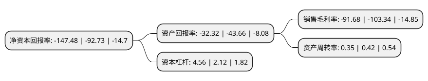

> 本页面由自动化程序生成于 2022年5月20日 01:11
> 内容可能存在错误，如有bug请提交issue至：https://github.com/Eroleice/doc-pi/issues
{.is-warning}

# 上市公司基本情况

## 基本资料

福建省爱迪尔珠宝实业股份有限公司（以下简称“ST爱迪尔”）成立于2001年08月16日，龙岩市。于2015年01月22日在深交所中小板上市。

ST爱迪尔注册资本45,406.108万元，集珠宝首饰产品设计生产加工，品牌连锁为一体的珠宝企业，采用加盟商加盟销售和非加盟商经销销售相结合的业务模式，开展“IDEAL”品牌珠宝首饰的设计，生产与销售，主要产品为钻石镶嵌饰品以下是详细信息：

- 公司名称: 福建省爱迪尔珠宝实业股份有限公司
- 股票代码: 002740.SZ
- 所在地: 福建 - 龙岩市
- 成立日期: 2001年08月16日
- 注册资本: 45,406.108万元
- 法定代表人: 李勇
- 主营业务: 集珠宝首饰产品设计生产加工，品牌连锁为一体的珠宝企业，采用加盟商加盟销售和非加盟商经销销售相结合的业务模式，开展“IDEAL”品牌珠宝首饰的设计，生产与销售，主要产品为钻石镶嵌饰品
- 公司官网: www.idr.com.cn
- 公司介绍: 公司是集珠宝首饰产品设计研发、生产加工、品牌连锁为一体的知名珠宝品牌企业，主要采用加盟商加盟销售和非加盟商经销销售相结合的业务模式，开展“IDEAL”品牌珠宝首饰的设计、生产与销售，主导产品为钻石镶嵌饰品。公司与印度H.K、奥地利SWAROVSKI以及国际铂金协会、国际钯金协会等国际公司和组织结成市场战略合作伙伴；与中国地质大学(武汉)等多家高校联合举办“爱迪尔珠宝班”，结成人才战略合作伙伴；与中国关心下一代工作委员会公益文化中心、《深圳青年》杂志社等结成“关爱”文化战略合作伙伴。公司已经发展成为以优秀文化著称的、当今中国最具发展潜力的珠宝企业之一。公司坚持以“关爱”为注脚点、以“非凡”为制高点的文化方向，坚持“以品牌建设为中心，构建科学的管理体系、优秀的共赢团队和优质的市场网络，成为以关爱指导服务的非凡公司”的战略方针，开启发展新征程，创造国际化、大平台、多品牌运营的风景线。

## 股东及高管情况

上市公司第一大股东为苏日明，持股64,243,174股，占比14.15%，**疑似为**上市公司实际控制人。

截至2022年03月31日，上市公司的前十大股东中，共有7名自然人股东，3名机构股东，其中5%以上大股东共有4名。上市公司前十大股东明细如下：

> 未能通过持股比例判定出上市公司实际控制人（持股30%以上）
> 可能存在通过间接持股、联合持股、协议控制等方式拥有实际控制权的主体，具体请参考上市公司定期公告！
{.is-warning}

> 截至2022年03月31日，上市公司前十大股东信息如下：

| 股东名称 | 持股数量（股） | 持股比例 |
| --- | --- | --- |
| 苏日明 | 64,243,174 | 14.15% |
| 李勇 | 38,066,490 | 8.38% |
| 龙岩文旅汇金发展集团有限公司 | 27,154,941 | 5.98% |
| 陈茂森 | 27,017,893 | 5.95% |
| 狄爱玲 | 19,298,823 | 4.25% |
| 成都市浪漫克拉钻石设计中心(有限合伙) | 12,229,128 | 2.69% |
| 李题 | 9,700,038 | 2.14% |
| 王均霞 | 9,623,072 | 2.12% |
| 龙岩市永盛发展有限公司 | 7,760,000 | 1.71% |
| 陈曙光 | 7,504,970 | 1.65% |

## 利润表分析

上市公司2021年总收入为8.41亿元，净利润为-7.72亿元，**未实现盈利**。

## 杜邦分析

> 数据列示周期：2021年 | 2020年 | 2019年
{.is-info}

上市公司的净资产收益率在近一年有所上升，上升幅度为59.04%，其变化情况分解如下：
- 上市公司的销售毛利率在近一年下降了-11.28%，可能是生产效率的下降、商品原材料价格上涨或商品价格的下跌所致。
- 上市公司的资产周转率在近一年下降了-16.67%，可能是源自于更慢的销售回款或库存管理效果下降。
- 上市公司的财务杠杆比率在近一年上升了115.09%，可能是增加负债扩大生产规模。

