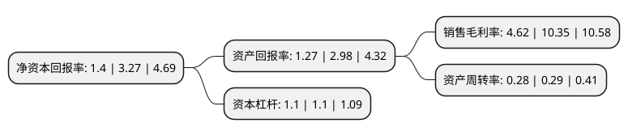

> 本页面由自动化程序生成于 2022年5月20日 01:11
> 内容可能存在错误，如有bug请提交issue至：https://github.com/Eroleice/doc-pi/issues
{.is-warning}

# 上市公司基本情况

## 基本资料

金发拉比妇婴童用品股份有限公司（以下简称“金发拉比”）成立于1996年08月02日，汕头市。于2015年06月10日在深交所中小板上市。

金发拉比注册资本35,402.5万元，主要产品:公司产品主要分为婴幼儿服饰棉品和婴幼儿日用品，品类包括婴幼儿居家，外出所需的服装，配饰及棉品，以及寝具，哺育，卫浴，洗护等一系列日常用品，同时也为孕产期女性提供专业的孕产妇用品。主营业务:公司是从事婴幼儿消费品的设计研发，生产和销售。以下是详细信息：

- 公司名称: 金发拉比妇婴童用品股份有限公司
- 股票代码: 002762.SZ
- 所在地: 广东 - 汕头市
- 成立日期: 1996年08月02日
- 注册资本: 35,402.5万元
- 法定代表人: 林浩亮
- 主营业务: 主要产品:公司产品主要分为婴幼儿服饰棉品和婴幼儿日用品，品类包括婴幼儿居家，外出所需的服装，配饰及棉品，以及寝具，哺育，卫浴，洗护等一系列日常用品，同时也为孕产期女性提供专业的孕产妇用品主营业务:公司是从事婴幼儿消费品的设计研发，生产和销售
- 公司官网: www.jflabi.com
- 公司介绍: 公司是国内最早从事婴幼儿服饰棉品及日用品的设计研发、生产、销售的企业之一，中国A股市场专业从事母婴产品和服务的上市公司。公司以优质产品夯实基础、以多元品牌驱动市场、以合作共赢拓展渠道，已成为国内领先的婴幼儿消费品品牌运营商。公司多年来专注于经营“穿”、“用”两类婴幼儿消费品，主要包括婴幼儿服饰棉品(内着服饰、外出服饰、家居棉品)、婴幼儿日用品(寝具、哺育、卫浴、洗护用品)以及孕产妇用品等。公司每年持续加大研发设计投入，不断创新、丰富产品品类和产品功能。公司始终秉承“绿色自然，安全舒适”的理念，制订高于国家和行业标准的企业标准，建立严密有效的品质管控体系，把严格的质量检测渗透到每个生产物流环节，确保产品有高标准的亲肤舒适性和触肤安全性。

## 股东及高管情况

上市公司第一大股东为林浩亮，持股107,248,750股，占比30.29%，为上市公司实际控制人。

截至2022年03月31日，上市公司的前十大股东中，共有10名自然人股东，其中5%以上大股东共有2名。上市公司前十大股东明细如下：

> 截至2022年03月31日，上市公司前十大股东信息如下：

| 股东名称 | 持股数量（股） | 持股比例 |
| --- | --- | --- |
| 林浩亮 | 107,248,750 | 30.29% |
| 林若文 | 91,887,098 | 25.95% |
| 陈迅 | 2,154,970 | 0.61% |
| 孙豫 | 1,679,425 | 0.47% |
| 贝旭 | 950,800 | 0.27% |
| 徐芬 | 823,200 | 0.23% |
| 孟凡武 | 661,500 | 0.19% |
| 林广 | 500,000 | 0.14% |
| 张昌盛 | 473,900 | 0.13% |
| 王寿春 | 438,600 | 0.12% |

## 利润表分析

上市公司2021年总收入为2.99亿元，净利润为0.13亿元，实现盈利。

## 杜邦分析

> 数据列示周期：2021年 | 2020年 | 2019年
{.is-info}

上市公司的净资产收益率在近一年有所下降，下降幅度为-57.19%，其变化情况分解如下：
- 上市公司的销售毛利率在近一年下降了-55.36%，可能是生产效率的下降、商品原材料价格上涨或商品价格的下跌所致。
- 上市公司的资产周转率在近一年下降了-3.45%，可能是源自于更慢的销售回款或库存管理效果下降。
- 上市公司的财务杠杆比率在近一年下降了0%，可能是减少负债降低财务费用。

