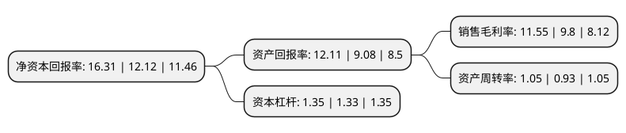

> 本页面由自动化程序生成于 2022年5月20日 01:11
> 内容可能存在错误，如有bug请提交issue至：https://github.com/Eroleice/doc-pi/issues
{.is-warning}

# 上市公司基本情况

## 基本资料

深圳汇洁集团股份有限公司（以下简称“汇洁股份”）成立于2007年08月29日，深圳市。于2015年06月10日在深交所中小板上市。

汇洁股份注册资本41,002.5万元，公司是专业从事内衣人体工学研究，工艺技术研究，品牌策划推广，开发设计，生产制造，市场营销的综合性内衣企业。主要产品是“曼妮芬”，“伊维斯”，“兰卓丽”三个主要品牌的文胸，内裤，保暖衣及功能性内衣等产品。以下是详细信息：

- 公司名称: 深圳汇洁集团股份有限公司
- 股票代码: 002763.SZ
- 所在地: 广东 - 深圳市
- 成立日期: 2007年08月29日
- 注册资本: 41,002.5万元
- 法定代表人: 吕兴平
- 主营业务: 公司是专业从事内衣人体工学研究，工艺技术研究，品牌策划推广，开发设计，生产制造，市场营销的综合性内衣企业主要产品是“曼妮芬”，“伊维斯”，“兰卓丽”三个主要品牌的文胸，内裤，保暖衣及功能性内衣等产品
- 公司官网: www.huijiegroup.com
- 公司介绍: 公司是一家专业从事内衣人体工学研究、产品设计、生产制造、市场营销、品牌推广的公司。公司产品涵括男士、女士、儿童内衣，家居，功能，保暖，泳衣及配饰，女士美妆等。公司在上海、北京、深圳和巴黎等地均都设有设计中心，拥有行业专利多项，被认定为深圳市企业技术中心。公司捐赠设立了深圳市汇洁爱心基金会，资助贫困乳腺癌患者及贫困学生，支持教育事业发展。

## 股东及高管情况

上市公司第一大股东为吕兴平，持股138,425,400股，占比33.76%，为上市公司实际控制人。

截至2022年03月31日，上市公司的前十大股东中，共有6名自然人股东，4个产品账户，其中5%以上大股东共有2名。上市公司前十大股东明细如下：

> 截至2022年03月31日，上市公司前十大股东信息如下：

| 股东名称 | 持股数量（股） | 持股比例 |
| --- | --- | --- |
| 吕兴平 | 138,425,400 | 33.76% |
| 林升智 | 133,194,600 | 32.48% |
| 中国工商银行股份有限公司-富国中证红利指数增强型证券投资基金 | 5,570,120 | 1.36% |
| 中国建设银行股份有限公司-大成中证红利指数证券投资基金 | 5,202,940 | 1.27% |
| 朱莉 | 3,124,580 | 0.76% |
| 何松春 | 2,990,000 | 0.73% |
| 中国银行股份有限公司-易方达中证红利交易型开放式指数证券投资基金 | 2,603,500 | 0.63% |
| 李成弟 | 2,182,040 | 0.53% |
| 袁建良 | 1,440,400 | 0.35% |
| 上海浦东发展银行股份有限公司-招商中证红利交易型开放式指数证券投资基金 | 1,415,000 | 0.35% |

## 利润表分析

上市公司2021年总收入为27.33亿元，净利润为3.15亿元，实现盈利。

## 杜邦分析

> 数据列示周期：2021年 | 2020年 | 2019年
{.is-info}

上市公司的净资产收益率在近一年有所上升，上升幅度为34.57%，其变化情况分解如下：
- 上市公司的销售毛利率在近一年上升了17.86%，可能是生产效率的提升、商品原材料价格下跌或商品价格的上涨所致。
- 上市公司的资产周转率在近一年上升了12.9%，可能是源自于更快的销售回款或库存管理效果提升。
- 上市公司的财务杠杆比率在近一年上升了1.5%，可能是增加负债扩大生产规模。

