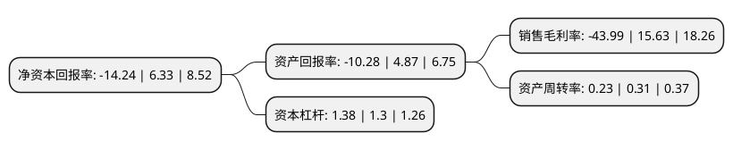

> 本页面由自动化程序生成于 2022年5月20日 01:12
> 内容可能存在错误，如有bug请提交issue至：https://github.com/Eroleice/doc-pi/issues
{.is-warning}

# 上市公司基本情况

## 基本资料

广东柏堡龙股份有限公司（以下简称“ST柏龙”）成立于2006年11月29日，揭阳市。于2015年06月26日在深交所中小板上市。

ST柏龙注册资本53,798.911万元，主营业务;公司是一家专注于服装设计，同时根据客户要求对公司设计款式提供配套组织生产服务的专业设计企业。主要提供服装款式设计，面料研发，印绣花设计，制版打样等一站式设计服务，同时根据客户要求提供配套组织生产服务。以下是详细信息：

- 公司名称: 广东柏堡龙股份有限公司
- 股票代码: 002776.SZ
- 所在地: 广东 - 揭阳市
- 成立日期: 2006年11月29日
- 注册资本: 53,798.911万元
- 法定代表人: 陈伟雄
- 主营业务: 主营业务;公司是一家专注于服装设计，同时根据客户要求对公司设计款式提供配套组织生产服务的专业设计企业主要提供服装款式设计，面料研发，印绣花设计，制版打样等一站式设计服务，同时根据客户要求提供配套组织生产服务
- 公司官网: www.bobaolon.net
- 公司介绍: 公司是一家专注于服装设计，同时根据客户需求对公司设计款式提供配套组织生产服务的文化创意和设计服务企业。公司契合服装行业终端“快时尚”趋势，塑造了“快速、多款、少量、时尚”的运营模式，即着力控制前导时间，强调快速设计、快速组织生产，使得客户可以快速更新产品；持续滚动开发新款式，以“多款、少量”取代“少款、多量”的传统经营模式，迎合消费者多样化和时尚性的个性需求，减少客户的存货风险和折扣促销成本。公司为高新技术企业、中国服装设计师协会单位会员、中国工业设计协会团体会员，中国针织工业协会在公司设立了中国针织文化衫创意与设计中心。公司曾获得广东省经济和信息化委员会主办的“省长杯”首届服装设计专项赛一等奖；广东省版权局授予公司“广东省版权兴业示范基地”称号；公司的商标被广东省工商行政管理局认定为“广东省著名商标”。

## 股东及高管情况

上市公司第一大股东为陈伟雄，持股125,751,987股，占比23.37%，**疑似为**上市公司实际控制人。

截至2021年09月30日，上市公司的前十大股东中，共有8名自然人股东，2个产品账户，其中5%以上大股东共有2名。上市公司前十大股东明细如下：

> 未能通过持股比例判定出上市公司实际控制人（持股30%以上）
> 可能存在通过间接持股、联合持股、协议控制等方式拥有实际控制权的主体，具体请参考上市公司定期公告！
{.is-warning}

> 截至2021年09月30日，上市公司前十大股东信息如下：

| 股东名称 | 持股数量（股） | 持股比例 |
| --- | --- | --- |
| 陈伟雄 | 125,751,987 | 23.37% |
| 陈娜娜 | 79,349,026 | 14.75% |
| 浙商财富(北京)投资基金管理有限公司-浙商投资合旭1号私募证券投资基金 | 17,213,300 | 3.2% |
| 浙江品润投资管理有限公司-品润FOF品人2期私募证券投资基金 | 9,571,198 | 1.78% |
| 王希坪 | 6,401,112 | 1.19% |
| 马国斌 | 3,768,000 | 0.7% |
| 姚润雄 | 3,409,812 | 0.63% |
| 张祥林 | 3,206,050 | 0.6% |
| 曾友兰 | 2,655,900 | 0.49% |
| 杨春梅 | 2,645,795 | 0.49% |

## 杜邦分析

> 数据列示周期：2020年 | 2019年 | 2018年
{.is-info}

上市公司的净资产收益率在近一年有所下降，下降幅度为-324.96%，其变化情况分解如下：
- 上市公司的销售毛利率在近一年下降了-381.45%，可能是生产效率的下降、商品原材料价格上涨或商品价格的下跌所致。
- 上市公司的资产周转率在近一年下降了-25.81%，可能是源自于更慢的销售回款或库存管理效果下降。
- 上市公司的财务杠杆比率在近一年上升了6.15%，可能是增加负债扩大生产规模。

