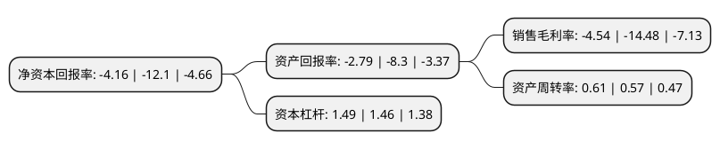

> 本页面由自动化程序生成于 2022年5月20日 01:12
> 内容可能存在错误，如有bug请提交issue至：https://github.com/Eroleice/doc-pi/issues
{.is-warning}

# 上市公司基本情况

## 基本资料

北京三夫户外用品股份有限公司（以下简称“三夫户外”）成立于2001年06月22日，北京市。于2015年12月09日在深交所中小板上市。

三夫户外注册资本15,758.749万元，主要产品:户外服装，户外鞋袜及户外装备三大类，主营业务为户外用品的销售，是以经营专业户外用品为主，大众户外用品为辅，线下线上同步发展，各门店全资直营的户外用品多渠道连锁零售商。以下是详细信息：

- 公司名称: 北京三夫户外用品股份有限公司
- 股票代码: 002780.SZ
- 所在地: 北京 - 北京市
- 成立日期: 2001年06月22日
- 注册资本: 15,758.749万元
- 法定代表人: 张恒
- 主营业务: 主要产品:户外服装，户外鞋袜及户外装备三大类，主营业务为户外用品的销售，是以经营专业户外用品为主，大众户外用品为辅，线下线上同步发展，各门店全资直营的户外用品多渠道连锁零售商
- 公司官网: www.sanfo.com
- 公司介绍: 公司的主营业务为户外用品的连锁零售。目前在北京、上海、南京、杭州、成都、深圳、沈阳、长春、青岛、石家庄、苏州、无锡等核心城市拥有多家国际一流水准的户外专营店，充分满足户外爱好者对野营、登山、攀岩、跑步、滑雪、自行车、自驾车、休闲旅行等活动的一站式购物需求。公司在全国范围内组织开展不同级别的专业越野跑赛事、铁人三项赛、公路马拉松、场地障碍赛等各类赛事。公司每周开展多条不同强度的户外AA制活动，定期开展户外基础培训知识讲座、徒步联盟、户外联欢、高海拔登山、远足徒步、自驾越野、休闲旅游等各类户外活动。公司已在全国陆续启动国家级示范营地设计建设项目，并将逐步建成全国性营地网络。和诸多国际国内相关机构合作，构筑国际化营地教育体系，力求打造具有世界影响力的国际一流户外运动综合营地。公司被中纺协评为“中国名店”，并连续多年被中国登山协会授予“全国十佳户外运动俱乐部”。

## 股东及高管情况

上市公司第一大股东为张恒，持股32,676,248股，占比20.74%，**疑似为**上市公司实际控制人。

截至2022年03月31日，上市公司的前十大股东中，共有8名自然人股东，2个产品账户，其中5%以上大股东共有1名。上市公司前十大股东明细如下：

> 未能通过持股比例判定出上市公司实际控制人（持股30%以上）
> 可能存在通过间接持股、联合持股、协议控制等方式拥有实际控制权的主体，具体请参考上市公司定期公告！
{.is-warning}

> 截至2022年03月31日，上市公司前十大股东信息如下：

| 股东名称 | 持股数量（股） | 持股比例 |
| --- | --- | --- |
| 张恒 | 32,676,248 | 20.74% |
| 北京熙诚金睿股权投资基金管理有限公司-北京新动力优质企业发展基金(有限合伙) | 6,325,110 | 4.01% |
| 上海春山新棠投资管理有限公司-春山新棠事件驱动型私募投资基金 | 6,189,252 | 3.93% |
| 孙雷 | 3,220,648 | 2.04% |
| 赵栋伟 | 2,044,059 | 1.3% |
| 李敬芳 | 1,325,145 | 0.84% |
| 王旸 | 1,276,908 | 0.81% |
| 刘世芳 | 1,072,017 | 0.68% |
| 王淑月 | 997,100 | 0.63% |
| 李峰 | 995,600 | 0.63% |

## 利润表分析

上市公司2021年总收入为5.55亿元，净利润为-0.26亿元，**未实现盈利**。

## 杜邦分析

> 数据列示周期：2021年 | 2020年 | 2019年
{.is-info}

上市公司的净资产收益率在近一年有所下降，下降幅度为-65.62%，其变化情况分解如下：
- 上市公司的销售毛利率在近一年下降了-68.65%，可能是生产效率的下降、商品原材料价格上涨或商品价格的下跌所致。
- 上市公司的资产周转率在近一年上升了7.02%，可能是源自于更快的销售回款或库存管理效果提升。
- 上市公司的财务杠杆比率在近一年上升了2.05%，可能是增加负债扩大生产规模。

