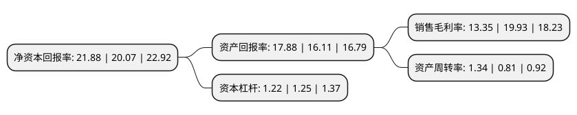

> 本页面由自动化程序生成于 2022年5月20日 01:12
> 内容可能存在错误，如有bug请提交issue至：https://github.com/Eroleice/doc-pi/issues
{.is-warning}

# 上市公司基本情况

## 基本资料

周大生珠宝股份有限公司（以下简称“周大生”）成立于2007年10月15日，深圳市。于2017年04月27日在深交所中小板上市。

周大生注册资本109,607.984万元，主要产品包括钻石镶嵌首饰，素金首饰。主营业务:公司从事“周大生”品牌珠宝首饰的设计，推广和连锁经营，是国内最具规模的珠宝品牌运营商之一。以下是详细信息：

- 公司名称: 周大生珠宝股份有限公司
- 股票代码: 002867.SZ
- 所在地: 广东 - 深圳市
- 成立日期: 2007年10月15日
- 注册资本: 109,607.984万元
- 法定代表人: 周宗文
- 主营业务: 主要产品包括钻石镶嵌首饰，素金首饰主营业务:公司从事“周大生”品牌珠宝首饰的设计，推广和连锁经营，是国内最具规模的珠宝品牌运营商之一
- 公司官网: www.chowtaiseng.com
- 公司介绍: 公司从事“周大生”品牌珠宝首饰的设计、推广和连锁经营，是国内最具规模的珠宝品牌运营商之一。“周大生”是全国中高端主流市场钻石珠宝领先品牌，主要产品包括钻石镶嵌首饰、素金首饰。公司连锁网络由营运管理网络、业务拓展网络、培训辅导网络、督导监察网络、整合营销网络、物流配送网络、ERP应用网络等7大网络构成，采取轻资产、整合运营型经营策略，专注于品牌运营、渠道管理、产品研发和供应链整合，不断提升品牌形象和影响力，实现公司的快速发展。公司始终坚持“为消费者传递美丽奉献爱心”的品牌理念，通过深入研究消费者情感文化、个性特征、装扮风格、场景需求，提出“引领情景风格珠宝新潮流”的全新产品定位，塑造周大生非凡的产品价值，为消费者带来驾驭多变情景的风格珠宝首饰。

## 股东及高管情况

上市公司第一大股东为深圳市周氏投资有限公司，持股609,018,750股，占比55.56%，为上市公司实际控制人。

截至2022年03月31日，上市公司的前十大股东中，共有3名自然人股东，2名机构股东，4个产品账户，1个海外主体，其中5%以上大股东共有2名。上市公司前十大股东明细如下：

> 截至2022年03月31日，上市公司前十大股东信息如下：

| 股东名称 | 持股数量（股） | 持股比例 |
| --- | --- | --- |
| 深圳市周氏投资有限公司 | 609,018,750 | 55.56% |
| 深圳市金大元投资有限公司 | 78,833,142 | 7.19% |
| 全国社保基金一零一组合 | 18,149,391 | 1.66% |
| 中信证券股份有限公司-社保基金1106组合 | 10,587,540 | 0.97% |
| 香港中央结算有限公司(陆股通) | 10,377,102 | 0.95% |
| 广发基金管理有限公司-社保基金四二零组合 | 9,493,755 | 0.87% |
| 兴业银行股份有限公司-富国兴远优选12个月持有期混合型证券投资基金 | 6,573,988 | 0.6% |
| 向钢 | 4,876,422 | 0.44% |
| 周华珍 | 4,876,422 | 0.44% |
| 卞凌 | 4,876,422 | 0.44% |

## 利润表分析

上市公司2021年总收入为91.55亿元，净利润为12.21亿元，实现盈利。

## 杜邦分析

> 数据列示周期：2021年 | 2020年 | 2019年
{.is-info}

上市公司的净资产收益率在近一年有所上升，上升幅度为9.02%，其变化情况分解如下：
- 上市公司的销售毛利率在近一年下降了-33.02%，可能是生产效率的下降、商品原材料价格上涨或商品价格的下跌所致。
- 上市公司的资产周转率在近一年上升了65.43%，可能是源自于更快的销售回款或库存管理效果提升。
- 上市公司的财务杠杆比率在近一年下降了-2.4%，可能是减少负债降低财务费用。

