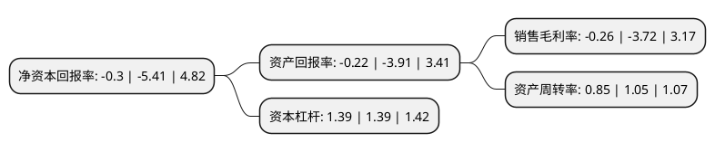

> 本页面由自动化程序生成于 2022年5月20日 01:12
> 内容可能存在错误，如有bug请提交issue至：https://github.com/Eroleice/doc-pi/issues
{.is-warning}

# 上市公司基本情况

## 基本资料

深圳市安奈儿股份有限公司（以下简称“安奈儿”）成立于2001年09月20日，深圳市。于2017年06月01日在深交所中小板上市。

安奈儿注册资本21,208.135万元，主营业务为“Annil安奈儿”品牌童装的研发设计，供应链管理，品牌运营及产品销售。公司产品涵盖大童装与小童装两大系列，包括上衣，外套，裤，裙，家居服等多品类产品。以下是详细信息：

- 公司名称: 深圳市安奈儿股份有限公司
- 股票代码: 002875.SZ
- 所在地: 广东 - 深圳市
- 成立日期: 2001年09月20日
- 注册资本: 21,208.135万元
- 法定代表人: 曹璋
- 主营业务: 主营业务为“Annil安奈儿”品牌童装的研发设计，供应链管理，品牌运营及产品销售公司产品涵盖大童装与小童装两大系列，包括上衣，外套，裤，裙，家居服等多品类产品
- 公司官网: www.annil.com
- 公司介绍: 公司是一家自主研发设计，主营中高端童装业务的自有品牌服装企业，旗下拥有“Annil安奈儿”童装品牌。公司以“不一样的舒适”为产品主题，追求优质的面料与舒适的体验，致力于为广大儿童消费者提供舒适、安全、精致的童装产品。公司产品涵盖大童装与小童装两大类别，包括上衣、外套、裤、裙、羽绒服、家居服等多品类童装产品。经过近多年的创业创新，“Annil安奈儿”品牌以面料优质环保、款式简洁新颖、穿着舒适大方的产品特征，赢得了广泛的市场认可，并已发展成为我国知名的童装品牌之一。

## 股东及高管情况

上市公司第一大股东为曹璋，持股53,311,050股，占比25.14%，**疑似为**上市公司实际控制人。

截至2022年03月31日，上市公司的前十大股东中，共有9名自然人股东，1个产品账户，其中5%以上大股东共有3名。上市公司前十大股东明细如下：

> 未能通过持股比例判定出上市公司实际控制人（持股30%以上）
> 可能存在通过间接持股、联合持股、协议控制等方式拥有实际控制权的主体，具体请参考上市公司定期公告！
{.is-warning}

> 截至2022年03月31日，上市公司前十大股东信息如下：

| 股东名称 | 持股数量（股） | 持股比例 |
| --- | --- | --- |
| 曹璋 | 53,311,050 | 25.14% |
| 王建青 | 47,379,150 | 22.34% |
| 徐文利 | 17,770,350 | 8.38% |
| 邓银招 | 9,630,606 | 4.54% |
| 新余善思投资管理中心(有限合伙)-善思君汉2号私募证券投资基金 | 5,936,675 | 2.8% |
| 张建飞 | 4,617,414 | 2.18% |
| 黄志敏 | 4,353,562 | 2.05% |
| 关志博 | 4,089,709 | 1.93% |
| 徐国新 | 3,693,931 | 1.74% |
| 彭显威 | 3,234,217 | 1.52% |

## 利润表分析

上市公司2021年总收入为11.85亿元，净利润为-0.04亿元，**未实现盈利**。

## 杜邦分析

> 数据列示周期：2021年 | 2020年 | 2019年
{.is-info}

上市公司的净资产收益率在近一年有所下降，下降幅度为-94.45%，其变化情况分解如下：
- 上市公司的销售毛利率在近一年下降了-93.01%，可能是生产效率的下降、商品原材料价格上涨或商品价格的下跌所致。
- 上市公司的资产周转率在近一年下降了-19.05%，可能是源自于更慢的销售回款或库存管理效果下降。
- 上市公司的财务杠杆比率在近一年下降了0%，可能是减少负债降低财务费用。

