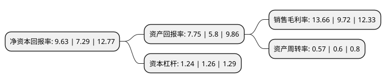

> 本页面由自动化程序生成于 2022年5月20日 01:13
> 内容可能存在错误，如有bug请提交issue至：https://github.com/Eroleice/doc-pi/issues
{.is-warning}

# 上市公司基本情况

## 基本资料

欣贺股份有限公司（以下简称“欣贺股份”）成立于2006年06月07日，厦门市。于2020年10月26日在深交所中小板上市。

欣贺股份注册资本43,230.899万元，主营业务:公司主营中，高端女装的设计，生产和销售，拥有完整的产业链条和显著的品牌优势。主要产品:目前拥有JORYA，JORYA weekend，GIVH SHYH(巨式国际)，ΛNMΛNI(恩曼琳)，CAROLINE(卡洛琳)，AIVEI和QDA七大自有品牌以下是详细信息：

- 公司名称: 欣贺股份有限公司
- 股票代码: 003016.SZ
- 所在地: 福建 - 厦门市
- 成立日期: 2006年06月07日
- 注册资本: 43,230.899万元
- 法定代表人: 孙瑞鸿
- 主营业务: 主营业务:公司主营中，高端女装的设计，生产和销售，拥有完整的产业链条和显著的品牌优势主要产品:目前拥有JORYA，JORYA weekend，GIVH SHYH(巨式国际)，ΛNMΛNI(恩曼琳)，CAROLINE(卡洛琳)，AIVEI和QDA七大自有品牌
- 公司官网: www.xinhee.cn
- 公司介绍: 公司是国内品牌女装的领军企业之一，主营中高端女装的设计、生产和销售，拥有完整的产业链条和显著的品牌优势。公司已形成JORYA、JORYA weekend定位高端，ΛNMΛNI(恩曼琳)、GIVHSHYH、CAROLINE、AIVEI和QDA定位中高端的金字塔式的品牌架构。是历史较长的国内自主高端女装品牌之一。担负着公司品牌定位和产品推广的重任。JORYA品牌高贵、典雅、精致的独特设计风格，更能突出女性的精致、性别魅力，弥补了细分风格女装市场的不足。荣获“全国产品和服务质量诚信示范企业”，“全国质量诚信质量标杆典型企业”,“JORYA中国驰名商标”等多项荣誉。

## 股东及高管情况

上市公司第一大股东为欣賀國際有限公司，持股272,716,480股，占比63.08%，为上市公司实际控制人。

截至2022年03月31日，上市公司的前十大股东中，共有2名自然人股东，7名机构股东，1个海外主体，其中5%以上大股东共有1名。上市公司前十大股东明细如下：

> 截至2022年03月31日，上市公司前十大股东信息如下：

| 股东名称 | 持股数量（股） | 持股比例 |
| --- | --- | --- |
| 欣賀國際有限公司 | 272,716,480 | 63.08% |
| 厦门市骏胜投资合伙企业(有限合伙) | 19,538,880 | 4.52% |
| 福建恒兴能源有限公司 | 7,000,000 | 1.62% |
| 厦门欣贺股权投资有限公司 | 4,800,000 | 1.11% |
| Purple Forest Limited | 4,429,760 | 1.02% |
| 厦门欣嘉骏投资有限公司 | 4,029,760 | 0.93% |
| 巨富發展有限公司 | 3,555,520 | 0.82% |
| 鴻業亞洲有限公司 | 2,607,360 | 0.6% |
| 明燕军 | 1,592,578 | 0.37% |
| 罗卫 | 1,369,500 | 0.32% |

## 利润表分析

上市公司2021年总收入为21.01亿元，净利润为2.87亿元，实现盈利。

## 杜邦分析

> 数据列示周期：2021年 | 2020年 | 2019年
{.is-info}

上市公司的净资产收益率在近一年有所上升，上升幅度为32.1%，其变化情况分解如下：
- 上市公司的销售毛利率在近一年上升了40.53%，可能是生产效率的提升、商品原材料价格下跌或商品价格的上涨所致。
- 上市公司的资产周转率在近一年下降了-5%，可能是源自于更慢的销售回款或库存管理效果下降。
- 上市公司的财务杠杆比率在近一年下降了-1.59%，可能是减少负债降低财务费用。

