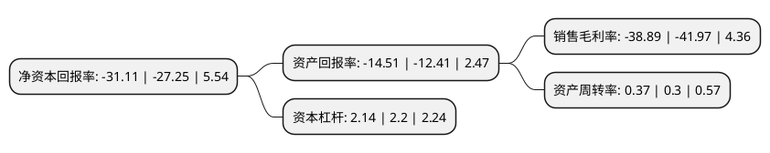

> 本页面由自动化程序生成于 2022年5月20日 01:18
> 内容可能存在错误，如有bug请提交issue至：https://github.com/Eroleice/doc-pi/issues
{.is-warning}

# 上市公司基本情况

## 基本资料

广东万里马实业股份有限公司（以下简称“万里马”）成立于2002年04月19日，东莞市。于2017年01月10日在深交所创业板上市。

万里马注册资本32,972.441万元，主要产品:“万里马”，“Saint Jack”品牌皮具产品。主营业务:皮具产品的研发设计，生产制造，品牌运营及市场销售业务。同时，采取ODM的模式，为国际知名企业生产手袋等产品。以下是详细信息：

- 公司名称: 广东万里马实业股份有限公司
- 股票代码: 300591.SZ
- 所在地: 广东 - 东莞市
- 成立日期: 2002年04月19日
- 注册资本: 32,972.441万元
- 法定代表人: 林大耀
- 主营业务: 主要产品:“万里马”，“Saint Jack”品牌皮具产品主营业务:皮具产品的研发设计，生产制造，品牌运营及市场销售业务同时，采取ODM的模式，为国际知名企业生产手袋等产品
- 公司官网: www.wanlima.com.cn
- 公司介绍: 公司主要从事皮具产品的研发设计、生产制造、品牌运营及市场销售业务。同时，采取ODM的模式，为国际知名企业生产手袋等产品。公司坚持自主研发，积极打造自有品牌，自身研发实力、生产能力及销售渠道实力不断加强。公司品牌始创于1993年，历经多年的沉淀与发展，在皮具产品的研发、设计、生产及销售等各方面均积累了丰富的运作经验。随着业务的不断发展，公司逐步推进多品牌战略，在大理推广公司品牌的同时，合理布局各细分市场，推出和代理了一些品牌，均取得了良好的市场反响。公司先后荣获“中国著名畅销品牌”、“中国驰名商标”称号、“广东省皮革鞋业百强企业”等荣誉称号。

## 股东及高管情况

上市公司第一大股东为林大耀，持股81,235,700股，占比20.02%，**疑似为**上市公司实际控制人。

截至2022年04月21日，上市公司的前十大股东中，共有9名自然人股东，1名机构股东，其中5%以上大股东共有5名。上市公司前十大股东明细如下：

> 未能通过持股比例判定出上市公司实际控制人（持股30%以上）
> 可能存在通过间接持股、联合持股、协议控制等方式拥有实际控制权的主体，具体请参考上市公司定期公告！
{.is-warning}

> 截至2022年04月21日，上市公司前十大股东信息如下：

| 股东名称 | 持股数量（股） | 持股比例 |
| --- | --- | --- |
| 林大耀 | 81,235,700 | 20.02% |
| 林大洲 | 38,076,800 | 9.39% |
| 林大洲 | 28,576,800 | 8.67% |
| 林大权 | 20,413,000 | 5.03% |
| 林大权 | 20,413,000 | 6.19% |
| 林彩虹 | 16,226,000 | 4.92% |
| 洛克化学(深圳)有限公司 | 3,469,000 | 1.05% |
| 李阳 | 1,823,600 | 0.55% |
| 潘祯祥 | 1,513,960 | 0.46% |
| 王海军 | 1,376,173 | 0.42% |

## 利润表分析

上市公司2021年总收入为3.39亿元，净利润为-1.32亿元，**未实现盈利**。

## 杜邦分析

> 数据列示周期：2021年 | 2020年 | 2019年
{.is-info}

上市公司的净资产收益率在近一年有所上升，上升幅度为14.17%，其变化情况分解如下：
- 上市公司的销售毛利率在近一年下降了-7.34%，可能是生产效率的下降、商品原材料价格上涨或商品价格的下跌所致。
- 上市公司的资产周转率在近一年上升了23.33%，可能是源自于更快的销售回款或库存管理效果提升。
- 上市公司的财务杠杆比率在近一年下降了-2.73%，可能是减少负债降低财务费用。

