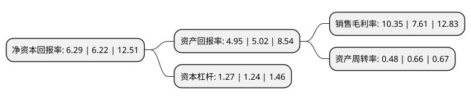

> 本页面由自动化程序生成于 2022年5月20日 01:20
> 内容可能存在错误，如有bug请提交issue至：https://github.com/Eroleice/doc-pi/issues
{.is-warning}

# 上市公司基本情况

## 基本资料

青岛酷特智能股份有限公司（以下简称“酷特智能”）成立于2007年12月28日，青岛市。于2020年07月08日在深交所创业板上市。

酷特智能注册资本24,000万元，公司主要从事个性化定制服装的生产与销售，包括了男士，女士正装全系列各品类，并向国内相关传统制造企业提供数字化定制工厂的整体改造方案及技术咨询服务。以下是详细信息：

- 公司名称: 青岛酷特智能股份有限公司
- 股票代码: 300840.SZ
- 所在地: 山东 - 青岛市
- 成立日期: 2007年12月28日
- 注册资本: 24,000万元
- 法定代表人: 张蕴蓝
- 主营业务: 公司主要从事个性化定制服装的生产与销售，包括了男士，女士正装全系列各品类，并向国内相关传统制造企业提供数字化定制工厂的整体改造方案及技术咨询服务
- 公司官网: www.kutesmart.com
- 公司介绍: 公司主要从事个性化定制服装的生产与销售，包括了男士、女士正装全系列各品类，并向国内相关传统制造企业提供数字化定制工厂的整体改造方案及技术咨询服务。公司坚持“成为有益于社会文明进步的百年企业”的企业愿景，以“践行科学的企业治理思想，创造全新的价值体系”为使命，专注研究实践“互联网+工业”，形成了以“大规模个性化定制”为核心的经营模式，总结出了一套传统企业转型升级的彻底解决方案——数据工程，并创造性地提出了以“个性化定制”模式展开的消费者直接对接工厂的C2M商业生态。2018年8月，公司获得中国管理模式五十人论坛颁发的“中国管理模式创新奖”；2018年10月，获得中国商业经济学会颁发的中国定制经济先锋版“优秀企业”称号。公司的经营模式、产品和服务质量得到行业及社会的认可。

## 股东及高管情况

上市公司第一大股东为张代理，持股35,827,638股，占比14.93%，**疑似为**上市公司实际控制人。

截至2022年03月31日，上市公司的前十大股东中，共有3名自然人股东，6名机构股东，1个产品账户，其中5%以上大股东共有5名。上市公司前十大股东明细如下：

> 未能通过持股比例判定出上市公司实际控制人（持股30%以上）
> 可能存在通过间接持股、联合持股、协议控制等方式拥有实际控制权的主体，具体请参考上市公司定期公告！
{.is-warning}

> 截至2022年03月31日，上市公司前十大股东信息如下：

| 股东名称 | 持股数量（股） | 持股比例 |
| --- | --- | --- |
| 张代理 | 35,827,638 | 14.93% |
| 深圳前海复星瑞哲恒益投资管理企业(有限合伙) | 26,736,690 | 11.14% |
| 张蕴蓝 | 24,542,832 | 10.23% |
| 张琰 | 23,516,017 | 9.8% |
| 中国科技产业投资管理有限公司-北京国科瑞华战略性新兴产业投资基金(有限合伙) | 13,740,000 | 5.73% |
| 青岛以勒泰和投资管理合伙企业(有限合伙) | 7,543,165 | 3.14% |
| 青岛高鹰天翔投资管理合伙企业(有限合伙) | 7,543,165 | 3.14% |
| 深圳前海瑞霖投资管理企业(有限合伙) | 7,123,807 | 2.97% |
| 德龙钢铁有限公司 | 3,600,002 | 1.5% |
| 宁波梅山保税港区天鹰合胜投资管理合伙企业(有限合伙) | 2,399,999 | 1% |

## 利润表分析

上市公司2021年总收入为5.92亿元，净利润为0.61亿元，实现盈利。

## 杜邦分析

> 数据列示周期：2021年 | 2020年 | 2019年
{.is-info}

上市公司的净资产收益率在近一年有所上升，上升幅度为1.13%，其变化情况分解如下：
- 上市公司的销售毛利率在近一年上升了36.01%，可能是生产效率的提升、商品原材料价格下跌或商品价格的上涨所致。
- 上市公司的资产周转率在近一年下降了-27.27%，可能是源自于更慢的销售回款或库存管理效果下降。
- 上市公司的财务杠杆比率在近一年上升了2.42%，可能是增加负债扩大生产规模。

