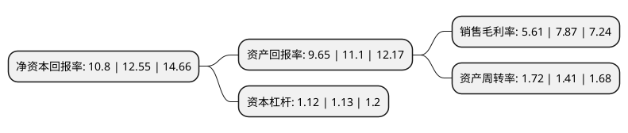

> 本页面由自动化程序生成于 2022年5月20日 01:21
> 内容可能存在错误，如有bug请提交issue至：https://github.com/Eroleice/doc-pi/issues
{.is-warning}

# 上市公司基本情况

## 基本资料

曼卡龙珠宝股份有限公司（以下简称“曼卡龙”）成立于2009年12月03日，杭州市。于2021年02月10日在深交所创业板上市。

曼卡龙注册资本20,400万元，公司拥有“MCLON曼卡龙”，“今古传奇”等珠宝首饰品牌。主营业务是珠宝首饰零售连锁销售业务。主要产品为“三爱一钻”即“爱尚金”，“爱尚炫”，“爱尚彩”以及钻石饰品。以下是详细信息：

- 公司名称: 曼卡龙珠宝股份有限公司
- 股票代码: 300945.SZ
- 所在地: 浙江 - 杭州市
- 成立日期: 2009年12月03日
- 注册资本: 20,400万元
- 法定代表人: 孙松鹤
- 主营业务: 公司拥有“MCLON曼卡龙”，“今古传奇”等珠宝首饰品牌主营业务是珠宝首饰零售连锁销售业务主要产品为“三爱一钻”即“爱尚金”，“爱尚炫”，“爱尚彩”以及钻石饰品
- 公司官网: www.mclon.com
- 公司介绍: 公司是一家集珠宝首饰创意、销售、品牌管理为一体的珠宝首饰零售连锁企业，将曼卡龙珠宝品牌定位于“每一天的珠宝”，打造都市时尚女性成为人群中的“每天·亮点”。公司将“年轻、轻奢、色彩、情感”的珠宝理念融入到产品创意中，聚焦于年轻消费群体，为顾客提供可以轻松拥有、具备轻奢时尚内涵的珠宝首饰。公司致力于成为“国际化轻奢时尚品牌”。发展至今，公司凭借精准的产品定位和科学化的管理方式从中国珠宝行业中脱颖而出，品牌影响力日益提升。公司一直以来十分重视产品的时尚感及设计感，并以不断追求创新设计为品牌核心竞争力。曼卡龙为消费者提供紧跟时尚潮流，又极具设计内涵的珠宝饰品，成为更了解现代新女性需求的时尚珠宝品牌。公司在浙江省内具有较高的知名度和美誉度，是省内较为强势的珠宝品牌。公司凭借稳健的发展、日臻成熟的品牌形象，先后荣获“中国珠宝首饰业驰名品牌”、“珠宝行业优秀企业”、“浙江省品牌产品”“2016年中国珠宝玉石首饰行业制度创新奖”等奖项。

## 股东及高管情况

上市公司第一大股东为浙江万隆曼卡龙投资有限公司，持股99,280,000股，占比48.67%，为上市公司实际控制人。

截至2022年03月31日，上市公司的前十大股东中，共有6名自然人股东，4名机构股东，其中5%以上大股东共有3名。上市公司前十大股东明细如下：

> 截至2022年03月31日，上市公司前十大股东信息如下：

| 股东名称 | 持股数量（股） | 持股比例 |
| --- | --- | --- |
| 浙江万隆曼卡龙投资有限公司 | 99,280,000 | 48.67% |
| 孙松鹤 | 18,421,263 | 9.03% |
| 曹斌 | 10,261,336 | 5.03% |
| 杭州迈卡企业管理咨询有限公司 | 2,665,600 | 1.31% |
| 楼红豆 | 1,846,869 | 0.91% |
| 浙江信海创业投资合伙企业(有限合伙) | 1,725,000 | 0.85% |
| 浙江浙商利海创业投资合伙企业(有限合伙) | 1,725,000 | 0.85% |
| 周斌 | 1,225,460 | 0.6% |
| 瞿吾珍 | 1,107,366 | 0.54% |
| 朱晔 | 878,220 | 0.43% |

## 利润表分析

上市公司2021年总收入为12.52亿元，净利润为0.7亿元，实现盈利。

## 杜邦分析

> 数据列示周期：2021年 | 2020年 | 2019年
{.is-info}

上市公司的净资产收益率在近一年有所下降，下降幅度为-13.94%，其变化情况分解如下：
- 上市公司的销售毛利率在近一年下降了-28.72%，可能是生产效率的下降、商品原材料价格上涨或商品价格的下跌所致。
- 上市公司的资产周转率在近一年上升了21.99%，可能是源自于更快的销售回款或库存管理效果提升。
- 上市公司的财务杠杆比率在近一年下降了-0.88%，可能是减少负债降低财务费用。

