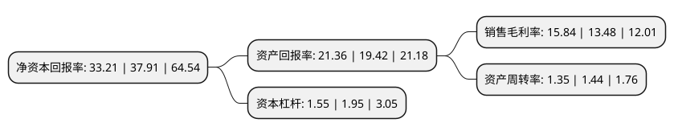

> 本页面由自动化程序生成于 2022年5月20日 01:22
> 内容可能存在错误，如有bug请提交issue至：https://github.com/Eroleice/doc-pi/issues
{.is-warning}

# 上市公司基本情况

## 基本资料

中山华利实业集团股份有限公司（以下简称“华利集团”）成立于2004年09月02日，中山市。于2021年04月26日在深交所创业板上市。

华利集团注册资本116,700万元，从事鞋履的开发设计，生产与销售，主要产品为运动鞋，包括运动休闲鞋，户外靴鞋，运动凉鞋与拖鞋等。以下是详细信息：

- 公司名称: 中山华利实业集团股份有限公司
- 股票代码: 300979.SZ
- 所在地: 广东 - 中山市
- 成立日期: 2004年09月02日
- 注册资本: 116,700万元
- 法定代表人: 张聪渊
- 主营业务: 从事鞋履的开发设计，生产与销售，主要产品为运动鞋，包括运动休闲鞋，户外靴鞋，运动凉鞋与拖鞋等
- 公司官网: www.huali-group.com
- 公司介绍: 公司从事运动鞋履的开发设计、生产与销售，是全球领先的运动鞋专业制造商，主要为Nike、Converse、Vans、Puma、UGG、Columbia、Under Armour、HOKA ONE ONE等全球知名运动品牌提供开发设计与制造服务，公司与全球运动鞋服市场份额前十名公司中的五家建立了长期稳定的合作关系。公司在越南、中国、多米尼加、缅甸等地共开设了20家制鞋工厂，2019年鞋履产量超过1.8亿双，是全球为数不多的产量超过1亿双的运动鞋专业制造商之一。

## 股东及高管情况

上市公司第一大股东为俊耀集团有限公司，持股990,255,000股，占比84.85%，为上市公司实际控制人。

截至2022年03月31日，上市公司的前十大股东中，共有5名机构股东，5个产品账户，其中5%以上大股东共有1名。上市公司前十大股东明细如下：

> 截至2022年03月31日，上市公司前十大股东信息如下：

| 股东名称 | 持股数量（股） | 持股比例 |
| --- | --- | --- |
| 俊耀集团有限公司 | 990,255,000 | 84.85% |
| 中山浤霆鞋业有限公司 | 30,660,000 | 2.63% |
| 深圳市永诚资本管理有限公司-深圳市永诚伍号投资合伙企业(有限合伙) | 16,170,000 | 1.39% |
| 深圳市永诚资本管理有限公司-深圳市永诚陆号投资合伙企业(有限合伙) | 12,915,000 | 1.11% |
| 兴证证券资管-兴业银行-兴证资管鑫众华利股份1号员工战略配售集合资产管理计划 | 11,272,672 | 0.97% |
| 招商银行股份有限公司-农银汇理策略收益一年持有期混合型证券投资基金 | 4,657,233 | 0.4% |
| 交通银行股份有限公司-富国天益价值混合型证券投资基金 | 4,406,637 | 0.38% |
| 中国工商银行-广发稳健增长证券投资基金 | 4,286,000 | 0.37% |
| 国家第一养老金信托公司-自有资金 | 4,011,429 | 0.34% |
| 中国农业银行股份有限公司-大成创业板两年定期开放混合型证券投资基金 | 3,582,899 | 0.31% |

## 利润表分析

上市公司2021年总收入为174.69亿元，净利润为27.67亿元，实现盈利。

## 杜邦分析

> 数据列示周期：2021年 | 2020年 | 2019年
{.is-info}

上市公司的净资产收益率在近一年有所下降，下降幅度为-12.4%，其变化情况分解如下：
- 上市公司的销售毛利率在近一年上升了17.51%，可能是生产效率的提升、商品原材料价格下跌或商品价格的上涨所致。
- 上市公司的资产周转率在近一年下降了-6.25%，可能是源自于更慢的销售回款或库存管理效果下降。
- 上市公司的财务杠杆比率在近一年下降了-20.51%，可能是减少负债降低财务费用。

