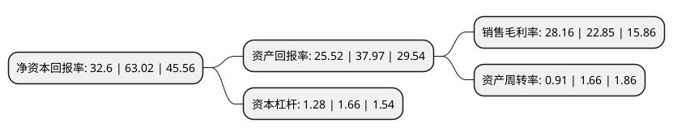

> 本页面由自动化程序生成于 2022年5月20日 01:23
> 内容可能存在错误，如有bug请提交issue至：https://github.com/Eroleice/doc-pi/issues
{.is-warning}

# 上市公司基本情况

## 基本资料

迪阿股份有限公司（以下简称“迪阿股份”）成立于2010年04月08日，深圳市。于2021年12月15日在深交所创业板上市。

迪阿股份注册资本40,001万元，发行人主要从事珠宝首饰的品牌运营，定制销售和研发设计，为婚恋人群定制高品质的求婚钻戒等钻石镶嵌饰品。公司主要产品为求婚钻戒，结婚对戒和其他饰品。以下是详细信息：

- 公司名称: 迪阿股份有限公司
- 股票代码: 301177.SZ
- 所在地: 广东 - 深圳市
- 成立日期: 2010年04月08日
- 注册资本: 40,001万元
- 法定代表人: 张国涛
- 主营业务: 发行人主要从事珠宝首饰的品牌运营，定制销售和研发设计，为婚恋人群定制高品质的求婚钻戒等钻石镶嵌饰品公司主要产品为求婚钻戒，结婚对戒和其他饰品
- 公司官网: www.darryring.com
- 公司介绍: 迪阿股份有限公司主要从事高端婚戒及珠宝首饰的品牌运营、定制销售和研发设计，为婚恋人群定制更有真爱理念的、高品质的婚戒及纪念日礼物等珠宝饰品。自创立以来，公司始终坚持“让爱情变得更美好”的企业使命，努力传播与见证世界的真爱与浪漫，力争成为“全球真爱文化引领者”。通过多年的不懈努力，DR品牌市场影响力突出，已成为具有较强市场竞争力的求婚钻戒品牌。

## 股东及高管情况

上市公司第一大股东为迪阿投资(珠海)有限公司，持股342,000,000股，占比85.5%，为上市公司实际控制人。

截至2022年03月31日，上市公司的前十大股东中，共有1名自然人股东，5名机构股东，4个产品账户，其中5%以上大股东共有1名。上市公司前十大股东明细如下：

> 截至2022年03月31日，上市公司前十大股东信息如下：

| 股东名称 | 持股数量（股） | 持股比例 |
| --- | --- | --- |
| 迪阿投资(珠海)有限公司 | 342,000,000 | 85.5% |
| 共青城温迪贰号投资管理合伙企业(有限合伙) | 7,200,000 | 1.8% |
| 共青城温迪壹号投资管理合伙企业(有限合伙) | 7,200,000 | 1.8% |
| 共青城温迪叁号投资管理合伙企业(有限合伙) | 3,600,000 | 0.9% |
| 珠海润信致融壹号投资合伙企业(有限合伙) | 2,566,735 | 0.64% |
| 中国银行股份有限公司-建信创新驱动混合型证券投资基金 | 1,660,125 | 0.42% |
| 中信建投证券-招商银行-中信建投迪阿股份1号战略配售集合资产管理计划 | 978,952 | 0.24% |
| 中国建设银行股份有限公司-易方达创新驱动灵活配置混合型证券投资基金 | 916,655 | 0.23% |
| 林秀娟 | 885,700 | 0.22% |
| 中国光大银行股份有限公司-建信信息产业股票型证券投资基金 | 811,332 | 0.2% |

## 利润表分析

上市公司2021年总收入为46.22亿元，净利润为13.01亿元，实现盈利。

## 杜邦分析

> 数据列示周期：2021年 | 2020年 | 2019年
{.is-info}

上市公司的净资产收益率在近一年有所下降，下降幅度为-48.27%，其变化情况分解如下：
- 上市公司的销售毛利率在近一年上升了23.24%，可能是生产效率的提升、商品原材料价格下跌或商品价格的上涨所致。
- 上市公司的资产周转率在近一年下降了-45.18%，可能是源自于更慢的销售回款或库存管理效果下降。
- 上市公司的财务杠杆比率在近一年下降了-22.89%，可能是减少负债降低财务费用。

