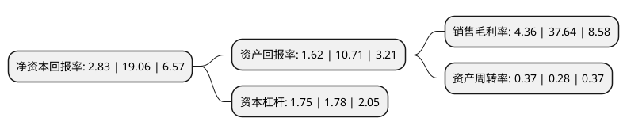

> 本页面由自动化程序生成于 2022年5月20日 01:24
> 内容可能存在错误，如有bug请提交issue至：https://github.com/Eroleice/doc-pi/issues
{.is-warning}

# 上市公司基本情况

## 基本资料

湖北美尔雅股份有限公司（以下简称“美尔雅”）成立于1993年12月31日，黄石市。于1997年11月06日在上交所主板上市。

美尔雅注册资本36,000万元，主要产品:“美尔雅”高级西服，晚礼服及职业装。以下是详细信息：

- 公司名称: 湖北美尔雅股份有限公司
- 股票代码: 600107.SH
- 所在地: 湖北 - 黄石市
- 成立日期: 1993年12月31日
- 注册资本: 36,000万元
- 法定代表人: 郑继平
- 主营业务: 主要产品:“美尔雅”高级西服，晚礼服及职业装
- 公司官网: www.mailyard.com.cn
- 公司介绍: 公司是一家中外合资的高档西服出口企业。公司以外贸为主，主要从事精毛纺织制品、服装及辅料制造、加工和销售。公司主营产品享誉海内外，在日本市场占有较高份额，其中主营产品美尔雅西服被评为“中国十大名牌服装”、“中国十大名牌西服”，并荣获欧洲质量金奖，是构建湖北“鄂东服装走廊”的龙头企业，也是国内规模最大的西服和时装生产企业之一。另外，公司在美尔雅期货经纪有限公司中具有控制地位，经营的四星级涉外磁湖山庄酒店为黄石市一家四星级涉外酒店。公司坚持用户至上，用真诚的服务去打动客户，以“诚实守信，客户至上”为原则，而在产品方面又以“品质为本，精益求精”作为自己的实践标准，力求给客户提供全方位优质服务的同时，也使企业得到长久发展。

## 股东及高管情况

上市公司第一大股东为湖北美尔雅集团有限公司，持股73,388,738股，占比20.39%，**疑似为**上市公司实际控制人。

截至2022年03月31日，上市公司的前十大股东中，共有7名自然人股东，2名机构股东，1个产品账户，其中5%以上大股东共有1名。上市公司前十大股东明细如下：

> 未能通过持股比例判定出上市公司实际控制人（持股30%以上）
> 可能存在通过间接持股、联合持股、协议控制等方式拥有实际控制权的主体，具体请参考上市公司定期公告！
{.is-warning}

> 截至2022年03月31日，上市公司前十大股东信息如下：

| 股东名称 | 持股数量（股） | 持股比例 |
| --- | --- | --- |
| 湖北美尔雅集团有限公司 | 73,388,738 | 20.39% |
| 刘迎 | 17,260,000 | 4.79% |
| 姜强国 | 6,000,100 | 1.67% |
| 孙辉 | 5,300,005 | 1.47% |
| 柯佳圻 | 4,620,346 | 1.28% |
| 张东升 | 4,153,900 | 1.15% |
| 孙财亮 | 4,000,000 | 1.11% |
| 北京合易盈通资产管理有限公司-合易盈浩甄选私募证券投资基金 | 3,770,000 | 1.05% |
| 东方时尚投资有限公司 | 3,700,015 | 1.03% |
| 王立强 | 2,959,881 | 0.82% |

## 杜邦分析

> 数据列示周期：2021年 | 2020年 | 2019年
{.is-info}

上市公司的净资产收益率在近一年有所下降，下降幅度为-85.15%，其变化情况分解如下：
- 上市公司的销售毛利率在近一年下降了-88.42%，可能是生产效率的下降、商品原材料价格上涨或商品价格的下跌所致。
- 上市公司的资产周转率在近一年上升了32.14%，可能是源自于更快的销售回款或库存管理效果提升。
- 上市公司的财务杠杆比率在近一年下降了-1.69%，可能是减少负债降低财务费用。

