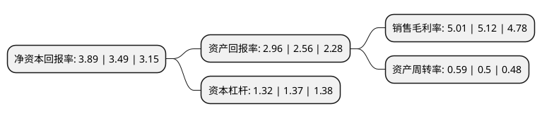

> 本页面由自动化程序生成于 2022年5月20日 01:24
> 内容可能存在错误，如有bug请提交issue至：https://github.com/Eroleice/doc-pi/issues
{.is-warning}

# 上市公司基本情况

## 基本资料

四川浪莎控股股份有限公司（以下简称“浪莎股份”）成立于1996年12月26日，宜宾市。于1998年04月16日在上交所主板上市。

浪莎股份注册资本9,721.759万元，主要产品:内衣制造。以下是详细信息：

- 公司名称: 四川浪莎控股股份有限公司
- 股票代码: 600137.SH
- 所在地: 四川 - 宜宾市
- 成立日期: 1996年12月26日
- 注册资本: 9,721.759万元
- 法定代表人: 翁荣弟
- 主营业务: 主要产品:内衣制造
- 公司官网: www.langshastock.com
- 公司介绍: 公司是一家主要从事纺织品生产、销售的公司，是中国名牌产品、产品质量国家免检的厂家。公司经营范围有实业投资、投资管理咨询(不含证券、期货等金融业务)；袜子、内衣、纱线的批发、零售和电子元器件的生产、销售。公司在中国强势媒体投放广告费用几千万，覆盖全国各地。配套、健全的营销网络，使公司几大品牌，已经成功进入千家万户，成为家喻户晓的知名品牌。公司凭借先进、科学的管理优势，实现了生产成本的降低，创造了纺织业界效益较为理想的局面，业绩名列前矛。公司将着力整合、优化、提升销售渠道，集中优势资源在产品展示、卖场布局等方面进行更加规范化、制度化管理，同时继续加强品牌建设，做好产品经营。

## 股东及高管情况

上市公司第一大股东为浪莎控股集团有限公司，持股41,495,355股，占比42.68%，为上市公司实际控制人。

截至2022年03月31日，上市公司的前十大股东中，共有6名自然人股东，4名机构股东，其中5%以上大股东共有2名。上市公司前十大股东明细如下：

> 截至2022年03月31日，上市公司前十大股东信息如下：

| 股东名称 | 持股数量（股） | 持股比例 |
| --- | --- | --- |
| 浪莎控股集团有限公司 | 41,495,355 | 42.68% |
| 西藏巨浪科技有限公司 | 19,288,888 | 19.84% |
| 深圳能源集团股份有限公司 | 1,079,477 | 1.11% |
| 肖颖超 | 371,001 | 0.38% |
| 华泰证券股份有限公司 | 338,600 | 0.35% |
| 顾力平 | 300,000 | 0.31% |
| 瞿诚 | 300,000 | 0.31% |
| 陈明杰 | 285,800 | 0.29% |
| 裘红波 | 284,006 | 0.29% |
| 朱艳 | 278,800 | 0.29% |

## 利润表分析

上市公司2021年总收入为4.02亿元，净利润为0.2亿元，实现盈利。

## 杜邦分析

> 数据列示周期：2021年 | 2020年 | 2019年
{.is-info}

上市公司的净资产收益率在近一年有所上升，上升幅度为11.46%，其变化情况分解如下：
- 上市公司的销售毛利率在近一年下降了-2.15%，可能是生产效率的下降、商品原材料价格上涨或商品价格的下跌所致。
- 上市公司的资产周转率在近一年上升了18%，可能是源自于更快的销售回款或库存管理效果提升。
- 上市公司的财务杠杆比率在近一年下降了-3.65%，可能是减少负债降低财务费用。

