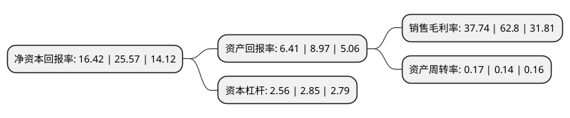

> 本页面由自动化程序生成于 2022年5月20日 01:24
> 内容可能存在错误，如有bug请提交issue至：https://github.com/Eroleice/doc-pi/issues
{.is-warning}

# 上市公司基本情况

## 基本资料

雅戈尔集团股份有限公司（以下简称“雅戈尔”）成立于1993年06月25日，宁波市。于1998年11月19日在上交所主板上市。

雅戈尔注册资本462,900.297万元，主要产品:西服，衬衫。以下是详细信息：

- 公司名称: 雅戈尔集团股份有限公司
- 股票代码: 600177.SH
- 所在地: 浙江 - 宁波市
- 成立日期: 1993年06月25日
- 注册资本: 462,900.297万元
- 法定代表人: 李如成
- 主营业务: 主要产品:西服，衬衫
- 公司官网: www.youngor.com
- 公司介绍: 公司是以品牌服装、地产开发、金融投资三大板块为主的多元并进、成长中的国际化集团。公司拥有衬衫、西服、西裤、夹克和领带物象名牌产品，在国内同行中优势明显。公司是我国近年来服装行业中发展速度较快的企业之一，综合实力和盈利能力居服装企业前列，是国内首家同时拥有衬衫、西服全自动吊挂流水线的服装企业，并率先将世界上免烫后整理工艺引进国内。公司以大会员为切入口，联动会员、股东及潜在粉丝，充分应用大数据手段360°采集会员信息，形成以大会员为核心的闭环，进行全渠道营销。届时，线上微商城、电商网站、社交媒体、手机终端移动社交、APP等平台将与线下雅戈尔门店同步联动，跨平台、跨渠道、跨区域实现线上线下营销模式的无缝链接，以更精准的差异化营销和跨界异业联盟，为会员提供更个性化的增值服务。首批试点在宁波和上海两大城市推行。

## 股东及高管情况

上市公司第一大股东为宁波雅戈尔控股有限公司，持股1,561,203,536股，占比33.73%，为上市公司实际控制人。

截至2022年03月31日，上市公司的前十大股东中，共有1名自然人股东，5名机构股东，3个产品账户，1个海外主体，其中5%以上大股东共有3名。上市公司前十大股东明细如下：

> 截至2022年03月31日，上市公司前十大股东信息如下：

| 股东名称 | 持股数量（股） | 持股比例 |
| --- | --- | --- |
| 宁波雅戈尔控股有限公司 | 1,561,203,536 | 33.73% |
| 昆仑信托有限责任公司-昆仑信托·添盈投资一号集合资金信托计划 | 479,185,437 | 10.35% |
| 中国证券金融股份有限公司 | 251,131,792 | 5.43% |
| 李如成 | 126,436,328 | 2.73% |
| 深圳市博睿财智控股有限公司 | 99,000,000 | 2.14% |
| 香港中央结算有限公司(陆股通) | 84,952,011 | 1.84% |
| 雅戈尔集团股份有限公司-第一期核心管理团队持股计划 | 68,324,928 | 1.48% |
| 深圳市恩情投资发展有限公司 | 47,022,900 | 1.02% |
| 招商银行股份有限公司-上证红利交易型开放式指数证券投资基金 | 40,125,510 | 0.87% |
| 宁波盛达发展有限公司 | 39,606,947 | 0.86% |

## 利润表分析

上市公司2021年总收入为136.06亿元，净利润为51.35亿元，实现盈利。

## 杜邦分析

> 数据列示周期：2021年 | 2020年 | 2019年
{.is-info}

上市公司的净资产收益率在近一年有所下降，下降幅度为-35.78%，其变化情况分解如下：
- 上市公司的销售毛利率在近一年下降了-39.9%，可能是生产效率的下降、商品原材料价格上涨或商品价格的下跌所致。
- 上市公司的资产周转率在近一年上升了21.43%，可能是源自于更快的销售回款或库存管理效果提升。
- 上市公司的财务杠杆比率在近一年下降了-10.18%，可能是减少负债降低财务费用。

