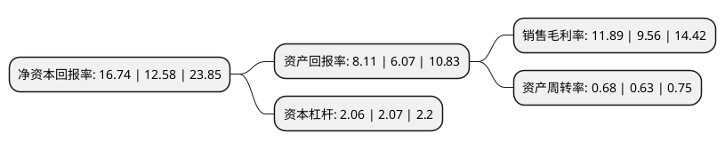

> 本页面由自动化程序生成于 2022年5月20日 01:26
> 内容可能存在错误，如有bug请提交issue至：https://github.com/Eroleice/doc-pi/issues
{.is-warning}

# 上市公司基本情况

## 基本资料

海澜之家集团股份有限公司（以下简称“海澜之家”）成立于1997年01月08日，无锡市。于2000年12月28日在上交所主板上市。

海澜之家注册资本431,960.276万元，主营业务;品牌服饰的经营，包括品牌管理，供应链管理和营销网络管理等业务以下是详细信息：

- 公司名称: 海澜之家集团股份有限公司
- 股票代码: 600398.SH
- 所在地: 江苏 - 无锡市
- 成立日期: 1997年01月08日
- 注册资本: 431,960.276万元
- 法定代表人: 周立宸
- 主营业务: 主营业务;品牌服饰的经营，包括品牌管理，供应链管理和营销网络管理等业务
- 公司官网: www.hla.com/www.hla.com.cn
- 公司介绍: 公司成立于1997年，是一家大型服装企业，业务涵盖品牌服装的经营以及高档西服、职业服的生产和销售，品牌服装的经营包括品牌管理、供应链管理和营销网络管理等。公司拥有海澜之家、爱居兔、圣凯诺等服装品牌，旗下圣凯诺品牌为职业装团购业务，其余品牌采用服装连锁经营的形式，产品包括男装、女装、配饰等，具有高性价比、品类丰富、符合大众消费需求的特点。目前公司已形成独具特色与竞争优势的“总部品牌管理-生产外包-总库物流-连锁销售”运营管理模式，在行业整体低迷形势下实现了持续发展。公司继续以服装产业为核心，以市场需求为导向，以信息技术为支撑，推进多品牌策略、多品类开发、全渠道布局，促进管理型平台的运营，进一步壮大产业规模，提高市场占有率。

## 股东及高管情况

上市公司第一大股东为海澜集团有限公司，持股1,765,971,703股，占比40.88%，为上市公司实际控制人。

截至2022年03月31日，上市公司的前十大股东中，共有6名机构股东，4个产品账户，其中5%以上大股东共有2名。上市公司前十大股东明细如下：

> 截至2022年03月31日，上市公司前十大股东信息如下：

| 股东名称 | 持股数量（股） | 持股比例 |
| --- | --- | --- |
| 海澜集团有限公司 | 1,765,971,703 | 40.88% |
| 荣基国际(香港)有限公司 | 1,107,604,228 | 25.64% |
| 江阴恒盛国际贸易有限公司 | 162,307,692 | 3.76% |
| 国星集团有限公司 | 126,240,000 | 2.92% |
| 中国证券金融股份有限公司 | 113,823,740 | 2.64% |
| 兴业银行股份有限公司-兴全新视野灵活配置定期开放混合型发起式证券投资基金 | 65,998,697 | 1.53% |
| 中国光大银行股份有限公司-兴全商业模式优选混合型证券投资基金(LOF) | 64,953,697 | 1.5% |
| 江阴市晟汇国际贸易有限公司 | 64,088,273 | 1.48% |
| 兴业银行股份有限公司-兴全趋势投资混合型证券投资基金 | 42,075,846 | 0.97% |
| 中国对外经济贸易信托有限公司-外贸信托-睿郡稳享私募证券投资基金 | 29,468,437 | 0.68% |

## 利润表分析

上市公司2021年总收入为201.88亿元，净利润为24亿元，实现盈利。

## 杜邦分析

> 数据列示周期：2021年 | 2020年 | 2019年
{.is-info}

上市公司的净资产收益率在近一年有所上升，上升幅度为33.07%，其变化情况分解如下：
- 上市公司的销售毛利率在近一年上升了24.37%，可能是生产效率的提升、商品原材料价格下跌或商品价格的上涨所致。
- 上市公司的资产周转率在近一年上升了7.94%，可能是源自于更快的销售回款或库存管理效果提升。
- 上市公司的财务杠杆比率在近一年下降了-0.48%，可能是减少负债降低财务费用。

