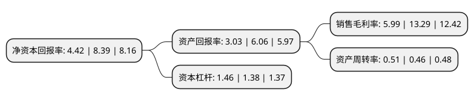

> 本页面由自动化程序生成于 2022年5月20日 01:31
> 内容可能存在错误，如有bug请提交issue至：https://github.com/Eroleice/doc-pi/issues
{.is-warning}

# 上市公司基本情况

## 基本资料

九牧王股份有限公司（以下简称“九牧王”）成立于2004年03月11日，泉州市。于2011年05月30日在上交所主板上市。

九牧王注册资本57,463.715万元，公司采用业务纵向一体化的模式，集品牌推广，研发设计，生产，销售为一体，经营九牧王品牌的男裤，茄克及其它服饰类产品。以下是详细信息：

- 公司名称: 九牧王股份有限公司
- 股票代码: 601566.SH
- 所在地: 福建 - 泉州市
- 成立日期: 2004年03月11日
- 注册资本: 57,463.715万元
- 法定代表人: 林聪颖
- 主营业务: 公司采用业务纵向一体化的模式，集品牌推广，研发设计，生产，销售为一体，经营九牧王品牌的男裤，茄克及其它服饰类产品
- 公司官网: www.joeone.cn
- 公司介绍: 公司是中国领先的商务休闲男装品牌企业，公司核心产品九牧王男裤及茄克多年来深受消费者的喜爱和好评。公司采用业务纵向一体化的模式，集品牌推广、研发设计、生产、销售为一体，经营九牧王品牌的男裤及其它服饰类产品。公司始终专注于以男裤为核心的中高档商务休闲男装的战略发展方向，致力于让男士拥有高性价比的精工时尚服饰，满足不同消费者在不同场合的穿着需求。公司获得“中国最受消费者欢迎的休闲装品牌”、“中国十大最具影响力品牌”、“中国家庭最受欢迎十大服装品牌”、“中国行业领先品牌”等荣誉。公司将以强大的资本力量进行产融结合，加大对服装主业的投资力度，助力品牌拓展前行：聚焦服装产业，通过收购兼并参股，发展多品牌；与细分产业的行业龙头、高发展潜力品牌进行战略参股合作，并逐步参与新兴产业的投资。

## 股东及高管情况

上市公司第一大股东为九牧王国际投资控股有限公司，持股308,768,140股，占比53.73%，为上市公司实际控制人。

截至2022年03月31日，上市公司的前十大股东中，共有2名自然人股东，6名机构股东，2个产品账户，其中5%以上大股东共有1名。上市公司前十大股东明细如下：

> 截至2022年03月31日，上市公司前十大股东信息如下：

| 股东名称 | 持股数量（股） | 持股比例 |
| --- | --- | --- |
| 九牧王国际投资控股有限公司 | 308,768,140 | 53.73% |
| 泉州市顺茂投资管理有限公司 | 28,650,000 | 4.99% |
| 泉州市铂锐投资管理有限公司 | 25,150,000 | 4.38% |
| 泉州市睿智投资管理有限公司 | 22,650,000 | 3.94% |
| 招商银行股份有限公司-上证红利交易型开放式指数证券投资基金 | 22,091,809 | 3.84% |
| 智立方(泉州)投资管理有限公司 | 22,050,000 | 3.84% |
| 兴证证券资管-兴业银行-兴证资管鑫众76号集合资产管理计划 | 10,427,013 | 1.81% |
| 瑞银资产管理(新加坡)有限公司-瑞银卢森堡投资SICAV | 8,873,090 | 1.54% |
| 吴晓滨 | 8,142,554 | 1.42% |
| 陈培泉 | 7,500,000 | 1.31% |

## 利润表分析

上市公司2021年总收入为30.5亿元，净利润为1.82亿元，实现盈利。

## 杜邦分析

> 数据列示周期：2021年 | 2020年 | 2019年
{.is-info}

上市公司的净资产收益率在近一年有所下降，下降幅度为-47.32%，其变化情况分解如下：
- 上市公司的销售毛利率在近一年下降了-54.93%，可能是生产效率的下降、商品原材料价格上涨或商品价格的下跌所致。
- 上市公司的资产周转率在近一年上升了10.87%，可能是源自于更快的销售回款或库存管理效果提升。
- 上市公司的财务杠杆比率在近一年上升了5.8%，可能是增加负债扩大生产规模。

