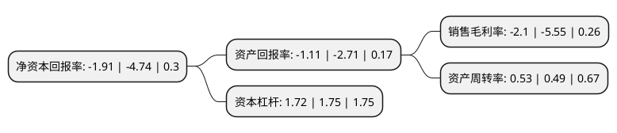

> 本页面由自动化程序生成于 2022年5月20日 01:31
> 内容可能存在错误，如有bug请提交issue至：https://github.com/Eroleice/doc-pi/issues
{.is-warning}

# 上市公司基本情况

## 基本资料

际华集团股份有限公司（以下简称“际华集团”）成立于2006年08月04日，北京市。于2010年08月16日在上交所主板上市。

际华集团注册资本439,162.94万元，主营业务为职业装，职业鞋靴，防护装具，纺织印染，皮革皮鞋等。旗下拥有职业装，职业鞋靴，防护装具，纺织印染以及皮革皮鞋五大业务板块。以下是详细信息：

- 公司名称: 际华集团股份有限公司
- 股票代码: 601718.SH
- 所在地: 北京 - 北京市
- 成立日期: 2006年08月04日
- 注册资本: 439,162.94万元
- 法定代表人: 吴同兴
- 主营业务: 主营业务为职业装，职业鞋靴，防护装具，纺织印染，皮革皮鞋等旗下拥有职业装，职业鞋靴，防护装具，纺织印染以及皮革皮鞋五大业务板块
- 公司官网: www.jihuachina.com
- 公司介绍: 公司是中国最大的军需轻工生产制造企业，是中国军队、武警部队军需被装产品生产保障基地，是国内统一着装部门和行业以及其他职业装着装单位的主要生产供应商，是国内少数几个面向国际军需品市场的销售、加工基地之一，主要从事军需轻工产品的开发、生产和销售。随着产品结构、产业结构调整的不断深入，公司已经拥有职业装、纺织印染、职业鞋靴、防护装具四大制造业务板块和铁合金、医药等高新技术业务板块，拥有从原材料生产与采购到产品制造与销售的全产业链生产支撑能力。同时，公司依托所属企业遍布全国各省、自治区、直辖市的生产及销售优势，积极开拓第三产业，通过产业结构的调整，探索以自有品牌“JH1912”为核心的高端零售连锁业务，开展集“奥特莱斯购物中心、体育运动设施及休闲娱乐中心、特色酒店会议中心、商业建筑及配套服务设施”于一体的“际华园”项目的建设，打造现代综合商业服务业态。

## 股东及高管情况

上市公司第一大股东为新兴际华集团有限公司，持股2,000,662,591股，占比45.56%，为上市公司实际控制人。

截至2022年03月31日，上市公司的前十大股东中，共有2名自然人股东，4名机构股东，4个产品账户，其中5%以上大股东共有1名。上市公司前十大股东明细如下：

> 截至2022年03月31日，上市公司前十大股东信息如下：

| 股东名称 | 持股数量（股） | 持股比例 |
| --- | --- | --- |
| 新兴际华集团有限公司 | 2,000,662,591 | 45.56% |
| 新兴铸管股份有限公司 | 192,850,000 | 4.39% |
| 易方达基金-中央汇金资产管理有限责任公司-易方达基金-汇金资管单一资产管理计划 | 136,991,700 | 3.12% |
| 国新投资有限公司 | 52,508,796 | 1.2% |
| 宁波梅山保税港区和盛乾通股权投资合伙企业(有限合伙) | 45,895,946 | 1.05% |
| 朱庆 | 19,166,500 | 0.44% |
| 李宗勇 | 16,188,900 | 0.37% |
| 信诚基金-中信证券-广州金控资本管理有限公司 | 15,873,015 | 0.36% |
| 南方基金-农业银行-南方中证金融资产管理计划 | 14,726,807 | 0.34% |
| 中国农业银行股份有限公司-中证500交易型开放式指数证券投资基金 | 13,215,685 | 0.3% |

## 利润表分析

上市公司2021年总收入为154.94亿元，净利润为-3.26亿元，**未实现盈利**。

## 杜邦分析

> 数据列示周期：2021年 | 2020年 | 2019年
{.is-info}

上市公司的净资产收益率在近一年有所下降，下降幅度为-59.7%，其变化情况分解如下：
- 上市公司的销售毛利率在近一年下降了-62.16%，可能是生产效率的下降、商品原材料价格上涨或商品价格的下跌所致。
- 上市公司的资产周转率在近一年上升了8.16%，可能是源自于更快的销售回款或库存管理效果提升。
- 上市公司的财务杠杆比率在近一年下降了-1.71%，可能是减少负债降低财务费用。

