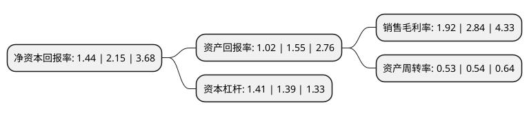

> 本页面由自动化程序生成于 2022年5月20日 01:32
> 内容可能存在错误，如有bug请提交issue至：https://github.com/Eroleice/doc-pi/issues
{.is-warning}

# 上市公司基本情况

## 基本资料

浙江红蜻蜓鞋业股份有限公司（以下简称“红蜻蜓”）成立于2007年09月19日，温州市。于2015年06月29日在上交所主板上市。

红蜻蜓注册资本57,620.08万元，主营业务:公司是一家以红蜻蜓品牌为主，集皮鞋，皮具，儿童用品的设计，开发，生产和销售为一体的时尚鞋服企业。主要产品:为红蜻蜓品牌成人皮鞋。以下是详细信息：

- 公司名称: 浙江红蜻蜓鞋业股份有限公司
- 股票代码: 603116.SH
- 所在地: 浙江 - 温州市
- 成立日期: 2007年09月19日
- 注册资本: 57,620.08万元
- 法定代表人: 钱金波
- 主营业务: 主营业务:公司是一家以红蜻蜓品牌为主，集皮鞋，皮具，儿童用品的设计，开发，生产和销售为一体的时尚鞋服企业主要产品:为红蜻蜓品牌成人皮鞋
- 公司官网: www.cnhqt.com
- 公司介绍: 公司是一家以红蜻蜓品牌为主，集皮鞋、皮具、儿童用品的设计、开发、生产和销售为一体的时尚鞋服企业。公司建立了遍布全国的营销网络，走出了一条以男女皮鞋为主，兼营皮具、儿童用品的快速发展之路。“红蜻蜓”品牌在广大消费者心目中已有相当的知名度和影响力，尤其在二、三线城市或商区，红蜻蜓占据领先市场份额，红蜻蜓产品时尚与舒适的特点深入人心，被国家工商总局认定为“驰名商标”，被中国皮革协会授予“中国真皮鞋王”称号，并多次获得多项国家、省、市级质量奖。公司非常重视产品的开发设计，致力于打造引领时尚和科技的一流产品，在全球时尚中心如法国巴黎、意大利米兰设有时尚信息中心。公司在温州、上海、广州、成都分别设有研发机构。

## 股东及高管情况

上市公司第一大股东为红蜻蜓集团有限公司，持股251,472,200股，占比43.64%，为上市公司实际控制人。

截至2022年03月31日，上市公司的前十大股东中，共有8名自然人股东，1名机构股东，1个产品账户，其中5%以上大股东共有2名。上市公司前十大股东明细如下：

> 截至2022年03月31日，上市公司前十大股东信息如下：

| 股东名称 | 持股数量（股） | 持股比例 |
| --- | --- | --- |
| 红蜻蜓集团有限公司 | 251,472,200 | 43.64% |
| 钱金波 | 56,339,806 | 9.78% |
| 金银宽 | 20,773,410 | 3.61% |
| 钱秀芬 | 16,802,002 | 2.92% |
| 陈铭海 | 13,848,940 | 2.4% |
| 广州市玄元投资管理有限公司-玄元科新162号私募证券投资基金 | 11,520,000 | 2% |
| 郑军 | 6,300,173 | 1.09% |
| 陈满仓 | 4,250,192 | 0.74% |
| 汪建斌 | 3,574,866 | 0.62% |
| 李忠康 | 3,276,000 | 0.57% |

## 利润表分析

上市公司2021年总收入为25.11亿元，净利润为0.48亿元，实现盈利。

## 杜邦分析

> 数据列示周期：2021年 | 2020年 | 2019年
{.is-info}

上市公司的净资产收益率在近一年有所下降，下降幅度为-33.02%，其变化情况分解如下：
- 上市公司的销售毛利率在近一年下降了-32.39%，可能是生产效率的下降、商品原材料价格上涨或商品价格的下跌所致。
- 上市公司的资产周转率在近一年下降了-1.85%，可能是源自于更慢的销售回款或库存管理效果下降。
- 上市公司的财务杠杆比率在近一年上升了1.44%，可能是增加负债扩大生产规模。

