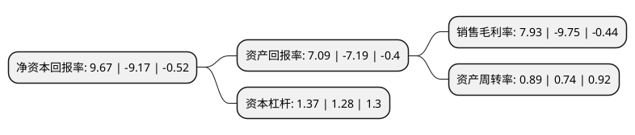

> 本页面由自动化程序生成于 2022年5月20日 01:33
> 内容可能存在错误，如有bug请提交issue至：https://github.com/Eroleice/doc-pi/issues
{.is-warning}

# 上市公司基本情况

## 基本资料

日播时尚集团股份有限公司（以下简称“日播时尚”）成立于2002年04月25日，上海市。于2017年05月31日在上交所主板上市。

日播时尚注册资本24,000万元，主要产品:自主品牌服装(上衣，外套，裤子，裙子等)以及配饰;主营业务:品牌服装的创意设计，工艺技术研发及生产销售。以下是详细信息：

- 公司名称: 日播时尚集团股份有限公司
- 股票代码: 603196.SH
- 所在地: 上海 - 上海市
- 成立日期: 2002年04月25日
- 注册资本: 24,000万元
- 法定代表人: 王卫东
- 主营业务: 主要产品:自主品牌服装(上衣，外套，裤子，裙子等)以及配饰;主营业务:品牌服装的创意设计，工艺技术研发及生产销售
- 公司官网: www.ribo-group.com
- 公司介绍: 公司为国内知名的服装品牌运营管理集团，其主营业务为品牌服装的创意设计、工艺技术研发及生产销售，并拥有强大的设计师队伍和专业的管理团队、先进的运作机制以及遍布全国主要城市的销售网络。公司专注于中高端时尚女装领域，为国内相对领先的时尚女装品牌运营管理集团。公司坚持原创设计原则，秉持“设计创新生活”的品牌理念，实施以“创意、设计”为主导的多品牌组合战略，积极、持续地打造品牌形象，为中高端主流消费群体提供精品服装。

## 股东及高管情况

上市公司第一大股东为上海日播投资控股有限公司，持股126,515,000股，占比52.71%，为上市公司实际控制人。

截至2022年03月31日，上市公司的前十大股东中，共有9名自然人股东，1名机构股东，其中5%以上大股东共有3名。上市公司前十大股东明细如下：

> 截至2022年03月31日，上市公司前十大股东信息如下：

| 股东名称 | 持股数量（股） | 持股比例 |
| --- | --- | --- |
| 上海日播投资控股有限公司 | 126,515,000 | 52.71% |
| 王卫东 | 27,870,000 | 11.61% |
| 曲江亭 | 14,720,000 | 6.13% |
| 廖永兵 | 1,681,900 | 0.7% |
| 林亮 | 1,400,000 | 0.58% |
| 赵红武 | 994,300 | 0.41% |
| 赵荣 | 958,200 | 0.4% |
| 倪新明 | 889,000 | 0.37% |
| 徐刚坤 | 823,300 | 0.34% |
| 谌建霞 | 818,000 | 0.34% |

## 利润表分析

上市公司2021年总收入为10.24亿元，净利润为0.81亿元，实现盈利。

## 杜邦分析

> 数据列示周期：2021年 | 2020年 | 2019年
{.is-info}

上市公司的净资产收益率在近一年有所下降，下降幅度为-205.45%，其变化情况分解如下：
- 上市公司的销售毛利率在近一年下降了-181.33%，可能是生产效率的下降、商品原材料价格上涨或商品价格的下跌所致。
- 上市公司的资产周转率在近一年上升了20.27%，可能是源自于更快的销售回款或库存管理效果提升。
- 上市公司的财务杠杆比率在近一年上升了7.03%，可能是增加负债扩大生产规模。

