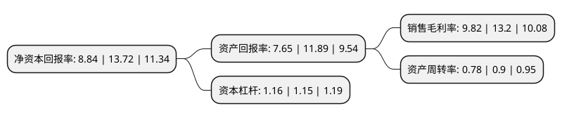

> 本页面由自动化程序生成于 2022年5月20日 01:34
> 内容可能存在错误，如有bug请提交issue至：https://github.com/Eroleice/doc-pi/issues
{.is-warning}

# 上市公司基本情况

## 基本资料

爱慕股份有限公司（以下简称“爱慕股份”）成立于1981年10月13日，北京市。于2021年05月31日在上交所主板上市。

爱慕股份注册资本40,001万元，专业从事高品质贴身服饰及其用品的研发，生产与销售。以下是详细信息：

- 公司名称: 爱慕股份有限公司
- 股票代码: 603511.SH
- 所在地: 北京 - 北京市
- 成立日期: 1981年10月13日
- 注册资本: 40,001万元
- 法定代表人: 张荣明
- 主营业务: 专业从事高品质贴身服饰及其用品的研发，生产与销售
- 公司官网: www.aimer.com.cn
- 公司介绍: 公司是中国知名的品牌企业，专业从事高品质贴身服饰及其用品的研发、生产与销售。公司秉承着“创造美，传递爱”的企业使命，专注于为消费者创造美好体验，致力于成为融合东方美学和现代设计并具有文化影响力的中国原创贴身服饰品牌企业。公司采取了多品牌、多品类、全渠道的运营模式。爱慕(Aímer)、爱慕先生(Aímer men)、爱美丽(imi’s)、爱慕儿童(Aímer kids)、慕澜(MODELAB)和兰卡文(La Clover)是公司已形成一定规模的主力品牌。爱慕运动(Aímer sports)、乎兮(Huxi)等是公司培育的具备一定成长潜力的品牌。除上述品牌外，公司的品牌组合还包括爱慕家居(Aímer home)、爱慕工坊(Aímer studio)、心爱(Shine love)、皇锦(EMPERORIENT)、纽格芙(Nature’s gift)等。公司运营的“爱慕官方旗舰店”已于2017年至2019年连续三年进入天猫“双11内衣热销店铺”前十名。同时，公司其他主力品牌爱美丽(imi’s)、爱慕儿童(Aímer kids)、慕澜(MODELAB)等均在其各自细分市场拥有相对优势的市场地位和市场口碑。公司因而连续多年被中国服装协会评为“全国服装行业百强企业”。

## 股东及高管情况

上市公司第一大股东为张荣明，持股163,323,229股，占比40.83%，为上市公司实际控制人。

截至2022年03月31日，上市公司的前十大股东中，共有1名自然人股东，8名机构股东，1个产品账户，其中5%以上大股东共有3名。上市公司前十大股东明细如下：

> 截至2022年03月31日，上市公司前十大股东信息如下：

| 股东名称 | 持股数量（股） | 持股比例 |
| --- | --- | --- |
| 张荣明 | 163,323,229 | 40.83% |
| 北京美山子科技发展中心(有限合伙) | 93,159,058 | 23.29% |
| 北京爱慕投资管理有限公司 | 67,246,734 | 16.81% |
| 曲水今盛泽优企业管理合伙企业(有限合伙) | 7,612,007 | 1.9% |
| 曲水今盛泽爱企业管理合伙企业(有限合伙) | 7,612,007 | 1.9% |
| 曲水今盛泽美企业管理合伙企业(有限合伙) | 6,619,137 | 1.65% |
| 嘉华优选(天津)企业管理咨询合伙企业(有限合伙) | 5,427,828 | 1.36% |
| 北京众海投资管理有限公司-北京众海嘉信网络科技合伙企业(有限合伙) | 2,520,000 | 0.63% |
| 福建晋江十月海畅股权投资合伙企业(有限合伙) | 2,160,000 | 0.54% |
| 北京朝投发投资管理有限公司-北京市盈润汇民基金管理中心(有限合伙) | 1,800,000 | 0.45% |

## 利润表分析

上市公司2021年总收入为35.18亿元，净利润为3.45亿元，实现盈利。

## 杜邦分析

> 数据列示周期：2021年 | 2020年 | 2019年
{.is-info}

上市公司的净资产收益率在近一年有所下降，下降幅度为-35.57%，其变化情况分解如下：
- 上市公司的销售毛利率在近一年下降了-25.61%，可能是生产效率的下降、商品原材料价格上涨或商品价格的下跌所致。
- 上市公司的资产周转率在近一年下降了-13.33%，可能是源自于更慢的销售回款或库存管理效果下降。
- 上市公司的财务杠杆比率在近一年上升了0.87%，可能是增加负债扩大生产规模。

