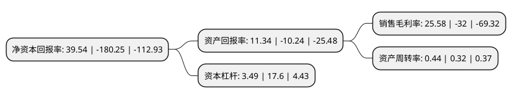

> 本页面由自动化程序生成于 2022年5月20日 01:34
> 内容可能存在错误，如有bug请提交issue至：https://github.com/Eroleice/doc-pi/issues
{.is-warning}

# 上市公司基本情况

## 基本资料

贵人鸟股份有限公司（以下简称“ST贵人”）成立于2004年07月13日，泉州市。于2014年01月24日在上交所主板上市。

ST贵人注册资本157,150.536万元，主要从事贵人鸟品牌运动鞋，运动服装的研发，设计，生产和销售。主要产品为运动鞋服。以下是详细信息：

- 公司名称: 贵人鸟股份有限公司
- 股票代码: 603555.SH
- 所在地: 福建 - 泉州市
- 成立日期: 2004年07月13日
- 注册资本: 157,150.536万元
- 法定代表人: 林思萍
- 主营业务: 主要从事贵人鸟品牌运动鞋，运动服装的研发，设计，生产和销售主要产品为运动鞋服
- 公司官网: www.grn.cn
- 公司介绍: 公司始创于1987年，是一家集运动鞋、服及配套产品研发、生产、营销于一体的综合性企业，是近年成长最为迅速的中国民族运动品牌。公司主要从事贵人鸟品牌运动鞋服的研发、生产和销售。目前，公司主要产品为贵人鸟品牌运动鞋及运动服装，分为“专业运动”和“运动休闲”两大系列，公司产品主要用于消费者进行体育活动、休闲生活的场合穿着，运动鞋和运动服装的生产模式不同，其中运动鞋主要由公司自主生产，运动服装则向外协厂采购，公司将重点放在设计研发、质量控制、品牌运营和销售渠道管控等环节。公司主要商标为“贵人鸟”，主要产品为运动鞋、运动服装以及配饰，公司产品主要面向大众消费市场。公司凭借差异化的品牌定位、全方位多层次的整合营销活动和战略性的三、四线城市布局，获得了消费者的认可。公司营销网络覆盖面积广，零售终端规模较大。

## 股东及高管情况

上市公司第一大股东为贵人鸟集团(香港)有限公司，持股411,420,000股，占比26.18%，**疑似为**上市公司实际控制人。

截至2022年03月31日，上市公司的前十大股东中，共有4名自然人股东，5名机构股东，1个产品账户，其中5%以上大股东共有2名。上市公司前十大股东明细如下：

> 未能通过持股比例判定出上市公司实际控制人（持股30%以上）
> 可能存在通过间接持股、联合持股、协议控制等方式拥有实际控制权的主体，具体请参考上市公司定期公告！
{.is-warning}

> 截至2022年03月31日，上市公司前十大股东信息如下：

| 股东名称 | 持股数量（股） | 持股比例 |
| --- | --- | --- |
| 贵人鸟集团(香港)有限公司 | 411,420,000 | 26.18% |
| 黑龙江泰富金谷网络科技有限公司 | 320,000,000 | 20.36% |
| 贵人鸟股份有限公司破产企业财产处置专用账户 | 74,107,343 | 4.72% |
| 高瑞 | 65,000,000 | 4.14% |
| 殷丽丽 | 65,000,000 | 4.14% |
| 张丽丽 | 65,000,000 | 4.14% |
| 中国华融资产管理股份有限公司 | 52,690,180 | 3.35% |
| 邹卫忠 | 24,863,989 | 1.58% |
| 三亚农村商业银行股份有限公司 | 19,051,468 | 1.21% |
| 福建华通银行股份有限公司 | 14,501,456 | 0.92% |

## 利润表分析

上市公司2021年总收入为14.19亿元，净利润为3.62亿元，实现盈利。

## 杜邦分析

> 数据列示周期：2021年 | 2020年 | 2019年
{.is-info}

上市公司的净资产收益率在近一年有所下降，下降幅度为-121.94%，其变化情况分解如下：
- 上市公司的销售毛利率在近一年下降了-179.94%，可能是生产效率的下降、商品原材料价格上涨或商品价格的下跌所致。
- 上市公司的资产周转率在近一年上升了37.5%，可能是源自于更快的销售回款或库存管理效果提升。
- 上市公司的财务杠杆比率在近一年下降了-80.17%，可能是减少负债降低财务费用。

