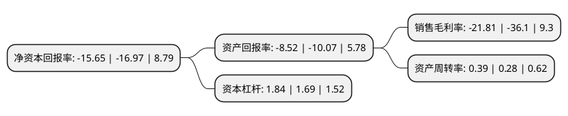

> 本页面由自动化程序生成于 2022年5月20日 01:34
> 内容可能存在错误，如有bug请提交issue至：https://github.com/Eroleice/doc-pi/issues
{.is-warning}

# 上市公司基本情况

## 基本资料

起步股份有限公司（以下简称“ST起步”）成立于2009年12月28日，丽水市。于2017年08月18日在上交所主板上市。

ST起步注册资本49,603.762万元，主营业务为童鞋，童装和儿童服饰配饰等的设计，研发，生产和销售。主要产品为儿童皮鞋，运动鞋和布鞋。以下是详细信息：

- 公司名称: 起步股份有限公司
- 股票代码: 603557.SH
- 所在地: 浙江 - 丽水市
- 成立日期: 2009年12月28日
- 注册资本: 49,603.762万元
- 法定代表人: 张连中
- 主营业务: 主营业务为童鞋，童装和儿童服饰配饰等的设计，研发，生产和销售主要产品为儿童皮鞋，运动鞋和布鞋
- 公司官网: www.abckids.com.cn
- 公司介绍: 公司是一家设计、研发、生产和销售童鞋、童装和儿童服饰配饰等为主的国内儿童用品行业知名的品牌运营商。公司坚持“为孩子提供健康、舒适、高性价比的儿童用品”的企业使命，秉承“用心经营爱”的企业理念，以“领跑中国童鞋，成为中国儿童用品领导品牌，逐步成为世界性的儿童用品企业”为企业愿景。致力传递ABC KIDS“因为爱”的品牌理念，打造卓越的儿童服饰行业领导品牌。公司始终坚持创新，为消费者提供高附加值、高性价比的儿童服饰产品。童鞋与童装业务协同发展，丰富的产品线满足了消费者对品牌儿童服饰一站式购物体验、全品类购物需求。

## 股东及高管情况

上市公司第一大股东为湖州鸿煜企业管理合伙企业(有限合伙)，持股143,843,689股，占比29%，**疑似为**上市公司实际控制人。

截至2022年03月31日，上市公司的前十大股东中，共有6名自然人股东，3名机构股东，1个产品账户，其中5%以上大股东共有3名。上市公司前十大股东明细如下：

> 未能通过持股比例判定出上市公司实际控制人（持股30%以上）
> 可能存在通过间接持股、联合持股、协议控制等方式拥有实际控制权的主体，具体请参考上市公司定期公告！
{.is-warning}

> 截至2022年03月31日，上市公司前十大股东信息如下：

| 股东名称 | 持股数量（股） | 持股比例 |
| --- | --- | --- |
| 湖州鸿煜企业管理合伙企业(有限合伙) | 143,843,689 | 29% |
| 香港起步国际集团有限公司 | 48,888,245 | 9.86% |
| 香港起步國際集團有限公司 | 48,888,245 | 9.86% |
| 张晓双 | 23,598,033 | 4.76% |
| 陈雨 | 23,590,033 | 4.76% |
| 青岛鹿秀投资管理有限公司-鹿秀驯鹿17号私募证券投资基金 | 5,379,500 | 1.08% |
| 盛俊岱 | 2,127,600 | 0.43% |
| 卢恩琴 | 2,055,500 | 0.41% |
| 林正德 | 2,048,700 | 0.41% |
| 徐海峰 | 1,682,139 | 0.34% |

## 利润表分析

上市公司2021年总收入为10.5亿元，净利润为-2.3亿元，**未实现盈利**。

## 杜邦分析

> 数据列示周期：2021年 | 2020年 | 2019年
{.is-info}

上市公司的净资产收益率在近一年有所下降，下降幅度为-7.78%，其变化情况分解如下：
- 上市公司的销售毛利率在近一年下降了-39.58%，可能是生产效率的下降、商品原材料价格上涨或商品价格的下跌所致。
- 上市公司的资产周转率在近一年上升了39.29%，可能是源自于更快的销售回款或库存管理效果提升。
- 上市公司的财务杠杆比率在近一年上升了8.88%，可能是增加负债扩大生产规模。

