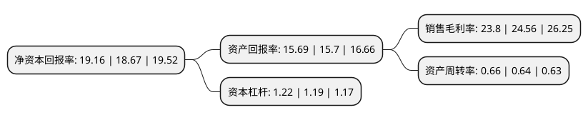

> 本页面由自动化程序生成于 2022年5月20日 01:34
> 内容可能存在错误，如有bug请提交issue至：https://github.com/Eroleice/doc-pi/issues
{.is-warning}

# 上市公司基本情况

## 基本资料

地素时尚股份有限公司（以下简称“地素时尚”）成立于2002年05月23日，上海市。于2018年06月22日在上交所主板上市。

地素时尚注册资本48,115万元，主营业务为中高端品牌女装相关的设计，推广以及销售。主要产品覆盖了女装领域的各类产品。以下是详细信息：

- 公司名称: 地素时尚股份有限公司
- 股票代码: 603587.SH
- 所在地: 上海 - 上海市
- 成立日期: 2002年05月23日
- 注册资本: 48,115万元
- 法定代表人: 马瑞敏
- 主营业务: 主营业务为中高端品牌女装相关的设计，推广以及销售主要产品覆盖了女装领域的各类产品
- 公司官网: www.dazzle-fashion.com
- 公司介绍: 公司是一家多品牌运作的服饰时尚集团，主营业务为中高端品牌女装相关的设计、推广以及销售。通过多品牌的战略及差异化定位，公司产品定位于18-45岁这一服装消费能力最强的女性消费群体，并分别覆盖中高端、高端和中端品牌女装市场，形成了对女装市场多维度、深层次的渗透。公司“DAZZLE”品牌经上海市工商行政管理局认定为“上海市著名商标”，并获得中国服装协会“第九届中国服装品牌年度大奖”中的“潜力大奖”荣誉。公司将在品牌的核心价值打造上,投入更多精力与资源,希望可以通过非凡个性的创意、充满艺术魅力的格调以及深切触动心灵的购物体验,筑造一个勇敢、创新、充满梦想的时尚乐园,为辛苦而脆弱的人生带来休憩与欢愉,成为专注时尚领域、具有国际竞争力的产业集团。

## 股东及高管情况

上市公司第一大股东为马瑞敏，持股259,181,965股，占比53.87%，为上市公司实际控制人。

截至2022年04月27日，上市公司的前十大股东中，共有5名自然人股东，1名机构股东，3个产品账户，1个海外主体，其中5%以上大股东共有3名。上市公司前十大股东明细如下：

> 截至2022年04月27日，上市公司前十大股东信息如下：

| 股东名称 | 持股数量（股） | 持股比例 |
| --- | --- | --- |
| 马瑞敏 | 259,181,965 | 53.87% |
| 马艺芯 | 48,016,296 | 9.98% |
| 马丽敏 | 32,640,000 | 6.78% |
| 上海亿马企业管理合伙企业(有限合伙) | 21,708,346 | 4.51% |
| 招商银行股份有限公司-上证红利交易型开放式指数证券投资基金 | 8,980,996 | 1.87% |
| 香港中央结算有限公司(陆股通) | 5,961,247 | 1.24% |
| 马姝敏 | 5,653,393 | 1.17% |
| 张浪 | 3,830,000 | 0.8% |
| 招商银行股份有限公司-泓德丰润三年持有期混合型证券投资基金 | 3,460,623 | 0.72% |
| 中国工商银行股份有限公司-泓德远见回报混合型证券投资基金 | 2,617,821 | 0.54% |

## 利润表分析

上市公司2021年总收入为28.97亿元，净利润为6.89亿元，实现盈利。

## 杜邦分析

> 数据列示周期：2021年 | 2020年 | 2019年
{.is-info}

上市公司的净资产收益率在近一年有所上升，上升幅度为2.62%，其变化情况分解如下：
- 上市公司的销售毛利率在近一年下降了-3.09%，可能是生产效率的下降、商品原材料价格上涨或商品价格的下跌所致。
- 上市公司的资产周转率在近一年上升了3.13%，可能是源自于更快的销售回款或库存管理效果提升。
- 上市公司的财务杠杆比率在近一年上升了2.52%，可能是增加负债扩大生产规模。

