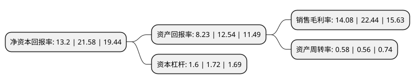

> 本页面由自动化程序生成于 2022年5月20日 01:35
> 内容可能存在错误，如有bug请提交issue至：https://github.com/Eroleice/doc-pi/issues
{.is-warning}

# 上市公司基本情况

## 基本资料

深圳歌力思服饰股份有限公司（以下简称“歌力思”）成立于1999年06月08日，深圳市。于2015年04月22日在上交所主板上市。

歌力思注册资本36,909.288万元，公司的主营业务为品牌女装的设计研发，生产和销售。主要产品为上衣类，裙类，外套类，裤类，女鞋及配饰，包括正装，休闲和高级三个系列。以下是详细信息：

- 公司名称: 深圳歌力思服饰股份有限公司
- 股票代码: 603808.SH
- 所在地: 广东 - 深圳市
- 成立日期: 1999年06月08日
- 注册资本: 36,909.288万元
- 法定代表人: 夏国新
- 主营业务: 公司的主营业务为品牌女装的设计研发，生产和销售主要产品为上衣类，裙类，外套类，裤类，女鞋及配饰，包括正装，休闲和高级三个系列
- 公司官网: www.ellassay.com
- 公司介绍: 公司主要从事女装的设计研发、生产和销售。公司是中国服装协会副会长单位、中国流行色协会授牌的中国女装色彩研发基地。“Ellassay”定位为中国高级女装品牌。经过多年的推广与经营，“Ellassay”已成长为极具竞争力的高端女装品牌。公司通过全资子公司东明国际拥有LAURèL GMBH在中国独立的所有权，包括设计权、定价权和销售权。“Laurèl”品牌的定位为国际轻奢高档女装，于1978年在慕尼黑成立，原为德国三大著名奢侈品牌之一的ESCADA旗下品牌。公司通过子公司中国香港唐利国际控股有限公司持有美国轻奢潮流品牌Ed Hardy在中国大陆及港澳台地区的品牌所有权，包括主品牌Ed Hardy及副品牌Ed HardySkinwear、Baby Hardy等。公司通过收购深圳前海上林投资管理有限公司16%股权，IRO是定位于轻奢领域的法国设计师品牌，以“street girls&fashionable women”为设计理念，追求街头情怀的法式简约风格，主打时尚女装产品。

## 股东及高管情况

上市公司第一大股东为深圳市歌力思投资管理有限公司，持股203,210,500股，占比55.06%，为上市公司实际控制人。

截至2022年04月29日，上市公司的前十大股东中，共有2名机构股东，7个产品账户，1个海外主体，其中5%以上大股东共有1名。上市公司前十大股东明细如下：

> 截至2022年04月29日，上市公司前十大股东信息如下：

| 股东名称 | 持股数量（股） | 持股比例 |
| --- | --- | --- |
| 深圳市歌力思投资管理有限公司 | 203,210,500 | 55.06% |
| 中国建设银行股份有限公司-中欧价值发现股票型证券投资基金 | 6,676,325 | 1.81% |
| 上海景林资产管理有限公司-景林丰收3号私募基金 | 5,343,442 | 1.45% |
| 中国工商银行股份有限公司-中欧潜力价值灵活配置混合型证券投资基金 | 4,040,679 | 1.09% |
| 上海景林资产管理有限公司-景林景泰丰收私募证券投资基金 | 3,796,224 | 1.03% |
| 国信证券股份有限公司 | 2,272,727 | 0.62% |
| 全国社保基金一一三组合 | 2,243,800 | 0.61% |
| 中国建设银行股份有限公司-华安生态优先混合型证券投资基金 | 2,059,085 | 0.56% |
| 上海阿杏投资管理有限公司-阿杏延安23号私募证券投资基金 | 2,006,800 | 0.54% |
| 香港中央结算有限公司(陆股通) | 1,955,391 | 0.53% |

## 利润表分析

上市公司2021年总收入为23.62亿元，净利润为3.32亿元，实现盈利。

## 杜邦分析

> 数据列示周期：2021年 | 2020年 | 2019年
{.is-info}

上市公司的净资产收益率在近一年有所下降，下降幅度为-38.83%，其变化情况分解如下：
- 上市公司的销售毛利率在近一年下降了-37.25%，可能是生产效率的下降、商品原材料价格上涨或商品价格的下跌所致。
- 上市公司的资产周转率在近一年上升了3.57%，可能是源自于更快的销售回款或库存管理效果提升。
- 上市公司的财务杠杆比率在近一年下降了-6.98%，可能是减少负债降低财务费用。

