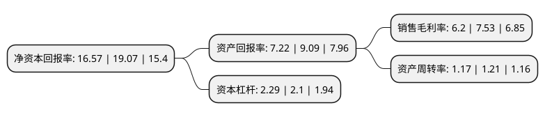

> 本页面由自动化程序生成于 2022年5月20日 01:35
> 内容可能存在错误，如有bug请提交issue至：https://github.com/Eroleice/doc-pi/issues
{.is-warning}

# 上市公司基本情况

## 基本资料

宁波太平鸟时尚服饰股份有限公司（以下简称“太平鸟”）成立于2001年09月10日，宁波市。于2017年01月09日在上交所主板上市。

太平鸟注册资本47,672.779万元，主营业务:致力于为消费者提供中等价位的优质时尚服饰。主要产品为各类品牌服饰产品，包括PEACEBIRD女装，PEACEBIRD男装，乐町LED’IN女装，MATERIAL GIRL女装，AMAZING PEACE男装，贝诗宝男装，Mini Peace童装等多个品牌。以下是详细信息：

- 公司名称: 宁波太平鸟时尚服饰股份有限公司
- 股票代码: 603877.SH
- 所在地: 浙江 - 宁波市
- 成立日期: 2001年09月10日
- 注册资本: 47,672.779万元
- 法定代表人: 张江平
- 主营业务: 主营业务:致力于为消费者提供中等价位的优质时尚服饰主要产品为各类品牌服饰产品，包括PEACEBIRD女装，PEACEBIRD男装，乐町LED’IN女装，MATERIAL GIRL女装，AMAZING PEACE男装，贝诗宝男装，Mini Peace童装等多个品牌
- 公司官网: www.peacebird.com
- 公司介绍: 公司是一家以零售为导向的多品牌时尚服饰公司。公司实施梯度品牌发展战略，各品牌针对差异化的细分市场，在目标消费群、品牌定位及产品设计等方面相互补充，满足日益细分的消费群体的多元需求；公司实施时尚化战略，高度注重产品研发设计，将当下最流行时尚元素和品牌风格融合于产品设计，造就强大的产品竞争力；公司采取“直营与加盟为主，代理为辅”相结合的销售模式，实现了电商与线下销售的同步快速发展。

## 股东及高管情况

上市公司第一大股东为太平鸟集团有限公司，持股229,362,000股，占比48.11%，为上市公司实际控制人。

截至2022年03月31日，上市公司的前十大股东中，共有4名自然人股东，5名机构股东，1个海外主体，其中5%以上大股东共有4名。上市公司前十大股东明细如下：

> 截至2022年03月31日，上市公司前十大股东信息如下：

| 股东名称 | 持股数量（股） | 持股比例 |
| --- | --- | --- |
| 太平鸟集团有限公司 | 229,362,000 | 48.11% |
| 陈红朝 | 44,435,500 | 9.32% |
| 宁波泛美投资管理有限公司 | 42,168,000 | 8.85% |
| 宁波鹏灏投资合伙企业(有限合伙) | 29,500,000 | 6.19% |
| 宁波禾乐投资股份有限公司 | 17,724,307 | 3.72% |
| 香港中央结算有限公司(陆股通) | 7,610,904 | 1.6% |
| 翁江宏 | 5,147,156 | 1.08% |
| 中信证券股份有限公司 | 4,292,277 | 0.9% |
| 王明峰 | 3,263,845 | 0.68% |
| 高路峰 | 3,259,926 | 0.68% |

## 利润表分析

上市公司2021年总收入为109.2亿元，净利润为6.76亿元，实现盈利。

## 杜邦分析

> 数据列示周期：2021年 | 2020年 | 2019年
{.is-info}

上市公司的净资产收益率在近一年有所下降，下降幅度为-13.11%，其变化情况分解如下：
- 上市公司的销售毛利率在近一年下降了-17.66%，可能是生产效率的下降、商品原材料价格上涨或商品价格的下跌所致。
- 上市公司的资产周转率在近一年下降了-3.31%，可能是源自于更慢的销售回款或库存管理效果下降。
- 上市公司的财务杠杆比率在近一年上升了9.05%，可能是增加负债扩大生产规模。

