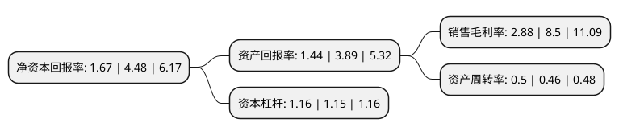

> 本页面由自动化程序生成于 2022年5月20日 01:36
> 内容可能存在错误，如有bug请提交issue至：https://github.com/Eroleice/doc-pi/issues
{.is-warning}

# 上市公司基本情况

## 基本资料

莱绅通灵珠宝股份有限公司（以下简称“莱绅通灵”）成立于1999年11月22日，南京市。于2016年11月23日在上交所主板上市。

莱绅通灵注册资本34,047.38万元，主营业务:珠宝首饰产品的设计，研发及销售业务，产品定位于中高端珠宝首饰零售市场，主要产品为钻石饰品和翡翠饰品。以下是详细信息：

- 公司名称: 莱绅通灵珠宝股份有限公司
- 股票代码: 603900.SH
- 所在地: 江苏 - 南京市
- 成立日期: 1999年11月22日
- 注册资本: 34,047.38万元
- 法定代表人: 马峻
- 主营业务: 主营业务:珠宝首饰产品的设计，研发及销售业务，产品定位于中高端珠宝首饰零售市场，主要产品为钻石饰品和翡翠饰品
- 公司官网: www.leysen1855.com
- 公司介绍: 公司主要经营比利时优质切工钻石和翡翠珠宝，致力于为顾客创造值得“为下一代珍藏”的珠宝。其独家发售的BLUEFLAME(新一代钻石蓝色火焰)，曾获HRD(比利时钻石高层议会)和安特卫普省政府联合颁发的荣誉证书，是中国珠宝行业完整拥有世界顶级钻石切割的专利产品，并被国土资源部珠宝玉石首饰管理中心、国家珠宝玉石质量监督检验中心(NGTC)授予“钻石革新设计奖”。公司收购了比利时王室珠宝供应商Joaillerie Leysen Freres SA，通过整合其百年积累的产品工艺和设计能力，公司将原通灵珠宝品牌升级为Leysen1855莱绅通灵，并确立“王室珠宝，为下一代珍藏”的高端珠宝品牌定位。

## 股东及高管情况

上市公司第一大股东为马峻，持股83,242,100股，占比24.45%，**疑似为**上市公司实际控制人。

截至2022年03月31日，上市公司的前十大股东中，共有6名自然人股东，2名机构股东，2个海外主体，其中5%以上大股东共有5名。上市公司前十大股东明细如下：

> 未能通过持股比例判定出上市公司实际控制人（持股30%以上）
> 可能存在通过间接持股、联合持股、协议控制等方式拥有实际控制权的主体，具体请参考上市公司定期公告！
{.is-warning}

> 截至2022年03月31日，上市公司前十大股东信息如下：

| 股东名称 | 持股数量（股） | 持股比例 |
| --- | --- | --- |
| 马峻 | 83,242,100 | 24.45% |
| 沈东军 | 53,042,900 | 15.58% |
| 王丽丽 | 36,019,200 | 10.58% |
| EUROSTAR DIAMONDS INTERNATIONAL S.A. | 24,705,940 | 7.26% |
| 蔄毅泽 | 18,900,000 | 5.55% |
| 南京克复荣光企业咨询合伙企业(有限合伙) | 17,023,700 | 5% |
| EURO DIAMOND(HK)LIMITED | 12,352,900 | 3.63% |
| 南京传世美璟投资管理有限公司 | 7,428,400 | 2.18% |
| 李玉芳 | 2,332,900 | 0.69% |
| 曹远宏 | 2,124,511 | 0.62% |

## 利润表分析

上市公司2021年总收入为13.24亿元，净利润为0.38亿元，实现盈利。

## 杜邦分析

> 数据列示周期：2021年 | 2020年 | 2019年
{.is-info}

上市公司的净资产收益率在近一年有所下降，下降幅度为-62.72%，其变化情况分解如下：
- 上市公司的销售毛利率在近一年下降了-66.12%，可能是生产效率的下降、商品原材料价格上涨或商品价格的下跌所致。
- 上市公司的资产周转率在近一年上升了8.7%，可能是源自于更快的销售回款或库存管理效果提升。
- 上市公司的财务杠杆比率在近一年上升了0.87%，可能是增加负债扩大生产规模。

