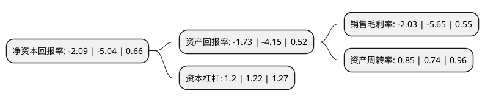

> 本页面由自动化程序生成于 2022年5月20日 01:36
> 内容可能存在错误，如有bug请提交issue至：https://github.com/Eroleice/doc-pi/issues
{.is-warning}

# 上市公司基本情况

## 基本资料

哈森商贸(中国)股份有限公司（以下简称“哈森股份”）成立于2006年08月21日，苏州市。于2016年06月29日在上交所主板上市。

哈森股份注册资本22,136万元，主营业务:中高端皮鞋的品牌运营﹑产品设计，生产和销售。主要产品:哈森(HARSON)，卡迪娜(KADINA)，卡文(COVER)，爱旅儿(ALLER-A)及哈森男鞋(HARSON BUSINESS)。以下是详细信息：

- 公司名称: 哈森商贸(中国)股份有限公司
- 股票代码: 603958.SH
- 所在地: 江苏 - 苏州市
- 成立日期: 2006年08月21日
- 注册资本: 22,136万元
- 法定代表人: 陈玉珍
- 主营业务: 主营业务:中高端皮鞋的品牌运营﹑产品设计，生产和销售主要产品:哈森(HARSON)，卡迪娜(KADINA)，卡文(COVER)，爱旅儿(ALLER-A)及哈森男鞋(HARSON BUSINESS)
- 公司官网: www.harsongroup.com
- 公司介绍: 公司是一家皮鞋制造商和零售商，主要从事中高端皮鞋的品牌运营﹑产品设计、生产和销售。公司先后多次获得中国皮革工业协会授予的“中国十大真皮鞋王”、“中国真皮领先鞋王”、“全国质量诚信倡议先进典型企业”等荣誉称号。公司的长期发展目标是成为国内一流的皮鞋制造商和零售商，短期目标是建立与目标市场相适应的营销网络；创新营销方式，提高单店盈利能力；整合自有品牌和代理品牌，逐步形成具有良好辨识度和稳定顾客群的品牌体系；适应市场变化，积极发展网络营销；在国内女鞋市场取得更大进步，在男鞋市场取得新的突破；严格质量管理，公司品牌优质的良好口碑。

## 股东及高管情况

上市公司第一大股东为珍兴国际股份有限公司，持股144,473,835股，占比65.27%，为上市公司实际控制人。

截至2022年03月31日，上市公司的前十大股东中，共有5名自然人股东，3名机构股东，2个海外主体，其中5%以上大股东共有1名。上市公司前十大股东明细如下：

> 截至2022年03月31日，上市公司前十大股东信息如下：

| 股东名称 | 持股数量（股） | 持股比例 |
| --- | --- | --- |
| 珍兴国际股份有限公司 | 144,473,835 | 65.27% |
| 香港欣荣投资有限公司 | 4,426,805 | 2% |
| 昆山珍实投资咨询有限公司 | 3,001,069 | 1.36% |
| AMAZING NINGBO  LIMITED | 2,999,996 | 1.36% |
| UBS AG | 1,710,010 | 0.77% |
| 侯书桥 | 1,070,000 | 0.48% |
| 胡玉兰 | 1,047,000 | 0.47% |
| 赵小弟 | 923,800 | 0.42% |
| 宫尚俊 | 910,000 | 0.41% |
| 刘慧桢 | 584,100 | 0.26% |

## 利润表分析

上市公司2021年总收入为9.89亿元，净利润为-0.21亿元，**未实现盈利**。

## 杜邦分析

> 数据列示周期：2021年 | 2020年 | 2019年
{.is-info}

上市公司的净资产收益率在近一年有所下降，下降幅度为-58.53%，其变化情况分解如下：
- 上市公司的销售毛利率在近一年下降了-64.07%，可能是生产效率的下降、商品原材料价格上涨或商品价格的下跌所致。
- 上市公司的资产周转率在近一年上升了14.86%，可能是源自于更快的销售回款或库存管理效果提升。
- 上市公司的财务杠杆比率在近一年下降了-1.64%，可能是减少负债降低财务费用。

