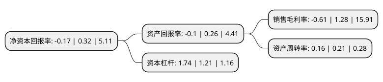

> 本页面由自动化程序生成于 2022年5月20日 01:01
> 内容可能存在错误，如有bug请提交issue至：https://github.com/Eroleice/doc-pi/issues
{.is-warning}

# 上市公司基本情况

## 基本资料

深圳市机场股份有限公司（以下简称“深圳机场”）成立于1998年04月10日，深圳市。于1998年04月20日在深交所主板上市。

深圳机场注册资本205,076.951万元，主要业务:航空主业以及航空主业延伸出的非航空业务。以下是详细信息：

- 公司名称: 深圳市机场股份有限公司
- 股票代码: 000089.SZ
- 所在地: 广东 - 深圳市
- 成立日期: 1998年04月10日
- 注册资本: 205,076.951万元
- 法定代表人: 陈繁华
- 主营业务: 航空主业以及航空主业延伸出的非航空业务
- 公司官网: www.szairport.com
- 公司介绍: 公司是国内最早由地方政府自主投资建设管理的机场，也是中国最大的航空运输市场之一。公司作为深圳宝安国际机场管理公司，主要经营航空主业以及航空主业延伸出的非航空业务。航空主业主要包括飞机起降及停场保障，机场飞行控制区的维护与运营管理，旅客的乘机、候机及进出港服务，航站楼商业及物业租赁业务、航空器的维护及辅助服务，航空货物的地面处理服务等，航空主业是机场作为民航运输基础设施固有承担的业务。非航空业务包括航空物流业务和航空增值业务。公司始终坚持打造科学高效的管理体系和市场化机制，致力于成为航空运输安全运行秩序的管理者、优质服务的提供者、社会效益的创造者。公司积极落实民航强国战略，携手国际一流合作伙伴，深度参与“未来机场”建设；与互联网领军企业加强战略合作，大力推进“数字化转型”，着力提升旅客体验和运营效率，更好保障机场公共安全和运营安全，力争成为行业发展的引领者。

## 股东及高管情况

上市公司第一大股东为深圳市机场(集团)有限公司，持股1,168,295,532股，占比56.97%，为上市公司实际控制人。

截至2022年03月31日，上市公司的前十大股东中，共有1名机构股东，6个产品账户，2个海外主体，1名其他股东，其中5%以上大股东共有1名。上市公司前十大股东明细如下：

> 截至2022年03月31日，上市公司前十大股东信息如下：

| 股东名称 | 持股数量（股） | 持股比例 |
| --- | --- | --- |
| 深圳市机场(集团)有限公司 | 1,168,295,532 | 56.97% |
| 香港中央结算有限公司(陆股通) | 55,115,298 | 2.69% |
| GIC PRIVATE LIMITED | 25,362,504 | 1.24% |
| 新华人寿保险股份有限公司-传统-普通保险产品-018L-CT001深 | 13,866,560 | 0.68% |
| 上海景林资产管理有限公司-景林丰收3号私募基金 | 12,377,976 | 0.6% |
| 基本养老保险基金一二零一组合 | 12,365,013 | 0.6% |
| 科威特政府投资局 | 9,960,828 | 0.49% |
| 中国建设银行股份有限公司-中欧新蓝筹灵活配置混合型证券投资基金 | 7,176,556 | 0.35% |
| 华润深国投信托有限公司-华润信托·景林乐享丰收集合资金信托计划 | 6,257,301 | 0.31% |
| 浙江旌安投资管理有限公司-旌安家远私募证券投资基金 | 6,109,800 | 0.3% |

## 利润表分析

上市公司2021年总收入为33.05亿元，净利润为-0.21亿元，**未实现盈利**。

## 杜邦分析

> 数据列示周期：2021年 | 2020年 | 2019年
{.is-info}

上市公司的净资产收益率在近一年有所下降，下降幅度为-153.12%，其变化情况分解如下：
- 上市公司的销售毛利率在近一年下降了-147.66%，可能是生产效率的下降、商品原材料价格上涨或商品价格的下跌所致。
- 上市公司的资产周转率在近一年下降了-23.81%，可能是源自于更慢的销售回款或库存管理效果下降。
- 上市公司的财务杠杆比率在近一年上升了43.8%，可能是增加负债扩大生产规模。

