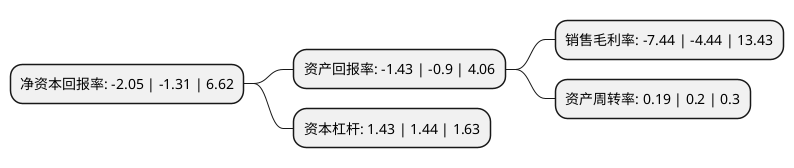

> 本页面由自动化程序生成于 2022年5月20日 01:23
> 内容可能存在错误，如有bug请提交issue至：https://github.com/Eroleice/doc-pi/issues
{.is-warning}

# 上市公司基本情况

## 基本资料

广州白云国际机场股份有限公司（以下简称“白云机场”）成立于2000年09月19日，广州市。于2003年04月28日在上交所主板上市。

白云机场注册资本236,671.828万元，主要业务:以航空器，旅客和货物，邮件为对象，提供飞机起降与停场，旅客综合服务，安全检查以及航空地面保障等航空服务业务，和货邮代理服务，航站楼内商业场地租赁服务，特许经营服务，地面运输服务和广告服务等航空性延伸服务业务。以下是详细信息：

- 公司名称: 广州白云国际机场股份有限公司
- 股票代码: 600004.SH
- 所在地: 广东 - 广州市
- 成立日期: 2000年09月19日
- 注册资本: 236,671.828万元
- 法定代表人: 邱嘉臣
- 主营业务: 以航空器，旅客和货物，邮件为对象，提供飞机起降与停场，旅客综合服务，安全检查以及航空地面保障等航空服务业务，和货邮代理服务，航站楼内商业场地租赁服务，特许经营服务，地面运输服务和广告服务等航空性延伸服务业务
- 公司官网: www.baiyunport.com
- 公司介绍: 公司是国内三大门户复合型枢纽机场之一，是国家着力打造的珠三角世界级机场群及粤港澳大湾区的核心机场。公司为白云机场的管理和运营机构，以白云机场为经营载体，主要从事以航空器、旅客和货物、邮件为对象，提供飞机起降与停场、旅客综合服务、安全检查以及航空地面保障等航空服务业务，和货邮代理服务、航站楼内商业场地租赁服务、特许经营服务、地面运输服务和广告服务等航空性延伸服务业务。公司目前拥有两座航站楼，三条跑道，以及完善的旅客服务、货物处理设施，主要在白云机场运营和管理航空性及非航空性业务。公司凭借其得天独厚的地理位置及海陆空层次分明的交通体系，具有覆盖东南亚、连接欧美澳，辐射内地各主要城市的天然网络优势。公司航线网络已覆盖全球五大洲，不论是旅客增量还是增速都处于领先地位。

## 股东及高管情况

上市公司第一大股东为广东省机场管理集团有限公司，持股1,353,744,552股，占比57.2%，为上市公司实际控制人。

截至2022年03月31日，上市公司的前十大股东中，共有2名机构股东，5个产品账户，2个海外主体，1名其他股东，其中5%以上大股东共有1名。上市公司前十大股东明细如下：

> 截至2022年03月31日，上市公司前十大股东信息如下：

| 股东名称 | 持股数量（股） | 持股比例 |
| --- | --- | --- |
| 广东省机场管理集团有限公司 | 1,353,744,552 | 57.2% |
| 香港中央结算有限公司(陆股通) | 78,163,744 | 3.3% |
| 信泰人寿保险股份有限公司-传统产品 | 21,765,803 | 0.92% |
| UBS AG | 20,827,966 | 0.88% |
| 华夏人寿保险股份有限公司-自有资金 | 20,693,045 | 0.87% |
| 平安安赢股票型养老金产品-中国银行股份有限公司 | 19,766,099 | 0.84% |
| 平安资产-工商银行-平安资产如意28号保险资产管理产品 | 16,309,181 | 0.69% |
| 中国建设银行股份有限公司-华安国企改革主题灵活配置混合型证券投资基金 | 15,178,865 | 0.64% |
| 挪威中央银行-自有资金 | 13,704,139 | 0.58% |
| 安本标准投资管理(亚洲)有限公司-安本标准-中国A股股票基金 | 12,578,282 | 0.53% |

## 利润表分析

上市公司2021年总收入为51.8亿元，净利润为-3.86亿元，**未实现盈利**。

## 杜邦分析

> 数据列示周期：2021年 | 2020年 | 2019年
{.is-info}

上市公司的净资产收益率在近一年有所上升，上升幅度为56.49%，其变化情况分解如下：
- 上市公司的销售毛利率在近一年上升了67.57%，可能是生产效率的提升、商品原材料价格下跌或商品价格的上涨所致。
- 上市公司的资产周转率在近一年下降了-5%，可能是源自于更慢的销售回款或库存管理效果下降。
- 上市公司的财务杠杆比率在近一年下降了-0.69%，可能是减少负债降低财务费用。

