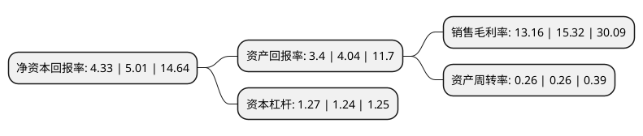

> 本页面由自动化程序生成于 2022年5月20日 01:29
> 内容可能存在错误，如有bug请提交issue至：https://github.com/Eroleice/doc-pi/issues
{.is-warning}

# 上市公司基本情况

## 基本资料

元翔(厦门)国际航空港股份有限公司（以下简称“厦门空港”）成立于2003年09月06日，厦门市。于1996年05月31日在上交所主板上市。

厦门空港注册资本29,781万元，主要业务:国内外航空运输企业及旅客提供地面保障服务;出租和管理候机楼内航空营业场所，商业场所和办公场所;商务信息咨询;旅客票务代理;其他航空运输辅助活动;装卸搬运;国内货运代理;其他未列明运输代理业务;其他仓储业;物业管理;停车场管理。以下是详细信息：

- 公司名称: 元翔(厦门)国际航空港股份有限公司
- 股票代码: 600897.SH
- 所在地: 福建 - 厦门市
- 成立日期: 2003年09月06日
- 注册资本: 29,781万元
- 法定代表人: 朱昭
- 主营业务: 国内外航空运输企业及旅客提供地面保障服务;出租和管理候机楼内航空营业场所，商业场所和办公场所;商务信息咨询;旅客票务代理;其他航空运输辅助活动;装卸搬运;国内货运代理;其他未列明运输代理业务;其他仓储业;物业管理;停车场管理
- 公司官网: www.xiamenairport.com.cn
- 公司介绍: 公司自1983年通航以来，逐步发展成为中国东南沿海重要的区域性航空枢纽。公司的经营范围是为国内外航空运输企业及旅客提供地面保障服务；出租和管理候机楼内航空营业场所、商业场所和办公场所；商务信息咨询；旅客票务代理；其他航空运输辅助活动；装卸搬运；国内货运代理；其他未列明运输代理业务；其他仓储业；物业管理；停车场管理。目前，公司空港飞行区等级为4E级，可起降B747－8等大型飞机，公司已形成覆盖中国大陆各主要城市及港、澳、台地区，连接东南亚、东北亚，通达欧、美、澳三大洲的航线网络。公司持续深耕人文内涵，从元素布景到主题空间，从艺趣体验到沉浸互动，从智能科技到创新服务，打造“最文艺”、“最具人情味”的文化体验休闲地；提升航延处置效率、完善机场服务质量标准体系，深入服务产品开发，利用大数据、电子信息等现代化技术，促进机场服务产品高质量高水准，提升客户体验价值，差异化提升服务品质。公司空港致力于深度开发流量及其价值，打造具有闽台海洋文化特色的人文机场，成为国内机场业引领体制机制变革，践行精益管理，独具品牌魅力的最佳机场运营商。

## 股东及高管情况

上市公司第一大股东为厦门翔业集团有限公司，持股202,500,000股，占比68%，为上市公司实际控制人。

截至2022年03月31日，上市公司的前十大股东中，共有1名自然人股东，8名机构股东，1个产品账户，其中5%以上大股东共有1名。上市公司前十大股东明细如下：

> 截至2022年03月31日，上市公司前十大股东信息如下：

| 股东名称 | 持股数量（股） | 持股比例 |
| --- | --- | --- |
| 厦门翔业集团有限公司 | 202,500,000 | 68% |
| 幸福人寿保险股份有限公司-分红 | 5,171,945 | 1.74% |
| 阿拉丁航空有限公司 | 3,800,000 | 1.28% |
| 幸福人寿保险股份有限公司-财富恒享两全(2019) | 3,187,640 | 1.07% |
| 王文峰 | 2,906,000 | 0.98% |
| 幸福人寿保险股份有限公司-资本补充债(2018) | 2,667,341 | 0.9% |
| 中国银行股份有限公司-嘉实物流产业股票型证券投资基金 | 1,996,500 | 0.67% |
| 中国太平洋人寿保险股份有限公司-分红-团体分红 | 1,400,000 | 0.47% |
| 中国太平洋人寿保险股份有限公司-分红-个人分红 | 1,187,724 | 0.4% |
| 幸福人寿保险股份有限公司-自有资金 | 992,540 | 0.33% |

## 利润表分析

上市公司2021年总收入为12.47亿元，净利润为1.64亿元，实现盈利。

## 杜邦分析

> 数据列示周期：2021年 | 2020年 | 2019年
{.is-info}

上市公司的净资产收益率在近一年有所下降，下降幅度为-13.57%，其变化情况分解如下：
- 上市公司的销售毛利率在近一年下降了-14.1%，可能是生产效率的下降、商品原材料价格上涨或商品价格的下跌所致。
- 上市公司的资产周转率在近一年下降了0%，可能是源自于更慢的销售回款或库存管理效果下降。
- 上市公司的财务杠杆比率在近一年上升了2.42%，可能是增加负债扩大生产规模。

