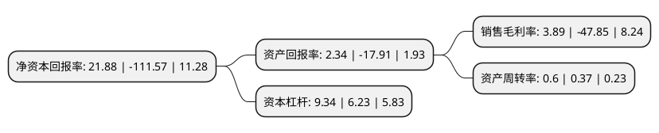

> 本页面由自动化程序生成于 2022年5月20日 01:07
> 内容可能存在错误，如有bug请提交issue至：https://github.com/Eroleice/doc-pi/issues
{.is-warning}

# 上市公司基本情况

## 基本资料

威海华东数控股份有限公司（以下简称“华东数控”）成立于2002年03月04日，威海市。于2008年06月12日在深交所中小板上市。

华东数控注册资本30,749.56万元，主营业务:以研制，生产制造数控机床，数控机床关键功能部件(数控系统，编码器，高速精密机床主轴，刀库等)及普通机床为主营业务的高新技术企业。以下是详细信息：

- 公司名称: 威海华东数控股份有限公司
- 股票代码: 002248.SZ
- 所在地: 山东 - 威海市
- 成立日期: 2002年03月04日
- 注册资本: 30,749.56万元
- 法定代表人: 连小明
- 主营业务: 主营业务:以研制，生产制造数控机床，数控机床关键功能部件(数控系统，编码器，高速精密机床主轴，刀库等)及普通机床为主营业务的高新技术企业
- 公司官网: www.huadongcnc.com/www.002248.net
- 公司介绍: 公司历经十年的发展，形成了以数控机床发展为主线，多向延伸产业链条，逐步向与数控机床产业密切相关、国家积极鼓励的新能源装备行业进军的战略格局。并已初步形成新能源高端装备制造、重型精密机床制造及重型精密加工、数控及普通机床、太阳能光伏发电逆变器及电站工程四个业务板块。主导产品有数控龙门导轨磨床系列产品、数控龙门铣镗床系列产品(包含定梁定柱、定梁动柱、动梁定柱、动梁动柱)、数控落地镗铣床系列产品、数控立式车床、数控立、卧加工中心、万能摇臂铣床、平面磨床等系列产品。公司建有省级技术中心、省级工程研究中心、省级工程实验室等研发机构，为山东省高新技术企业。公司通过ISO9001:2008，ISO14001:2004，GB/T28001-2001质量管理体系、环境管理体系、职业健康安全管理体系认证，金太阳能产品认证，CE认证，ASME认证，TUV认证。具备并已承担了高档精密数控机床、金太阳光伏发电等国家级重点项目工程。

## 股东及高管情况

上市公司第一大股东为威海威高国际医疗投资控股有限公司，持股53,825,800股，占比17.5%，**疑似为**上市公司实际控制人。

截至2022年03月31日，上市公司的前十大股东中，共有8名自然人股东，1名机构股东，1个产品账户，其中5%以上大股东共有1名。上市公司前十大股东明细如下：

> 未能通过持股比例判定出上市公司实际控制人（持股30%以上）
> 可能存在通过间接持股、联合持股、协议控制等方式拥有实际控制权的主体，具体请参考上市公司定期公告！
{.is-warning}

> 截至2022年03月31日，上市公司前十大股东信息如下：

| 股东名称 | 持股数量（股） | 持股比例 |
| --- | --- | --- |
| 威海威高国际医疗投资控股有限公司 | 53,825,800 | 17.5% |
| 唐鑛 | 5,409,900 | 1.76% |
| 汤世贤 | 4,556,257 | 1.48% |
| 王志明 | 1,513,301 | 0.49% |
| 涂植纯 | 1,333,300 | 0.43% |
| 方芳 | 1,257,002 | 0.41% |
| 林国法 | 1,159,400 | 0.38% |
| 陈颢之 | 994,700 | 0.32% |
| 欧阳春 | 926,100 | 0.3% |
| 北京愚公移山投资顾问有限公司-愚公移山私募基金1号 | 860,300 | 0.28% |

## 利润表分析

上市公司2021年总收入为3.15亿元，净利润为0.12亿元，实现盈利。

## 杜邦分析

> 数据列示周期：2021年 | 2020年 | 2019年
{.is-info}

上市公司的净资产收益率在近一年有所下降，下降幅度为-119.61%，其变化情况分解如下：
- 上市公司的销售毛利率在近一年下降了-108.13%，可能是生产效率的下降、商品原材料价格上涨或商品价格的下跌所致。
- 上市公司的资产周转率在近一年上升了62.16%，可能是源自于更快的销售回款或库存管理效果提升。
- 上市公司的财务杠杆比率在近一年上升了49.92%，可能是增加负债扩大生产规模。

