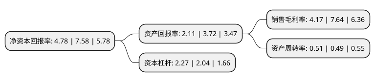

> 本页面由自动化程序生成于 2022年5月20日 01:10
> 内容可能存在错误，如有bug请提交issue至：https://github.com/Eroleice/doc-pi/issues
{.is-warning}

# 上市公司基本情况

## 基本资料

江苏亚威机床股份有限公司（以下简称“亚威股份”）成立于2000年02月12日，扬州市。于2011年03月03日在深交所中小板上市。

亚威股份注册资本55,672.301万元，主营业务;从事板材成形机床产品的研发，生产，加工及销售。主要产品:分为三大类，分别为数控平板加工机床，普通平板加工机床，数控卷板加工机械。以下是详细信息：

- 公司名称: 江苏亚威机床股份有限公司
- 股票代码: 002559.SZ
- 所在地: 江苏 - 扬州市
- 成立日期: 2000年02月12日
- 注册资本: 55,672.301万元
- 法定代表人: 冷志斌
- 主营业务: 主营业务;从事板材成形机床产品的研发，生产，加工及销售主要产品:分为三大类，分别为数控平板加工机床，普通平板加工机床，数控卷板加工机械
- 公司官网: www.yawei.cc
- 公司介绍: 公司是国内中高端金属板材成形机床行业的领先企业之一。研发制造销售数控转塔冲床、数控折弯机、数控激光切割机、金属平板加工自动化系统、金属卷板加工自动化生产线、线性和水平多关节机器人等高端、智能、自动化产品。企业设有国家级博士后科研工作站，是国家火炬计划重点高新技术企业，建有省级技术中心，有近300名从事技术创新产品研发人员，先后承担并成功完成多项国家级、省级科技攻关和科技成果转化项目。产品和服务定位于国内外中高端客户市场，多年来以行业领先的技术性能水平、优质的实物质量和完善高效的一体化营销服务体系赢得了国内外客户的长期青睐。公司先后被授予“全国机械工业先进集体”、“全国质量工作先进单位”、“中国机床工具行业30强”、“江苏省五一劳动奖状”、“江苏省优秀企业”等荣誉称号。

## 股东及高管情况

上市公司第一大股东为江苏亚威科技投资有限公司，持股41,456,751股，占比7.45%，**疑似为**上市公司实际控制人。

截至2022年03月31日，上市公司的前十大股东中，共有8名自然人股东，1名机构股东，1个产品账户，其中5%以上大股东共有1名。上市公司前十大股东明细如下：

> 未能通过持股比例判定出上市公司实际控制人（持股30%以上）
> 可能存在通过间接持股、联合持股、协议控制等方式拥有实际控制权的主体，具体请参考上市公司定期公告！
{.is-warning}

> 上市公司第一大股东持股不超过10%，请检查是否存在公司控制权风险！
{.is-danger}

> 截至2022年03月31日，上市公司前十大股东信息如下：

| 股东名称 | 持股数量（股） | 持股比例 |
| --- | --- | --- |
| 江苏亚威科技投资有限公司 | 41,456,751 | 7.45% |
| 吉素琴 | 21,713,247 | 3.9% |
| 冷志斌 | 20,754,895 | 3.73% |
| 中国工商银行股份有限公司-诺安先锋混合型证券投资基金 | 13,539,850 | 2.43% |
| 闻庆云 | 12,312,152 | 2.21% |
| 张敬兵 | 12,308,050 | 2.21% |
| 施金霞 | 11,786,968 | 2.12% |
| 王宏祥 | 9,562,862 | 1.72% |
| 周家智 | 9,104,652 | 1.64% |
| 潘恩海 | 7,282,049 | 1.31% |

## 利润表分析

上市公司2021年总收入为19.99亿元，净利润为0.83亿元，实现盈利。

## 杜邦分析

> 数据列示周期：2021年 | 2020年 | 2019年
{.is-info}

上市公司的净资产收益率在近一年有所下降，下降幅度为-36.94%，其变化情况分解如下：
- 上市公司的销售毛利率在近一年下降了-45.42%，可能是生产效率的下降、商品原材料价格上涨或商品价格的下跌所致。
- 上市公司的资产周转率在近一年上升了4.08%，可能是源自于更快的销售回款或库存管理效果提升。
- 上市公司的财务杠杆比率在近一年上升了11.27%，可能是增加负债扩大生产规模。

