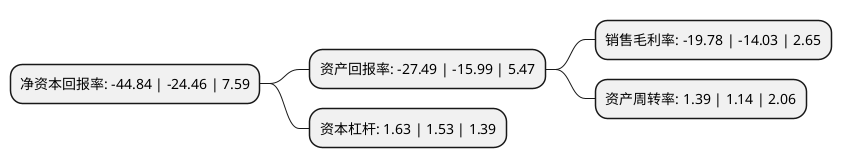

> 本页面由自动化程序生成于 2022年5月20日 01:11
> 内容可能存在错误，如有bug请提交issue至：https://github.com/Eroleice/doc-pi/issues
{.is-warning}

# 上市公司基本情况

## 基本资料

无锡华东重型机械股份有限公司（以下简称“华东重机”）成立于2004年01月09日，无锡市。于2012年06月12日在深交所中小板上市。

华东重机注册资本100,769.064万元，主要业务:轨道吊，岸桥等集装箱装卸设备的研发，生产，销售与安装业务，以及以加工，贸易为主的不锈钢板块业务。主要产品:岸桥，轨道吊，轮胎吊，通用门式起重机和门座式起重机等集装箱装卸设备以下是详细信息：

- 公司名称: 无锡华东重型机械股份有限公司
- 股票代码: 002685.SZ
- 所在地: 江苏 - 无锡市
- 成立日期: 2004年01月09日
- 注册资本: 100,769.064万元
- 法定代表人: 翁耀根
- 主营业务: 轨道吊，岸桥等集装箱装卸设备的研发，生产，销售与安装业务，以及以加工，贸易为主的不锈钢板块业务主要产品:岸桥，轨道吊，轮胎吊，通用门式起重机和门座式起重机等集装箱装卸设备
- 公司官网: www.hdhm.com
- 公司介绍: 公司创始于1990年，是专业生产集装箱装卸设备的知名企业，为A股上市企业。其产品主要包括各种规格的岸边集装箱起重机、轨道式集装箱门式起重机、轮胎式集装箱门式起重机、通用门式起重机和门座式起重机等专业港口装卸设备。公司总部设在经济发达的长江三角洲，近代起重工业之都—江苏无锡。公司拥有专业的经营管理团队、经验丰富的工程设计人员和技术娴熟的工人。公司产品已出口韩国、印尼、泰国、孟加拉国、哈萨克斯坦及巴拿马等国家与地区。并且已成功进入中国香港和记黄埔、PSA、DP World等全球知名港口运营商控股及参股的港口码头，公司产品广泛应用于国内上海、广州、大连、珠海、湛江、锦州、日照、宁波、厦门、广西北部湾等大型海港，以及宜宾、泸州、重庆、武汉、芜湖、南京等内河港口。公司拥有强大的设计、制造和安装能力，能够满足用户对质量、交货期和服务的高标准要求。到目前为止，公司产品已经遍布国内外100多个港口码头。

## 股东及高管情况

上市公司第一大股东为周文元，持股178,177,676股，占比17.68%，**疑似为**上市公司实际控制人。

截至2022年05月11日，上市公司的前十大股东中，共有6名自然人股东，2名机构股东，2个产品账户，其中5%以上大股东共有5名。上市公司前十大股东明细如下：

> 未能通过持股比例判定出上市公司实际控制人（持股30%以上）
> 可能存在通过间接持股、联合持股、协议控制等方式拥有实际控制权的主体，具体请参考上市公司定期公告！
{.is-warning}

> 截至2022年05月11日，上市公司前十大股东信息如下：

| 股东名称 | 持股数量（股） | 持股比例 |
| --- | --- | --- |
| 周文元 | 178,177,676 | 17.68% |
| 周文元 | 178,177,676 | 17.68% |
| 翁耀根 | 80,266,667 | 7.97% |
| 翁耀根 | 80,266,667 | 7.97% |
| 深圳鸿基天成投资管理有限公司-鸿基天成优选六号私募证券投资基金 | 51,500,000 | 5.11% |
| 无锡华东重机科技集团有限公司 | 48,035,333 | 4.77% |
| 无锡振杰投资有限公司 | 22,000,000 | 2.18% |
| 深圳市云图资产管理服务有限公司-云图优选10号私募证券投资基金 | 20,000,000 | 1.98% |
| 翁霖 | 14,047,619 | 1.39% |
| 王建裕 | 7,622,400 | 0.76% |

## 利润表分析

上市公司2021年总收入为70.66亿元，净利润为-13.97亿元，**未实现盈利**。

## 杜邦分析

> 数据列示周期：2021年 | 2020年 | 2019年
{.is-info}

上市公司的净资产收益率在近一年有所上升，上升幅度为83.32%，其变化情况分解如下：
- 上市公司的销售毛利率在近一年上升了40.98%，可能是生产效率的提升、商品原材料价格下跌或商品价格的上涨所致。
- 上市公司的资产周转率在近一年上升了21.93%，可能是源自于更快的销售回款或库存管理效果提升。
- 上市公司的财务杠杆比率在近一年上升了6.54%，可能是增加负债扩大生产规模。

