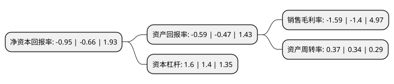

> 本页面由自动化程序生成于 2022年5月20日 01:13
> 内容可能存在错误，如有bug请提交issue至：https://github.com/Eroleice/doc-pi/issues
{.is-warning}

# 上市公司基本情况

## 基本资料

湖南宇晶机器股份有限公司（以下简称“宇晶股份”）成立于1998年06月11日，益阳市。于2018年11月29日在深交所中小板上市。

宇晶股份注册资本10,000万元，专业从事精密数控机床设备的研发，设计，生产和销售的高新技术企业，致力于为下游客户提供硬脆材料切割，研磨及抛光等加工服务一体化解决方案。以下是详细信息：

- 公司名称: 湖南宇晶机器股份有限公司
- 股票代码: 002943.SZ
- 所在地: 湖南 - 益阳市
- 成立日期: 1998年06月11日
- 注册资本: 10,000万元
- 法定代表人: 杨宇红
- 主营业务: 专业从事精密数控机床设备的研发，设计，生产和销售的高新技术企业，致力于为下游客户提供硬脆材料切割，研磨及抛光等加工服务一体化解决方案
- 公司官网: www.yj-cn.com
- 公司介绍: 公司是国家级“高新技术企业”。公司定位于硬脆材料精密加工机床制造领域，是专业从事多线切割机、研磨抛光机等硬脆材料精密加工机床的研发、设计、生产和销售，并为客户提供专业化解决方案。公司产品主要应用于手机触摸屏及后盖、太阳能光伏、磁性材料、蓝宝石等行业。凭借可靠的产品质量、合理的价格及完善的售后服务体系，在用户之间形成了较大的知名度，目前在全国市场范围内，处于领先地位。公司先后获得湖南科学技术进步一等奖、中国机械工业科技一等奖、工业科学技术一等奖、科学技术进步二等奖、湖南省科学技术进步奖、技术创新奖、SGS认证等多项荣誉。

## 股东及高管情况

上市公司第一大股东为杨宇红，持股35,963,900股，占比35.96%，为上市公司实际控制人。

截至2022年03月31日，上市公司的前十大股东中，共有5名自然人股东，2名机构股东，3个产品账户，其中5%以上大股东共有1名。上市公司前十大股东明细如下：

> 截至2022年03月31日，上市公司前十大股东信息如下：

| 股东名称 | 持股数量（股） | 持股比例 |
| --- | --- | --- |
| 杨宇红 | 35,963,900 | 35.96% |
| 罗群强 | 3,116,250 | 3.12% |
| 张国秋 | 3,016,250 | 3.02% |
| 深圳格律资产管理有限公司-格律连赢1号私募证券投资基金 | 2,391,300 | 2.39% |
| 张靖 | 2,346,875 | 2.35% |
| 中国工商银行股份有限公司-前海开源新经济灵活配置混合型证券投资基金 | 1,812,200 | 1.81% |
| 中信证券股份有限公司 | 1,259,692 | 1.26% |
| 中国国际金融股份有限公司 | 1,211,371 | 1.21% |
| 华泰证券股份有限公司-中庚价值领航混合型证券投资基金 | 1,058,000 | 1.06% |
| 罗永红 | 1,010,300 | 1.01% |

## 利润表分析

上市公司2021年总收入为4.56亿元，净利润为-0.08亿元，**未实现盈利**。

## 杜邦分析

> 数据列示周期：2021年 | 2020年 | 2019年
{.is-info}

上市公司的净资产收益率在近一年有所上升，上升幅度为43.94%，其变化情况分解如下：
- 上市公司的销售毛利率在近一年上升了13.57%，可能是生产效率的提升、商品原材料价格下跌或商品价格的上涨所致。
- 上市公司的资产周转率在近一年上升了8.82%，可能是源自于更快的销售回款或库存管理效果提升。
- 上市公司的财务杠杆比率在近一年上升了14.29%，可能是增加负债扩大生产规模。

