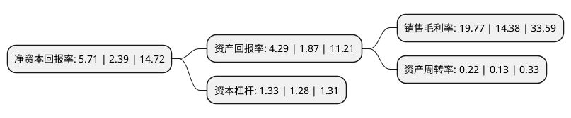

> 本页面由自动化程序生成于 2022年5月20日 01:20
> 内容可能存在错误，如有bug请提交issue至：https://github.com/Eroleice/doc-pi/issues
{.is-warning}

# 上市公司基本情况

## 基本资料

华辰精密装备(昆山)股份有限公司（以下简称“华辰装备”）成立于2007年09月04日，苏州市。于2019年12月04日在深交所创业板上市。

华辰装备注册资本15,692万元，主营业务:全自动数控轧辊磨床的研发，生产和销售。以下是详细信息：

- 公司名称: 华辰精密装备(昆山)股份有限公司
- 股票代码: 300809.SZ
- 所在地: 江苏 - 苏州市
- 成立日期: 2007年09月04日
- 注册资本: 15,692万元
- 法定代表人: 曹宇中
- 主营业务: 主营业务:全自动数控轧辊磨床的研发，生产和销售
- 公司官网: www.hiecise.com
- 公司介绍: 公司是一家专业从事全自动数控轧辊磨床的研发、生产的高新技术企业，主要产品为全自动数控轧辊磨床，公司针对客户在不同金属材料轧制及板形控制方式下，对工件(以轧辊为代表)的定制化磨削需求(包括轧辊辊形及精度、磨削效率、稳定性等)，提供包括技术研发、产品设计、生产制造、交付安装、维修改造服务等在内的全流程服务。公司是经江苏省科学技术厅、江苏省财政厅、江苏省国家税务局和江苏省地方税务局联合认定的高新技术企业，是江苏省科技计划项目实施单位、江苏省信息化与工业化融合产品或装备智能化示范企业、江苏省博士后创新实践基地、江苏省重点企业研发机构，其技术中心被认定为江苏省企业技术中心、江苏省高速精密磨削工程技术研究中心。公司通过了ISO9001质量管理体系认证。先后获得“国家火炬计划项目”、“国家重点新产品”、“江苏省科学技术奖”、“江苏省高新技术产品”、“江苏名牌产品”、“江苏省优秀新产品金奖”、“江苏省首台(套)重大装备产品”、“2018年度江苏机械工业科技进步奖特等奖”等荣誉，多项核心技术处于国内乃至国际领先地位，是国内轧辊磨床行业的领军企业。

## 股东及高管情况

上市公司第一大股东为曹宇中，持股36,670,000股，占比23.37%，**疑似为**上市公司实际控制人。

截至2022年03月31日，上市公司的前十大股东中，共有8名自然人股东，1名机构股东，1个产品账户，其中5%以上大股东共有3名。上市公司前十大股东明细如下：

> 未能通过持股比例判定出上市公司实际控制人（持股30%以上）
> 可能存在通过间接持股、联合持股、协议控制等方式拥有实际控制权的主体，具体请参考上市公司定期公告！
{.is-warning}

> 截至2022年03月31日，上市公司前十大股东信息如下：

| 股东名称 | 持股数量（股） | 持股比例 |
| --- | --- | --- |
| 曹宇中 | 36,670,000 | 23.37% |
| 刘翔雄 | 36,665,000 | 23.37% |
| 赵泽明 | 36,665,000 | 23.37% |
| 徐彩英 | 1,425,000 | 0.91% |
| 辛启富 | 215,800 | 0.14% |
| 厦门恒兴集团有限公司 | 215,300 | 0.14% |
| 易三明 | 200,000 | 0.13% |
| 于劲松 | 167,700 | 0.11% |
| 西安悦枫资产管理有限公司-悦枫澜山闻雪私募证券投资基金 | 157,800 | 0.1% |
| 樊晓霞 | 135,000 | 0.09% |

## 利润表分析

上市公司2021年总收入为4.09亿元，净利润为0.8亿元，实现盈利。

## 杜邦分析

> 数据列示周期：2021年 | 2020年 | 2019年
{.is-info}

上市公司的净资产收益率在近一年有所上升，上升幅度为138.91%，其变化情况分解如下：
- 上市公司的销售毛利率在近一年上升了37.48%，可能是生产效率的提升、商品原材料价格下跌或商品价格的上涨所致。
- 上市公司的资产周转率在近一年上升了69.23%，可能是源自于更快的销售回款或库存管理效果提升。
- 上市公司的财务杠杆比率在近一年上升了3.91%，可能是增加负债扩大生产规模。

