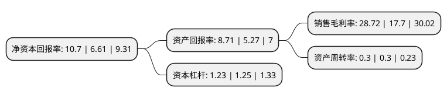

> 本页面由自动化程序生成于 2022年5月20日 01:39
> 内容可能存在错误，如有bug请提交issue至：https://github.com/Eroleice/doc-pi/issues
{.is-warning}

# 上市公司基本情况

## 基本资料

科德数控股份有限公司（以下简称“科德数控”）成立于2008年01月28日，大连市。于2021年07月09日在上交所科创板上市。

科德数控注册资本9,072万元，从事高端五轴联动数控机床及其关键功能部件，高档数控系统的研发，生产，销售及服务的高新技术企业，主要产品为系列化五轴立式(含车铣)，五轴卧式(含车铣)，五轴龙门，五轴卧式铣车复合四大通用加工中心和五轴磨削，五轴叶片两大系列化专用机床，以及服务于高端数控机床的高档数控系统，伺服驱动装置，系列化电机，系列化传感产品，电主轴，铣头，转台等。以下是详细信息：

- 公司名称: 科德数控股份有限公司
- 股票代码: 688305.SH
- 所在地: 辽宁 - 大连市
- 成立日期: 2008年01月28日
- 注册资本: 9,072万元
- 法定代表人: 于本宏
- 主营业务: 从事高端五轴联动数控机床及其关键功能部件，高档数控系统的研发，生产，销售及服务的高新技术企业，主要产品为系列化五轴立式(含车铣)，五轴卧式(含车铣)，五轴龙门，五轴卧式铣车复合四大通用加工中心和五轴磨削，五轴叶片两大系列化专用机床，以及服务于高端数控机床的高档数控系统，伺服驱动装置，系列化电机，系列化传感产品，电主轴，铣头，转台等
- 公司官网: www.dlkede.com
- 公司介绍: 公司是从事高端五轴联动数控机床及其关键功能部件、高档数控系统的研发、生产、销售及服务的高新技术企业，主要产品为系列化五轴立式(含车铣)、五轴卧式(含车铣)、五轴龙门、五轴卧式铣车复合四大通用加工中心和五轴磨削、五轴叶片两大系列化专用机床，以及服务于高端数控机床的高档数控系统，伺服驱动装置，系列化电机，系列化传感产品，电主轴，铣头，转台等，依靠完整的人才链、技术链和产业链，公司在五轴联动数控机床、高档数控系统及关键功能部件核心技术方面取得一系列重大突破，站在了行业技术水平的前列，功能、控制精度和加工效率等方面达到国际先进水平，公司高度重视技术研发，坚持核心技术自主可控的发展战略，报告期内累计研发投入为14,655.44万元，约占总营业收入的45.90%。核心技术团队参与制定17项国家标准、4项行业标准。《开放式数控系统关键技术与标准及应用》获得辽宁省科学技术进步一等奖。公司承担及参与了29项“高档数控机床与基础制造装备”国家科技重大专项(04专项)及8项其他国家级课题，KMC800U五轴联动立式加工中心产品进入“军工领域国产高档数控机床供应目录”。

## 股东及高管情况

上市公司第一大股东为大连光洋科技集团有限公司，持股26,140,000股，占比28.81%，**疑似为**上市公司实际控制人。

截至2022年03月31日，上市公司的前十大股东中，共有4名自然人股东，4名机构股东，2个产品账户，其中5%以上大股东共有4名。上市公司前十大股东明细如下：

> 未能通过持股比例判定出上市公司实际控制人（持股30%以上）
> 可能存在通过间接持股、联合持股、协议控制等方式拥有实际控制权的主体，具体请参考上市公司定期公告！
{.is-warning}

> 截至2022年03月31日，上市公司前十大股东信息如下：

| 股东名称 | 持股数量（股） | 持股比例 |
| --- | --- | --- |
| 大连光洋科技集团有限公司 | 26,140,000 | 28.81% |
| 国投(上海)创业投资管理有限公司-国投(上海)科技成果转化创业投资基金企业(有限合伙) | 13,000,000 | 14.33% |
| 于本宏 | 9,460,000 | 10.43% |
| 宋梦璐 | 5,270,000 | 5.81% |
| 谷景霖 | 4,400,000 | 4.85% |
| 大连亚首企业管理咨询合伙企业(有限合伙) | 2,750,000 | 3.03% |
| 中信证券-工商银行-中信证券科德数控员工参与科创板战略配售集合资产管理计划 | 2,268,000 | 2.5% |
| 华泰证券股份有限公司 | 1,859,995 | 2.05% |
| 赵宁威 | 1,670,000 | 1.84% |
| 大连万众国强投资合伙企业(有限合伙) | 1,650,000 | 1.82% |

## 利润表分析

上市公司2021年总收入为2.53亿元，净利润为0.72亿元，实现盈利。

## 杜邦分析

> 数据列示周期：2021年 | 2020年 | 2019年
{.is-info}

上市公司的净资产收益率在近一年有所上升，上升幅度为61.88%，其变化情况分解如下：
- 上市公司的销售毛利率在近一年上升了62.26%，可能是生产效率的提升、商品原材料价格下跌或商品价格的上涨所致。
- 上市公司的资产周转率在近一年下降了0%，可能是源自于更慢的销售回款或库存管理效果下降。
- 上市公司的财务杠杆比率在近一年下降了-1.6%，可能是减少负债降低财务费用。

