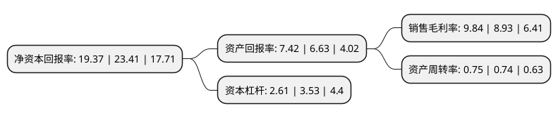

> 本页面由自动化程序生成于 2022年5月20日 01:40
> 内容可能存在错误，如有bug请提交issue至：https://github.com/Eroleice/doc-pi/issues
{.is-warning}

# 上市公司基本情况

## 基本资料

纽威数控装备(苏州)股份有限公司（以下简称“纽威数控”）成立于1997年04月29日，苏州市。于2021年09月17日在上交所科创板上市。

纽威数控注册资本32,666.67万元，中高档数控机床的研发，生产及销售，现有大型加工中心，立式数控机床，卧式数控机床等系列200多种型号产品，广泛应用于汽车，工程机械，模具，阀门，自动化装备，电子设备，航空，船舶，通用设备等行业，部分产品根据客户特殊需求定制化开发。以下是详细信息：

- 公司名称: 纽威数控装备(苏州)股份有限公司
- 股票代码: 688697.SH
- 所在地: 江苏 - 苏州市
- 成立日期: 1997年04月29日
- 注册资本: 32,666.67万元
- 法定代表人: 程章文
- 主营业务: 中高档数控机床的研发，生产及销售，现有大型加工中心，立式数控机床，卧式数控机床等系列200多种型号产品，广泛应用于汽车，工程机械，模具，阀门，自动化装备，电子设备，航空，船舶，通用设备等行业，部分产品根据客户特殊需求定制化开发
- 公司官网: www.newaycnc.com
- 公司介绍: 公司专注于中高档数控机床的研发、生产及销售，现有大型加工中心、立式数控机床、卧式数控机床等系列200多种型号产品，广泛应用于汽车、工程机械、模具、阀门、自动化装备、电子设备、航空、船舶、通用设备等行业，部分产品根据客户特殊需求定制化开发。纽威数控部分产品被评定为“国家重点新产品”、“江苏省高新技术产品”、“江苏省首台套产品”、“江苏省名牌产品”。公司采用“经销为主、直销为辅”的销售模式。经销模式下，公司与经销商签订销售协议，经销商与客户签订销售协议，产品由公司直接发送到最终用户处安装、调试，客户完成终验收后确认收入，经销商直接将货款支付给公司。直销模式下，公司直接与客户签订协议，产品直接发送至客户处安装、调试，客户完成终验收后确认收入，客户直接将货款支付给公司。在生产、采购方面，公司分别采取“以销定产”“以销定购”的模式，提高存货周转效率，降低库存风险。

## 股东及高管情况

上市公司第一大股东为席超，持股49,575,000股，占比15.18%，**疑似为**上市公司实际控制人。

截至2022年03月31日，上市公司的前十大股东中，共有6名自然人股东，2名机构股东，2个产品账户，其中5%以上大股东共有4名。上市公司前十大股东明细如下：

> 未能通过持股比例判定出上市公司实际控制人（持股30%以上）
> 可能存在通过间接持股、联合持股、协议控制等方式拥有实际控制权的主体，具体请参考上市公司定期公告！
{.is-warning}

> 截至2022年03月31日，上市公司前十大股东信息如下：

| 股东名称 | 持股数量（股） | 持股比例 |
| --- | --- | --- |
| 席超 | 49,575,000 | 15.18% |
| 王保庆 | 49,575,000 | 15.18% |
| 陆斌 | 49,575,000 | 15.18% |
| 程章文 | 49,575,000 | 15.18% |
| 姚毓明 | 16,000,000 | 4.9% |
| 杨溟 | 16,000,000 | 4.9% |
| 苏州新有威投资管理合伙企业(有限合伙) | 14,700,000 | 4.5% |
| 中信建投证券-农业银行-中信建投纽威数控科创板战略配售集合资产管理计划 | 8,166,670 | 2.5% |
| 中信建投投资有限公司 | 1,744,635 | 0.53% |
| 景顺长城基金-兴业银行-景顺长城基金顺利2号集合资产管理计划 | 1,370,000 | 0.42% |

## 利润表分析

上市公司2021年总收入为17.12亿元，净利润为1.68亿元，实现盈利。

## 杜邦分析

> 数据列示周期：2021年 | 2020年 | 2019年
{.is-info}

上市公司的净资产收益率在近一年有所下降，下降幅度为-17.26%，其变化情况分解如下：
- 上市公司的销售毛利率在近一年上升了10.19%，可能是生产效率的提升、商品原材料价格下跌或商品价格的上涨所致。
- 上市公司的资产周转率在近一年上升了1.35%，可能是源自于更快的销售回款或库存管理效果提升。
- 上市公司的财务杠杆比率在近一年下降了-26.06%，可能是减少负债降低财务费用。

