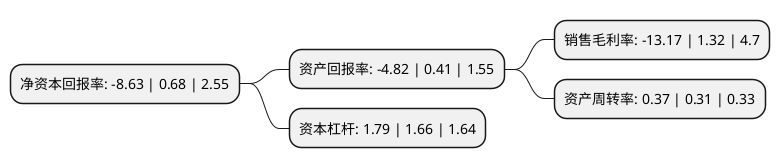

> 本页面由自动化程序生成于 2022年5月20日 01:02
> 内容可能存在错误，如有bug请提交issue至：https://github.com/Eroleice/doc-pi/issues
{.is-warning}

# 上市公司基本情况

## 基本资料

冰山冷热科技股份有限公司（以下简称“冰山冷热”）成立于1993年12月18日，大连市。于1993年12月08日在深交所主板上市。

冰山冷热注册资本84,321.251万元，主营业务:制冷设备及配套辅机，阀门，配件以及制冷工程所需配套产品的加工，制造以下是详细信息：

- 公司名称: 冰山冷热科技股份有限公司
- 股票代码: 000530.SZ
- 所在地: 辽宁 - 大连市
- 成立日期: 1993年12月18日
- 注册资本: 84,321.251万元
- 法定代表人: 纪志坚
- 主营业务: 主营业务:制冷设备及配套辅机，阀门，配件以及制冷工程所需配套产品的加工，制造
- 公司官网: www.bingshan.cn
- 公司介绍: 公司是以经营“冰山”牌制冷设备及其配套辅机、阀、配件以及冷冻工程所需配套产品加工制造、制冷空调系统设计制造安装维修调试和技术服务等为主业的国家一级企业。公司坚持以现代的科技、现代的管理、现代的人才为牵动，大力开发适应市场需求，高科技含量、高附加值的新产品，形成了工业制冷成套、中央空调成套、制冰成套、冷链成套、气调保鲜成套、组合库成套和特种制冷工程成套的七大成套能力。公司是中国最大的工业制冷设备生产企业和中国最大的制冷成套设备出口企业。获得大连市首批科技创新企业称号。

## 股东及高管情况

上市公司第一大股东为大连冰山集团有限公司，持股170,916,934股，占比20.27%，**疑似为**上市公司实际控制人。

截至2022年03月31日，上市公司的前十大股东中，共有7名自然人股东，2名机构股东，1个海外主体，其中5%以上大股东共有2名。上市公司前十大股东明细如下：

> 未能通过持股比例判定出上市公司实际控制人（持股30%以上）
> 可能存在通过间接持股、联合持股、协议控制等方式拥有实际控制权的主体，具体请参考上市公司定期公告！
{.is-warning}

> 截至2022年03月31日，上市公司前十大股东信息如下：

| 股东名称 | 持股数量（股） | 持股比例 |
| --- | --- | --- |
| 大连冰山集团有限公司 | 170,916,934 | 20.27% |
| SANYO ELECTRIC CO LTD | 73,503,150 | 8.72% |
| 林镇铭 | 6,730,000 | 0.8% |
| 陈勇 | 4,520,000 | 0.54% |
| 吴安 | 4,500,000 | 0.53% |
| 薛红 | 3,600,000 | 0.43% |
| 大连市工业发展投资有限公司 | 3,406,725 | 0.4% |
| 李晓华 | 3,145,608 | 0.37% |
| 詹长城 | 2,971,647 | 0.35% |
| 陈慈柔 | 2,635,550 | 0.31% |

## 利润表分析

上市公司2021年总收入为20.89亿元，净利润为-2.76亿元，**未实现盈利**。

## 杜邦分析

> 数据列示周期：2021年 | 2020年 | 2019年
{.is-info}

上市公司的净资产收益率在近一年有所下降，下降幅度为-1369.12%，其变化情况分解如下：
- 上市公司的销售毛利率在近一年下降了-1097.73%，可能是生产效率的下降、商品原材料价格上涨或商品价格的下跌所致。
- 上市公司的资产周转率在近一年上升了19.35%，可能是源自于更快的销售回款或库存管理效果提升。
- 上市公司的财务杠杆比率在近一年上升了7.83%，可能是增加负债扩大生产规模。

